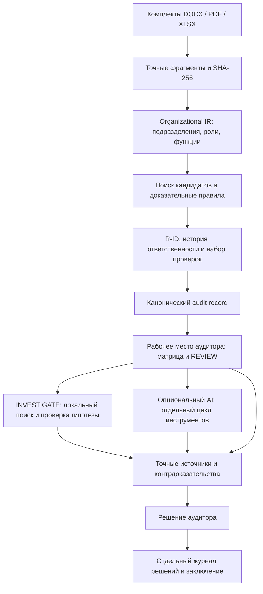

# ORG-X — The Organizational Debugger

**Отладчик организационной ответственности: после реорганизации кто владеет каждой функцией — и чем это доказано?**

HackAlem AI · трек 11 Казахтелеком · «Анализ организационной структуры и функционала».

Представьте **Git + тесты + debugger для организационной ответственности**. Документы — исходный текст, редакции «до» и «после» — два состояния, а извлечённые обязанности и полномочия — проверяемая модель. Эта метафора описывает работу с двумя загруженными комплектами документов.

ORG-X превращает комплекты документов в модель ответственности с `R-ID`, выполняет набор организационных проверок и позволяет **расследовать каждый неоднозначный случай**: найти кандидатов, проверить владельца и полномочие, открыть контрдоказательства и точный источник. Аудитор фиксирует решение; исходный системный анализ сохраняется.

```text
Документы «до / после» → Модель ответственности → Проверки (PASS / REVIEW)
При REVIEW: INVESTIGATE → Источники и контрдоказательства
Решение аудитора → Отдельный журнал → Заключение
```

Пользователь — аналитик или внутренний аудитор, проверяющий реорганизацию. Его результат — **матрица «кто отвечал → кто отвечает», очередь рисков с источниками и заключение с решениями**. Основная опасность — принять отсутствие текстового совпадения за потерю ответственности. Поэтому ORG-X сохраняет неоднозначность и проверяет альтернативы: возможный пробел, дублирование и конфликт полномочий не объявляются установленными нарушениями.

**AI proposes. Evidence proves. Human decides.** Сходство текста предлагает кандидатов; подтверждение требует проверки владельца, полномочия и контекста. Неопределённость остаётся видимой.

**Доступно жюри сейчас:** полный локальный сценарий без API-ключа, контрольные документы и три формата экспорта. Внешний AI-агент реализован отдельно и по умолчанию отключён; его инструментальный цикл проверен fake-клиентом, живой вызов OpenAI не проверялся.

## Быстрый запуск для эксперта

**Где работает приложение:** эксперт скачивает этот репозиторий и запускает ORG-X на своём компьютере. Интерфейс открывается в браузере по адресу `http://127.0.0.1:8000` (`localhost`). GitHub хранит исходники; приложение запускает команда ниже. Компьютер команды и отдельный публичный сервер для проверки не нужны.

Основной сценарий, контрольные документы и локальное расследование **работают без API-ключа, внешнего сервиса и аккаунта участника**. Интернет нужен для первоначальной установки зависимостей. Команды предназначены для macOS/Linux; на Windows используйте WSL2.

Требования: Python **3.9+** с `venv`, Node.js **22+**, pnpm **9.15.0**, Git. Проверенная конфигурация: Python 3.9.6, Node.js 22.9.0, pnpm 9.15.0. Зависимости зафиксированы в `requirements.lock` и `frontend/pnpm-lock.yaml`.

```bash
git clone https://github.com/BAITC-Hacks/hack-001016ea-intent.git
cd hack-001016ea-intent

# Если pnpm не установлен или его версия отличается от 9.15.0:
npm install -g pnpm@9.15.0

bash scripts/setup.sh
bash scripts/check.sh
bash scripts/start.sh
```

Выполняйте команды по очереди в терминале; после ошибки сначала устраните её по разделу «Если запуск не получился». Для уже скачанного репозитория начните с `cd` в его корень. Если репозиторий закрыт, используйте доступ, предоставленный организатором.

После `start.sh` дождитесь строки **`Uvicorn running on http://127.0.0.1:8000`** и откройте **http://127.0.0.1:8000** в браузере. Оставьте этот терминал работающим: сервер выполняется, пока процесс не остановлен. Документация API: **http://127.0.0.1:8000/docs**. Остановка — `Ctrl+C`; для следующего запуска достаточно `bash scripts/start.sh` из корня проекта.

`setup.sh` устанавливает зависимости и создаёт `.env`, если его ещё нет. `check.sh` последовательно запускает тесты и production-сборку, используя временную базу и отключённый внешний AI. `start.sh` пересобирает frontend перед запуском, чтобы интерфейс соответствовал текущему коду.

**Как понять, что всё готово:** на странице видны ORG-X и кнопка **«Открыть контрольный комплект»**. В новой копии без оригиналов организатора текущий набор тестов даёт **93 passed, 23 skipped**, затем успешную production-сборку. Пропущены только проверки, которым нужны оригинальные DOCX; для встроенного контрольного примера они не требуются. Заполнять API-ключ или менять `.env` для этого сценария не нужно.

<details>
<summary>Те же шаги вручную</summary>

```bash
python3 -m venv .venv
.venv/bin/python -m pip install -r requirements.lock
.venv/bin/python -m pip check
pnpm --dir frontend install --frozen-lockfile
test -f .env || cp .env.example .env
ORGX_ENABLE_OPENAI=0 .venv/bin/python -m pytest -q
pnpm --dir frontend build
.venv/bin/python -m uvicorn orgx.main:app --app-dir backend --host 127.0.0.1 --port 8000
```

</details>

## Демо за 5 минут: от REVIEW к решению аудитора

В репозитории есть **синтетический** комплект: три DOCX «до» и три «после» в [`examples/control`](examples/control). Это учебные документы ORG-X, а не документы Казахтелекома. Исходные тексты — [`sources.json`](examples/control/sources.json), генератор — [`scripts/generate_control.py`](scripts/generate_control.py).

Начните с вопроса: **«Функцию исключили из прежнего перечня. Кто теперь за неё отвечает?»** Затем пройдите одну запись от проверки до решения. Первые четыре шага — основной сюжет для короткой защиты; остальные показывают охват MVP.

1. **Загрузить и получить модель.** Нажмите **«Открыть контрольный комплект»**. После анализа появятся шесть документов и экран **«Организационные тесты»**. Для ручной загрузки: **«Новый аудит»** → три файла `examples/control/before` в «До изменений» и три файла `examples/control/after` в «После изменений» → **«Начать анализ»**.
2. **Найти неоднозначность.** Выберите запись **«Проверяет комплектность документов для закрытия гарантийных обращений»** со статусом «Возможный пробел». Покажите `R-ID`, прежнего владельца и проверку **«Непрерывность владельца»**: новый владелец не подтверждён, поэтому требуется `REVIEW`.
3. **Расследовать.** Нажмите **«INVESTIGATE · Расследовать»**. Пройдите журнал: исходная гипотеза → поиск по новой версии → проверка кандидатов → попытка опровергнуть гипотезу → итог. Откройте источники: `before/02-functions.docx`, §7.2.2, и `after/03-order.docx`, §2.3. В контрольном случае гипотеза остаётся **«Возможный пробел»**: исключение прямо указано, но потеря всей функции не доказана. Пересмотр гипотезы не обязан менять её статус.
4. **Принять решение и получить результат.** Нажмите **«Вывод и решение аудитора» → «Решение аудитора»**. Выберите **«Нужны данные»**, укажите демонстрационного ответственного и обоснование: «Запросить действующий пункт, назначающий владельца после исключения функции по §2.3». Нажмите **«Сохранить решение»**. В **«Заключении»** появится решение 1 из 6; **«Заключение с решениями»** скачивает Markdown с этой записью. Системный вывод остаётся неизменным.
5. **Проверить реорганизацию и передачу.** В **«Подразделениях»**: Департамент проверки сохранён, Департамент реестров преобразован в Департамент данных по §2.1 распоряжения, Департамент контроля добавлен. В **«Матрице функций»**: проверка квартальной отчётности сохранена; формирование реестра договоров передано по §2.2. Откройте источники обеих версий и основание передачи.
6. **Проверить другие риски.** В **«Функции и выводы»** откройте **«Возможное дублирование»** сверки склада у ДД/ДК (§9.4.2 и §9.7.1) и **«Риск конфликта полномочий»** — право и запрет утверждать корректировку бюджета (§9.9.1 и §9.10.1). Вкладки **«Источники»**, **«Поиск и кандидаты»**, **«Журнал исследования»** показывают основания и ограничения. Частичное пересечение контроля сроков и качества остаётся на ручную проверку.
7. **Выгрузить и воспроизвести.** **«Матрица функций» → «Скачать CSV»** даёт матрицу со ссылками. **«Заключение» → «Audit JSON»** даёт канонический системный результат. Повторный анализ того же комплекта возвращает тот же ID и результат из кэша; решения человека хранятся отдельно.

Ориентиры контрольного примера: **6 выводов** — по одному сохранению, переносу, возможному пробелу, дублированию, конфликту полномочий и случаю для ручной проверки. Экран организационных тестов показывает **9 записей ответственности и 63 проверки: 2 записи PASS, 7 REVIEW, 0 FAIL**. Это разные счётчики: записи ответственности и проверки не равны числу функций или выводов. REVIEW — ожидаемый результат для неоднозначных случаев; 0 FAIL не означает отсутствие организационных рисков.

Риски — основания для проверки, а не утверждения о нарушениях. Контрольный комплект проверяет известные сценарии; он не доказывает точность на произвольных документах.

## Центральный кейс для защиты: право ДККМ в редакциях 8 → 9

В локальной разработке использованы `Внутренний_аудит_редакция_8_до.docx`, `Внутренний_аудит_редакция_9_после.docx` и описание трека `track_11.txt`.

Оригинальные файлы **не включены в Git**. Полученные у организатора DOCX загрузите через интерфейс. Для кнопки реальной пары, source-тестов и benchmark поместите оба DOCX с указанными именами в `work/hackalem/kazakhtelecom/`. Текст задания при наличии хранится в `work/hackalem/docs/track_11.txt`; для запуска он не нужен.

Если доступны оригиналы, используйте этот кейс для демонстрации реальной неоднозначности. На чистом клоне без них воспроизводимым сценарием остаётся контрольный комплект выше.

**Вопрос:** прежнее право ДККМ формировать группы контроля качества явно указано в §5.6.2 «до». Прямое продолжение этого полномочия не установлено, но в новой редакции есть другие положения о контроле качества — §5.5.2 и §10.7. Достаточно ли этого, чтобы объявить функцию потерянной?

1. Загрузите редакции 8 и 9, откройте **«Организационные тесты»** и найдите запись о формировании групп контроля качества.
2. Покажите прежнего владельца и точный §5.6.2, затем нажмите **«INVESTIGATE · Расследовать»**.
3. Откройте проверенных кандидатов и контрдоказательства, сопоставьте действие, полномочие и контекст с §5.5.2 и §10.7 «после».
4. Завершите выводом: **потенциальный пробел конкретного полномочия; потеря всей функции контроля качества не доказана**. Через **«Вывод и решение аудитора»** запросите подтверждающий документ или зафиксируйте мотивированное решение.

Фраза для защиты: **«Отсутствие текстового совпадения ещё не означает потерю ответственности. Здесь мы проверяем гипотезу, показываем альтернативные положения и оставляем решение аудитору».**

Другие проверяемые изменения реальной пары:

- В перечне §3.4 **ДНМ и ДККМ сохранены**, ДИТААД и ДОА добавлены. Изменение ролей §5.3 рассматривается отдельно: вывод «два департамента заменены четырьмя» не делается.
- Взаимодействие с субъектами СВК перенесено из §5.4.4/а–б «до» в §5.3.3/а–б «после». Ответственный указан коллективно; исключительный владелец не выдумывается.
- Участие в органах управления (§4.4 «после») сопоставляется с ограничением управленческих решений (§5.8.1/в) и мерами независимости. Это потенциальный риск, требующий проверки.

[`truth/source_truth.json`](truth/source_truth.json) содержит 22 авторских контрольных случая, исходные цитаты и SHA-256. Runtime не читает этот файл. Независимая экспертная приёмка не проводилась: `human_signoff=null`. Подробнее — [`truth/README.md`](truth/README.md).

## Архитектура и технологии



- **Backend:** Python, FastAPI, Uvicorn, Pydantic; SQLite хранит результаты, кэш и решения аудитора.
- **Извлечение:** `python-docx` для DOCX, PyMuPDF для текстового PDF, openpyxl для XLSX. Исходные фрагменты сохраняются отдельно от интерпретации.
- **Сопоставление:** детерминированный поиск, явные владельцы, модальность `duty/right/prohibition`, контекст и проверяемые правила. Similarity не является вероятностью правильного вывода.
- **Frontend:** React 19, TypeScript, Vite, Tailwind CSS, Lucide.
- **AI:** опциональный OpenAI Responses API с ограниченным циклом вызова инструментов. Модель предлагает кандидатов; не меняет системные факты.
- **Проверки:** pytest, API TestClient, синтетические/adversarial кейсы, контрольные цитаты реальных документов, TypeScript и production-сборка.

Карта репозитория:

```text
backend/orgx/        ingestion, IR, правила, API, investigator, SQLite
backend/tests/      API, источники, устойчивость и негативные сценарии
frontend/src/       рабочее место аудитора
examples/control/  воспроизводимый синтетический комплект 3 + 3 DOCX
truth/              контрольная разметка реальной пары
scripts/            установка, проверка, запуск, генератор и benchmark
docs/               архитектура, результаты проверки, сторонние компоненты
work/               локальная база и документы; исключены из Git
```

Описание модулей, API и доказательной политики — [`docs/architecture.md`](docs/architecture.md). Результаты выполненных проверок — [`docs/validation.md`](docs/validation.md).

### Модель ответственности и набор организационных проверок

Набор проверок отвечает на практический вопрос: **можно ли по переданным документам проследить ответственность после изменения?** Экран показывает владельцев в обеих версиях, кандидатов и цепочку источников. Для каждой записи выполняются семь проверок: непрерывность владельца, основание передачи, границы ответственности, конкурирующие владельцы, совместимость полномочий, разделение/объединение и целостность источников.

`R-ID` — fingerprint нормализованных action/object/context/authority. Он не зависит от номера пункта, версии и отдельного поля владельца; перефразирование может изменить ID. Совпавший fingerprint сам по себе не доказывает эквивалентность. `lineage_id` различает конкретные вхождения и сохраняет ссылки на документы. Документарные риски вне извлечённых функций отображаются отдельными записями.

`PASS` означает выполнение указанного документарного условия. `REVIEW` требует проверки. Текущие правила не выдают организационный `FAIL`: недостаток или противоречивость оснований дают `REVIEW`, а повреждённая доказательная цепочка отклоняется валидатором. Поэтому сюжет демонстрации — **REVIEW → INVESTIGATE → EVIDENCE → HUMAN DECISION**. `SPLIT`/`MERGED` допускаются только как гипотезы полного буквального покрытия частей при совместимых контексте и полномочиях; это не подтверждённое правопреемство.

Кнопка локального расследования выполняет поиск, проверку кандидатов, поиск контрдоказательств и пересмотр рабочей гипотезы. Журнал отражает выполненные операции. Это детерминированный workflow без LLM; отдельное AI-исследование описано ниже. На реальной паре показываются её фактические результаты — наличие split/merge не выдумывается ради демонстрации.

Модель истории, условия проверок и API — [`docs/debugger.md`](docs/debugger.md).

## Окружение, данные и AI

### Два режима расследования

- **Без внешнего AI — режим по умолчанию.** Документы → модель → проверки → локальное `INVESTIGATE` → источники → решение. Поиск и пересмотр гипотезы выполняются кодом; API-ключ не нужен. Именно этот полный сценарий проверен в браузере.
- **С внешним AI — опциональный агент.** Модель выбирает поисковые запросы и вызывает инструменты поиска, просмотра функций и предложения пар. Предложения и журнал действий показываются отдельно; модель не переписывает канонические выводы.

Для проверки второго режима задайте в локальном `.env` `ORGX_ENABLE_OPENAI=1`, `OPENAI_API_KEY` и доступную аккаунту `OPENAI_MODEL`, затем перезапустите сервер. Откройте карточку вывода → **«Журнал исследования» → «Запустить AI-исследование»**. Это отдельное действие передаёт фрагменты в OpenAI. Ключ остаётся на backend и не должен попадать в репозиторий.

**Граница проверки:** цикл инструментов и обработка ошибок проверены fake-клиентом; живой вызов и качество конкретной модели не проверялись. На защите показывайте AI ON только после успешного запуска с собственным доступом. Отсутствие ключа или ошибка API сохраняют доступ к локальному аудиту и не доказывают выполнение AI-расследования.

### Настройки и хранение

Настройки читаются из `.env` в корне; пример — [`.env.example`](.env.example). Заданные переменные процесса имеют приоритет.

- `ORGX_ENABLE_OPENAI=0` — внешний AI отключён; `1` разрешает опциональные AI-действия интерфейса.
- `OPENAI_API_KEY` — ключ только на backend, нужен исключительно для внешнего AI.
- `OPENAI_MODEL` — модель/snapshot, доступные аккаунту; автоматической подмены нет.
- `ORGX_DB` — путь SQLite. По умолчанию `work/orgx.sqlite` внутри проекта; относительный пользовательский путь считается от рабочей директории процесса.
- `PORT=8000` — порт скрипта запуска. Например: `PORT=8010 bash scripts/start.sh`. Передаётся в shell; файл `.env` не задаёт порт Uvicorn.

Загрузка, анализ, источники, локальная проверка и экспорт работают локально. SQLite содержит извлечённые тексты, результаты и решения; `.env` и `work/` исключены из Git. Для отдельной базы: `ORGX_DB=work/test.sqlite bash scripts/start.sh`.

При включённом AI отдельное действие интерфейса отправляет выбранные функции, контекст и запрошенные фрагменты в OpenAI. `investigator.py` предоставляет инструменты `search_evidence`, `inspect_claim`, `propose_pair`; модель может выбрать следующий поиск и изменить кандидатов. Лимит — 8 раундов и 10 инструментальных вызовов. Перед предложением пары обязательны поиск в обеих версиях, отдельный поиск контрдоказательств в версии «после», просмотр обеих функций и проверка допустимых source ID.

Вызовы и результаты сохраняются отдельно. Неизвестные инструменты/ID отклоняются; отсутствие ключа, ошибка сервиса или лимит не отменяют локальный аудит. Непроверенный текст модели не становится доказательством. Пакетный адаптер `llm.py` отдельно предлагает ID соответствий. Кэш учитывает запрос, версию протокола и модель. Новые ответы внешней модели не обещаются детерминированными; канонический record не зависит от них.

Приложение рассчитано на одного локального аудитора и слушает `127.0.0.1`. Многопользовательская авторизация и сетевое развёртывание в MVP не входят.

## Тестирование и воспроизводимость

```bash
# Тесты + TypeScript + production-сборка, последовательно:
bash scripts/check.sh

# Проверки устойчивости без документов организатора:
.venv/bin/python -m pytest -q backend/tests/test_robustness.py -m 'not source_documents'

# Benchmark реальной пары, если её DOCX помещены в work/:
ORGX_ENABLE_OPENAI=0 .venv/bin/python scripts/benchmark.py
```

Без оригиналов организатора source-тесты выводят **SKIPPED**: это отсутствие проверки реальной пары, а не успешная приёмка её результатов. Синтетический комплект поставляется с кодом и работает на чистом клоне. Внешний AI в автоматических тестах заменён fake-клиентом: платные API-вызовы не нужны.

Проверяются точные цитаты и хэши, устойчивость к перенумерации, отрицанию и числовым условиям, неизвестный/конкурирующий владелец, сужение контекста, форматы файлов, ошибки API, порядок комплектов, кэш и сохранение решений. Повторные входные байты и имена при тех же версиях движка/политики дают одинаковый канонический JSON. Решение аудитора не переписывает исходный анализ.

## Ограничения и интерпретация

- Парсер распознаёт явные списки подразделений, заголовки функций/прав/обязанностей и поддерживаемые распорядительные формулировки. Нестандартная структура, синонимы и перефразирование могут требовать ручной проверки; универсальное извлечение всех функций не заявляется.
- `action/object/scope/authority` основаны на тексте и структуре, а не на полной семантической онтологии. Пустой scope не означает неограниченную ответственность. Некоторые правила специализированы для положений внутреннего аудита.
- Отсутствие совпадения не доказывает потерю функции. Точное совпадение без проверки владельца, модальности и контекста не доказывает сохранение. Новые дубли проверяются и без предшественника; смысловые дубли с другими формулировками могут быть пропущены.
- DOCX: основной текст и таблицы; без OCR, колонтитулов, сносок и вложенных файлов. Исправления Word требуют принятия/отклонения перед повторным анализом. PDF: текстовые блоки и страницы, порядок чтения требует проверки; сканы без текста отклоняются. XLSX: текст/формулы и координаты ячеек, без вычисления формул. Старые `.doc`/`.xls` не поддерживаются.
- Лимиты: **8 файлов на версию**, **20 МБ на файл**, **40 МБ на комплект**, **100 МБ распакованного DOCX/XLSX**, **12 000 фрагментов** на комплект и **1 500 функций**. Повтор одного файла внутри версии отклоняется.
- Риски требуют решения ответственного сотрудника. Проверка законодательства, сравнение с другими операторами, доказательство фактического конфликта интересов и автоматическое перераспределение ответственности не реализованы.

## Если запуск не получился

- **Не найден python3/pnpm:** установите версии из требований; на Linux может понадобиться `python3-venv`.
- **Ошибка установки:** проверьте доступ к PyPI/npm и свободное место; повторите `bash scripts/setup.sh`. Существующий `.env` сохраняется.
- **Порт занят:** остановите старый экземпляр или выполните `PORT=8010 bash scripts/start.sh`.
- **Браузер пишет «Не удаётся подключиться»:** убедитесь, что `start.sh` завершил сборку и процесс Uvicorn продолжает работать. Откройте адрес из терминала; при `PORT=8010` это `http://127.0.0.1:8010`. После `Ctrl+C` сервер останавливается.
- **Нет реальной пары:** используйте контрольный комплект или загрузку файлов; оригиналы в Git не входят.
- **HTTP 422:** проверьте формат, лимиты, отсутствие повторов и наличие текста. Для сканированного PDF нужен предварительный OCR вне ORG-X.
- **HTTP 507:** проверьте свободное место и право записи в каталог SQLite.
- **AI отключён/нет ключа:** штатный режим; основной сценарий доступен.

Для разработки: backend на 8000 и отдельно `pnpm --dir frontend dev`. Vite проксирует `/api` на 8000; произвольный `PORT` этот proxy не меняет.

## Источники и сторонние компоненты

Задание: [страница HackAlem AI](https://edu.astanahub.com/hackathons/df4743f5-c492-415c-b45a-1f13adb78e06), «Треки», задача 11 Казахтелекома. [Положение](https://edu.astanahub.com/hackathons/df4743f5-c492-415c-b45a-1f13adb78e06?tab=regulations), §5.4.15 и §5.6.4–6: самостоятельный запуск, документация и проверка без личных аккаунтов команды.

Библиотеки и лицензии — [`docs/third-party.md`](docs/third-party.md); версии — в lock-файлах. При разработке, анализе и тестировании использован OpenAI Codex. Контрольные документы синтетические; источники организатора и авторская разметка обозначены отдельно. Обучение собственной модели не выполняется. Лицензия исходных документов организатора не заменяется лицензиями программных компонентов.
