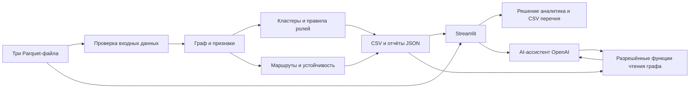

# Граф денег — EpiQ

[](https://github.com/BAITC-Hacks/hack-144ec83b-epiq/actions/workflows/ci.yml)

**От исходных клиентов — к цепочке переводов и обоснованному списку проверок.**

## О проекте

MVP для кейса Freedom на HackAlem AI. Инструмент помогает AML-аналитику исследовать
обезличенную транзакционную сеть до четырёх колен: найти точки сбора и распределения
денег, изучить связи и выбрать участников для углублённой проверки.

Аналитик получает приоритетный список, числовое обоснование роли, историю операций
и рекомендации следующего запроса. Результаты — гипотезы по наблюдаемым данным,
а не установление личности, виновности или фактического руководства группой.
Это прототип команды, а не официальный сервис банка.

## Что реализовано

- Проверка трёх Parquet-файлов: обязательные поля, уникальность узлов и пар связей,
  положительные суммы, наличие участников, согласованность сумм и числа операций.
- Направленный взвешенный граф; признаки оборота, связности, PageRank,
  приближённого посредничества и достижимости из исходных узлов — seed.
- Кластеры Louvain внутри слабосвязных компонент.
- Шесть объяснимых ролей: аккумулятор, распределитель, транзит, конечный узел,
  координатор, периферия. Приоритет и краткое обоснование для каждого узла.
- Топ-20 в CSV; до 200 кандидатов после фильтров в интерфейсе; поиск по `gid`.
- Фильтры ролей, приоритета и сигналов; сценарии поиска сборщиков,
  дальнейшего движения денег и границы наблюдения.
- Восемь представлений: «Сеть», «След денег», «Общие получатели», «Операции», «Маршруты»,
  «Устойчивость», «Связи», «Кластеры».
- Граф окружения на один или два шага, до 60 связей, масштабирование и перемещение.
  Цвет узлов обозначает роль; связи с сигналами подсвечиваются и имеют пояснения.
- Маршруты A→B→C с примерами дат, сумм и задержек; неизвестный порядок
  операций одного дня явно отмечается.
- Общие получатели для 2–5 выбранных seed: направленные пути до четырёх
  переходов из каждого исходного клиента, суммы связей и экспорт доказательных путей.
- Повторяющиеся цепочки: минимум два непересекающихся эпизода A→B→C,
  задержка 1–2 дня, отношение выхода ко входу 0,8–1,2; даты и суммы каждого эпизода.
- Разбор места в рейтинге: вклады пяти факторов и сравнение с другим кандидатом из топ-20.
- Три примера для защиты автоматически выбираются из результатов и сохраняются в `out/demo_cases.md`.
- Временные сигналы, синхронные плательщики, дневные всплески, аномальность
  относительно своего колена и участие в сильносвязных группах с циклами.
- Стресс-тест связности после удаления топ-1, 5, 10 и 20 узлов.
- Карточка участника с пробелами данных и рекомендацией следующего запроса.
- Перечень клиентов для проверки и/или запроса в правоохранительные органы,
  который аналитик формирует вручную и скачивает в CSV.
- AI-ассистент OpenAI: вопросы обычным языком, контекст выбранного узла, короткая
  история диалога и ссылки на результаты разрешённых функций анализа.
  Локальный режим по ключевым словам доступен без API.

## Как работает решение

1. Организатор предоставляет узлы, агрегированные связи и отдельные транзакции.
2. Пайплайн проверяет вход, строит граф и рассчитывает признаки.
3. Правила назначают роли, кластеры, приоритеты и объяснения.
4. Результаты сохраняются в CSV; сайт читает их и историю транзакций.
5. Аналитик выбирает сценарий и участника, изучает граф, путь от seed и операции.
6. Для связей с сигналами видит суммы и даты, проверяет ограничения.
7. Принимает решение, добавляет участника в перечень и выгружает его.

Система не отправляет запросы в правоохранительные органы и не блокирует счета.

### Правила и приоритет

`priority_score` лежит в диапазоне 0–1 и объединяет охват seed (30%), оборот (25%),
посредничество (20%), связность (15%) и силу роли (10%).
Изолированным узлам назначается нулевой приоритет.
В карточке «Почему такое место в топе» показаны слагаемые, их максимумы и разница
с выбранным кандидатом. Охват ограничен пятью seed; остальные структурные
признаки нормируются по перцентилям среди положительных значений. При одинаковом
приоритете применяется порядок по `gid`. Слагаемые сохранены в `node_features.csv`.

| Роль | Основные условия допуска |
|---|---|
| Аккумулятор | Не менее 3 разных плательщиков |
| Распределитель | Не менее 5 разных получателей |
| Транзит | Есть вход и выход; выход/вход 0,8–1,2; не seed и не `depth=4` |
| Конечный узел | Выход до 10% входа; ещё 2 дня наблюдения после последнего входа; не seed и не `depth=4` |
| Координатор | Достижим из 2+ seed, верхние 10% по посредничеству, связывает 2+ соседних кластера |
| Периферия | Ни одно содержательное правило не выполнено |

Это условия допуска: при нескольких подходящих ролях учитывается сила правил.
Формулы находятся в [scoring.py](src/money_graph/scoring.py),
пояснения — в [архитектуре](docs/architecture.md).

## Технологии

| Компонент | Назначение |
|---|---|
| Python 3.10+ | Расчётное ядро и запуск |
| pandas, NumPy | Обработка таблиц и вычисления |
| PyArrow, DuckDB | Чтение Parquet; DuckDB — резервный способ чтения в ядре |
| NetworkX, SciPy | Графовые алгоритмы и расчётная поддержка |
| Streamlit 1.64+ | Локальный веб-интерфейс |
| PyVis / vis-network | Интерактивный граф и свечение связей |
| OpenAI SDK / Responses API, GPT-5 mini | Опциональный AI-ассистент с вызовом локальных функций анализа |
| JSON Schema | Проверка аргументов инструментов, типов и лимитов |
| pytest | Автоматические проверки |
| GitHub Actions | CI с pytest на Python 3.12 / Ubuntu |

Диапазоны версий: [requirements.txt](requirements.txt), [pyproject.toml](pyproject.toml).
Роли и приоритеты рассчитываются правилами, модели на данных проекта не обучались.
Для AI-ассистента используется `gpt-5-mini` через OpenAI Responses API; нужен
отдельный API-ключ, интернет и доступные кредиты. Расчёт, граф и локальный режим
помощника работают без ключа и внешних API.

## Архитектура



Расчёт отделён от сайта. Интерфейс читает готовые результаты и дополнительно
проверяет временные сигналы на маршрутах показанного окружения для подсветки связей.

```text
run.py                           подготовка окружения, расчёт и запуск сайта
app.py                           интерфейс аналитика
.streamlit/config.toml           тема интерфейса
src/money_graph/
  io_validation.py               чтение, валидация и хеши входных файлов
  graph_features.py              граф, признаки, кластеры
  scoring.py                     роли, приоритеты, обоснования
  advanced_analysis.py           двухшаговые маршруты и устойчивость
  route_evidence.py              проверка пар операций и сигналы связей
  repeated_routes.py             повторения цепочек с независимыми окнами дат
  investigations.py              общие получатели и ограниченный обход от seed
  investigation_ui.py            интерфейс общих получателей и повторений
  demo_cases.py                  выбор проверяемых примеров из текущих данных
  assistant_tools.py             проверяемые функции чтения графа для AI
  ai_assistant.py                ограниченный цикл вызовов OpenAI Responses API
  assistant_ui.py                диалог, разрешение передачи данных, источники ответов
  pipeline.py                    оркестрация и запись результатов
  cli.py                         командный интерфейс расчёта
tests/                           проверки правил, результатов и маршрутов
docs/                            архитектура, аудит ТЗ и сценарий защиты
```

## Установка и запуск

### 1. Подготовьте окружение и репозиторий

Нужны Python 3.10+ с `pip` и `venv`, файлы данных организатора и интернет
для первой установки зависимостей. Git нужен только для клонирования;
вместо него можно скачать и распаковать ZIP репозитория.

```bash
git clone https://github.com/BAITC-Hacks/hack-144ec83b-epiq.git
cd hack-144ec83b-epiq
```

### 2. Подготовьте данные

Создайте папку `data` и распакуйте в неё три файла. Ниже показана структура,
**это не команды терминала**:

```text
data/
  nodes.parquet
  edges.parquet
  transactions.parquet
```

### 3. Запустите одной командой

Из папки репозитория:

```bash
python run.py
```

Скрипт проверит наличие данных и свободного порта, создаст `.venv` при необходимости,
установит недостающие зависимости, рассчитает результаты и запустит сайт.
Активация окружения не нужна. Откройте [локальное приложение](http://localhost:8501).
Остановка — `Ctrl+C`. На Linux/macOS при необходимости используйте `python3`.

Повторный запуск использует установленные пакеты, если их версии подходят,
и заново рассчитывает результаты. После установки пакетов расчёт работает без интернета.
Установка зависимостей и расчёт проверены в отдельной копии без `.venv` и без
готовых результатов на Windows / Python 3.14.7. Использовался тот же компьютер
и доступный кэш pip; это не проверка на отдельной чистой ОС. Подробности —
в [отчёте проверки](docs/release-verification.md).

### Дополнительные команды

```bash
# Только расчёт, без сайта
python run.py --no-ui

# Свои каталоги данных и результатов
python run.py --data "C:/dataset" --out "C:/results"

# Если порт 8501 занят
python run.py --port 8502
```

Если приложение уже работает на 8501, откройте его вместо запуска второй копии.
Сообщение `Missing data` означает, что нужно проверить папку `data` или `--data`.
При ошибке установки проверьте доступ к пакетам и совместимость версии Python.

### Подключение AI-ассистента — необязательно

Создайте локальный `.streamlit/secrets.toml` по примеру
[secrets.toml.example](.streamlit/secrets.toml.example):

```toml
OPENAI_API_KEY = "ваш_API_ключ"
OPENAI_MODEL = "gpt-5-mini"
```

`secrets.toml` исключён из Git. Также поддерживаются переменные окружения с теми
же именами; они имеют приоритет. Код активации API-кредитов не является API-ключом.
Официальная процедура — в [OpenAI Quickstart](https://developers.openai.com/api/docs/quickstart).

Откройте «Ассистент аналитика» → «AI · OpenAI». После разрешения передачи данных
введите вопрос, например «Почему выбранный участник в топе и что запросить дальше?».
OpenAI получает вопрос, последние сообщения диалога, выбранный gid и ограниченные
результаты функций — идентификаторы, суммы, даты и пути. Полные файлы не загружаются.
При отсутствии разрешения поле AI-вопроса отключено; локальный режим остаётся доступен.

Ответ содержит ссылки `[D1]` и раскрываемые данные. Модель не выполняет произвольный
код, не меняет граф и не отправляет запросы в другие организации. Подробнее:
[устройство и проверка AI-ассистента](docs/ai-assistant.md).

## Как проверить решение — сценарий для жюри

1. Подготовьте данные и выполните `python run.py`.
2. Проверьте `out/nodes_roles.csv`, `out/clusters.csv`, `out/top_nodes.csv`.
   Для исходной поставки кейса ожидается 2 248 узлов и 20 строк топа;
   на другом наборе количество узлов определяется входом.
3. На сайте выберите «Кто собирает деньги», затем участника из списка.
   Проверьте обоснование, число плательщиков, роль и приоритет.
4. Откройте «След денег» и «Операции». Для достижимого из seed участника
   будет показан путь; если пути нет или выбран сам seed, появится пояснение.
5. В «Сети» наведите на подсвеченную связь, если она есть. Янтарный означает
   операции в окне 0–2 дня, коралловый — также известный порядок по дням
   и сопоставимые суммы. Для операций одного дня порядок неизвестен.
6. Раскройте «Почему такое место в топе»: сумма пяти вкладов должна совпадать
   с итогом, а сравнение — объяснять разницу с другим кандидатом.
7. Откройте `out/demo_cases.md`: там находятся реальные `gid`, seed и даты
   для трёх примеров. В «Общих получателях» выберите 2–5 указанных seed,
   найдите сборщика и проверьте пути из каждого seed.
8. В «Маршрутах» выберите повторяющуюся цепочку из демо и сравните даты
   и суммы её эпизодов с «Операциями». В «Устойчивости» изучите изменение связности.
9. Выберите решение в карточке, нажмите «Добавить в перечень» и скачайте CSV.
10. Откройте `run_manifest.json`: время расчёта, версии и SHA-256 входа.
   Лимит ТЗ — менее пяти минут на исходном наборе; оценивается фактический
   расчёт, без времени установки зависимостей.

При пустом списке ослабьте фильтры. Наличие сигнала зависит от данных.
Тайминг защиты — в [сценарии демо](docs/demo-script.md).

### Автоматические тесты

После подготовки `.venv`, в Windows PowerShell:

```powershell
.\.venv\Scripts\python.exe -m pip install -r requirements-dev.txt
.\.venv\Scripts\python.exe -m pytest -q
```

Linux/macOS:

```bash
.venv/bin/python -m pip install -r requirements-dev.txt
.venv/bin/python -m pytest -q
```

Тесты используют синтетические примеры и не требуют данных организатора.
Проверяются ограничения ролей, согласованность топа, временные пары, циклические
связи, устойчивость и отсутствие переноса сигнала на посторонние рёбра.
Это не измерение точности обнаружения преступных схем.

После расчёта на реальных данных можно также проверить все восемь экранов,
вклады рейтинга, выбор seed, эпизоды и добавление решения:

```powershell
.\.venv\Scripts\python.exe scripts/smoke_ui.py
```

На Linux/macOS используйте `.venv/bin/python scripts/smoke_ui.py`.

Отдельная проверка настоящего API на полностью вымышленных данных (расходует кредиты):

```powershell
.\.venv\Scripts\python.exe scripts/smoke_ai.py --live --synthetic
```

Обычные `pytest` и `smoke_ui.py` не вызывают платный API.

## Данные и интеграции

Вход — локальная обезличенная выгрузка организатора. Parquet-файлы и результаты
исключены из Git через `.gitignore`.

| Файл | Обязательные поля |
|---|---|
| `nodes.parquet` | `gid`, `depth`, `is_seed` |
| `edges.parquet` | `src`, `dst`, `sum_kzt`, `n_tx`, `depth` |
| `transactions.parquet` | `src`, `dst`, `date`, `sum_kzt` |

`gid` — идентификатор участника; `src` / `dst` — отправитель / получатель;
`sum_kzt` — сумма в тенге; `n_tx` — число операций; `depth` — колено;
`is_seed` — исходный клиент. Пары связей и суммы должны совпадать с агрегацией
транзакций. Совпадающие строки операций сохраняются с предупреждением:
без `transaction_id` нельзя доказать, что это технические дубли.

| Выходной файл | Содержание |
|---|---|
| `nodes_roles.csv` | `gid`, `role`, `role_score`, `cluster_id`, `priority_score`, `evidence` |
| `clusters.csv` | Размер, seed, внутренний оборот, лидеры и гипотеза кластера |
| `top_nodes.csv` | Первые 20 узлов или все узлы, если их меньше 20 |
| `node_features.csv`, `edges.csv` | Признаки и связи для интерфейса |
| `route_patterns.csv` | До 200 крупнейших структурных маршрутов с проверкой примеров операций |
| `repeated_routes.csv`, `route_episodes.csv` | Повторяющиеся маршруты и отдельные датированные эпизоды, без лимита топ-200 |
| `resilience.csv` | Результаты удаления топовых узлов |
| `demo_cases.md`, `demo_cases.json` | Примеры сборщика, повторяющегося маршрута и границы наблюдения, если они есть в данных |
| `quality_report.json` | Проверки входа, предупреждения и сводные показатели |
| `run_manifest.json` | Версия правил, SHA-256 входа, версии библиотек и длительность |

Банковские API и внешнее обогащение клиентов не подключены.
OpenAI — опциональная внешняя интеграция помощника; включается пользователем.
Ресурсы PyVis встраиваются в HTML. Локальный запуск не является интеграцией
с инфраструктурой Freedom.

## Ограничения текущей версии

- Наблюдение ограничено выгрузкой: четвёртое колено обрывается, вход seed неполон,
  отсутствующие переводы не восстанавливаются.
- Порог исключения переводов ниже 5 000 KZT описан для исходной поставки кейса;
  приложение само такой фильтр при загрузке не применяет.
- Нет размеченных ролей: точность, полнота обнаружения и снижение потерь не измерены.
  Оценки правил не являются вероятностями виновности.
- Путь от seed структурный: хронология всей цепочки не проверяется. Проверка
  времени реализована для A→B→C и не доказывает движение одной и той же суммы.
- Порядок внутри дня неизвестен. Сопоставимость 80–120% — экспертная эвристика;
  разбиение и объединение нескольких платежей не сопоставляются.
- Повторения считаются консервативно: один и тот же маршрут, непересекающиеся
  окна дат, без увеличения счётчика от совпадающих строк. Одна операция может
  поддерживать разные альтернативные маршруты; их суммы нельзя складывать.
- Общий получатель определяется по направленной достижимости из каждого seed.
  Это не доказательство совместного управления счетами или хронологии всей цепочки.
- `cycle_size` — размер сильносвязной группы, а не длина одного простого цикла.
  Хронология полного кольца не проверяется.
- Граф показывает ограниченное окружение; подсветка проверяет только его
  двухшаговые маршруты. Отсутствие подсветки не означает безопасность.
- Локальный помощник понимает ключевые слова. AI-режим использует LLM и семь
  ограниченных функций чтения; неподдерживаемые фильтры требуют уточнения.
  Ответы модели могут ошибаться и должны сверяться с раскрываемыми данными.
  Автоматически проверяются полные gid и ссылки на источники, но не вся семантика текста.
- AI отправляет часть данных внешнему провайдеру после разрешения пользователя.
  До трёх вызовов функций и четырёх API-запросов на вопрос; ошибки не повторяются
  автоматически. История хранится только в текущей сессии.
- Решения хранятся в сессии Streamlit; перечень нужно выгружать в CSV.
  Нет постоянного хранилища дел, авторизации, разграничения прав и журнала действий.
- Нет потоковой обработки, банковских интеграций и автоматической отправки запросов.
- Миллионы узлов не тестировались. Зависимости заданы диапазонами версий,
  полноценного lock-файла окружения нет.

## Развёрнутая версия

Публичный адрес deployed-версии в репозитории не указан.
Доступен [локальный сайт](http://localhost:8501), который работает только
на компьютере, где запущен проект.

## Переход к миллиону узлов

Это направление развития, не реализованный результат. Потребуются колонночная
обработка Parquet, графовый движок с меньшими накладными расходами вместо NetworkX,
пакетный расчёт признаков и приближённое посредничество. Поиск временных пар нужно
ограничить индексом по узлу и дате, лимитами кандидатов и фоновыми задачами;
на больших узлах число пар быстро растёт. В интерфейс передаются агрегаты и
локальные подграфы. Для эксплуатации также нужны авторизация, журнал действий,
постоянное хранилище дел и проверка качества с аналитиками банка.

## Дополнительные материалы

- [Архитектура и направления масштабирования](docs/architecture.md).
- [Чек-лист технического задания](docs/tz-compliance.md).
- [Сценарий демонстрации](docs/demo-script.md).
- [Обзор открытых проектов и происхождение идей](docs/open-source-review.md).
- [Продуктовая адаптация к кейсу Freedom](docs/freedom-product-fit.md).

В обзоре источников отделены идеи от собственной реализации. Использование
стандартных алгоритмов и библиотек не означает подтверждённый результат
проверки на антиплагиат.
