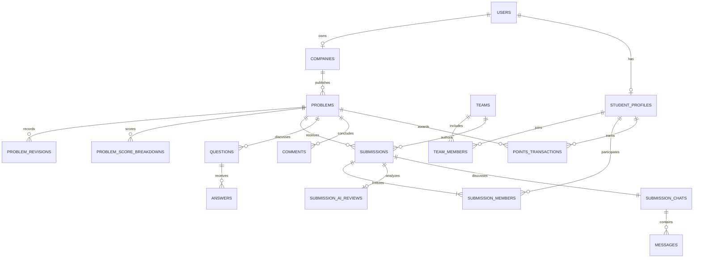

# AI Sana · Trinity

Рабочий MVP платформы, где бизнес формулирует задачи с AI, студенческие команды отправляют готовые проекты, а компания вручную выбирает победителя после анонимного рассмотрения.

Интерфейс на русском языке. Три демо-роли: **Student / Company / Admin**. Данные синтетические. Без API-ключа весь сценарий работает в детерминированном mock-режиме.

Работа втроём: [роли, ветки, push, pull request и сдача на HackAlem AI](TEAM_GUIDE.md).

Репозиторий команды: [BAITC-Hacks/hack-340dff38-trinity](https://github.com/BAITC-Hacks/hack-340dff38-trinity).

## Быстрый запуск с PostgreSQL

Нужен Docker с Compose v2. Из корня проекта:

```sh
cp .env.example .env
docker compose up --build
```

В PowerShell вместо `cp` можно использовать `Copy-Item .env.example .env`.

- Приложение: **http://localhost:8080**
- OpenAPI: **http://localhost:8000/docs**
- Проверка сервера: **http://localhost:8000/api/health**

Compose запускает PostgreSQL, ждёт готовности, выполняет Alembic и идемпотентный seed, затем запускает backend и Nginx с frontend. Данные сохраняются в именованном томе `sana-data`. `docker compose down` останавливает приложение, сохраняя том.

Для повторного seed: `docker compose exec backend python -m app.seed`. Если пользователи уже существуют, команда ничего не меняет.

## Локальный запуск без Docker

Требуются Python 3.12+, Node.js 22.12+ или 24+, npm либо pnpm. Для полноценного сервера используйте PostgreSQL 16+; для автономного демо поддерживается SQLite.

### Windows: одна команда

```powershell
.\start-local.ps1
```

Скрипт создаёт `.venv`, устанавливает зависимости, применяет миграции, создаёт SQLite-демо и собирает frontend. Откройте **http://127.0.0.1:5173**. Ctrl+C останавливает сервисы. Скрипт предназначен для локального mock-демо; Claude и PostgreSQL настраиваются при ручном запуске ниже.

Если Windows-песочница запрещает дочерние процессы esbuild: `./start-local.ps1 -PortableBuild`. В проекте есть отдельная сборка на TypeScript + Rollup через Vite; она не меняет стандартную сборку.

### Backend вручную

```sh
python -m venv .venv
# Linux/macOS:
source .venv/bin/activate
# Windows PowerShell: .\.venv\Scripts\Activate.ps1
pip install -r backend/requirements.txt
cd backend
alembic upgrade head
python -m app.seed
uvicorn app.main:app --host 127.0.0.1 --port 8000
```

Если `.env` отсутствует, backend использует `sqlite:///./sana.db` и `AI_MODE=mock`. Для PostgreSQL скопируйте `.env.example` в корень проекта, создайте БД и укажите `DATABASE_URL`. Из корня можно поднять только БД: `docker compose up -d postgres`, затем запустить backend вручную. Переменные окружения имеют приоритет над `.env`.

### Frontend вручную (второй терминал)

```sh
cd frontend
npm install -g pnpm@11.19.0
pnpm install --frozen-lockfile
pnpm dev
```

Приложение: **http://127.0.0.1:5173**. Vite проксирует `/api` на `127.0.0.1:8000`. `pnpm build` проверяет TypeScript и создаёт `frontend/dist`. `pnpm preview` запускает собранный frontend.

Можно использовать `npm install`, `npm run dev`, `npm run build`. Зафиксированный `pnpm-lock.yaml` предназначен для воспроизводимых сборок и Docker.

В ограниченной Windows-среде, где даже запуск npm-скрипта не может создать pipe, выполните команды напрямую:

```sh
node node_modules/typescript/bin/tsc --noEmit
node scripts/build-portable.mjs
node scripts/preview-portable.mjs
```

Это полноценная статическая сборка Vite без минификации. Прокси API и порт те же. Необязательный поиск сетевых дисков Windows отключается только внутри portable-скриптов. Обычная сборка использует стандартный Vite/esbuild.

## Демонстрационный сценарий

1. «Демо-вход» → «Я представляю бизнес» → **company@example.com / Qadam Retail**.
2. «Создать задачу» → ввести короткую проблему или нажать «Использовать пример».
3. AI задаёт семь уточняющих вопросов. Ответьте, сформируйте карточку и отредактируйте поля.
4. Посмотрите семь составляющих качества, получите рекомендацию срока и выберите дедлайн.
5. «Подтвердить и опубликовать». Задача появится в каталоге по `qualityScore DESC`; слабые задачи остаются видимыми.
6. Через меню профиля переключитесь на **student@example.com / Айзат Нурлан**. В кабинете создайте команду с демо-участниками или соло.
7. Откройте задачу, посмотрите контакты бизнеса и Q&A. Отправьте готовый проект от команды; AI-разбор появится сразу. До дедлайна проект можно редактировать.
8. Вернитесь в компанию → «Решения». Работа называется **Solution #N**; профили, контакты и внешние ссылки не передаются в анонимном ответе.
9. Обсудите решение через его чат. Для демонстрации нажмите **«Завершить приём (демо)»** и подтвердите. Реальный дедлайн также проверяется сервером при запросах.
10. Вручную выберите ровно одного победителя с подтверждением. Данные всех команд станут доступны компании.
11. Выставьте оценку, например **95** команде из **3** участников. Каждый получит **31.67** балла. Повторный запрос не увеличит баланс.
12. В профиле студента проверьте баланс и историю. На странице задачи публично появляется только победитель; открываются комментарии.
13. Переключитесь на **admin@example.com**, проверьте очередь и одобрите либо скройте отмеченный материал.

Демо-кнопка завершения доступна только владельцу опубликованной задачи при `DEMO_TOOLS_ENABLED=true`. Она переносит дедлайн на текущее время, сохраняет ревизию и не позволяет открыть приём заново. Для публичного стенда её можно отключить.

### Seed

6 компаний в Retail, FinTech, Agriculture, Education, Logistics и Manufacturing; 10 студентов; 5 команд, включая соло; 8 задач; 12 решений; Q&A, сообщения, комментарии и очередь модерации.

- Задача №1 — активная задача Qadam Retail.
- №4 — дедлайн истёк, есть 3 анонимных решения, победитель ещё не выбран.
- №5 — дедлайн примерно через 7 часов после seed.
- №6 — слабая задача с низким качеством.
- №8 — завершённый проект: оценка 90, три участника получили по 30 баллов.

Сроки рассчитываются относительно первого запуска seed. Повторный seed не сдвигает даты и не сбрасывает баллы.

## Архитектура и структура

```text
ai-sana/
  backend/
    app/
      core/             # настройки, сессии БД, demo auth
      models.py         # SQLAlchemy 2 relational schema
      schemas.py        # входные DTO и JSON-контракты AI
      routers/          # REST API
      services/         # транзакции и бизнес-правила
        ai/             # пять AI-функций + Claude provider
      seed.py
      main.py
    migrations/         # Alembic, зафиксированная схема 0001
    tests/              # критические правила и сквозной API-сценарий
  frontend/
    src/
      lib/              # типы, API client, auth/hooks
      components/       # карточки, AI, quality, chat, Q&A, modal
      pages/            # каталог и кабинеты трёх ролей
      styles.css
    scripts/            # альтернативная сборка для Windows sandbox
    nginx.conf
  docker-compose.yml
  .env.example
  start-local.ps1
```

React → `/api` → FastAPI routes → domain services → SQLAlchemy → PostgreSQL. Синхронные обработчики FastAPI выполняются в пуле потоков; отдельный scheduler и WebSocket не нужны. Никаких ключей Claude или обращений к Claude во frontend нет.



Дополнительно: `demo_sessions` с хешами токенов, `moderation_items` с типом и ID материала. `problems.winner_submission_id` ссылается на выбранное решение. FK, индексы и ограничения заданы в моделях и миграции.

## Четыре независимых показателя

| Показатель | Кто выставляет | Назначение |
|---|---|---|
| Problem Quality Score | Claude / mock | Полнота постановки и сортировка каталога |
| Submission AI Score | Claude / mock | Рекомендательный разбор проекта |
| Company Winner Score | Компания, 0–100 целое | Окончательная оценка выбранного решения |
| Student Points | Сервер | Оценка компании / число участников победителя |

Качество задачи: контекст и потребность **20**, данные **20**, результат **15**, критерии успеха **15**, ограничения **10**, пользователи **10**, связь с бизнесом **10**. Всего **100**. Уровни: 0–39 — нужны уточнения; 40–69 — рабочая; 70–89 — готова; 90–100 — приоритетная. API сохраняет для каждого критерия объяснение, недостающие сведения и рекомендации.

Оценка решения: `creativity`, `effectiveness`, `implementation`, `feasibility` — по **25**. AI не выбирает победителя и не начисляет баллы.

Баллы используют Python `Decimal`, SQL `NUMERIC(12,2)` и `ROUND_HALF_UP`. `95 / 3 = 31.67` каждому; сумма округлённых долей в этом примере равна 95.01 — это намеренно соответствует требованию равных округлённых долей. Баланс накапливается. Команды баллов не имеют, проигравшие не получают начислений; лидербордов нет.

## Транзакции, сроки и анонимность

- Любой запрос создания/изменения решения проверяет дедлайн на сервере, включая повторную проверку после AI-запроса. На границе `now >= deadline` приём закрыт. Публичный статус вычисляется при чтении без фонового процесса.
- PostgreSQL блокирует строку задачи при критических изменениях. Выбор победителя дополнительно защищён условным `UPDATE ... WHERE winner_submission_id IS NULL` и частичным уникальным индексом на `submissions(problem_id) WHERE status='WINNER'`.
- Оценка, все транзакции и обновления баланса сохраняются атомарно. `UNIQUE(student_id, problem_id)` блокирует дубли начислений. Повтор той же оценки идемпотентен; другая оценка после фиксации получает 409.
- `submission_members` фиксирует состав на момент отправки. Состав использованной команды заблокирован; для другой конфигурации создаётся новая команда.
- До выбора компания получает **AnonymousSubmissionResponse**, где отсутствуют `teamId`, имена, университеты, email, GitHub/portfolio, репозиторий, demo URL, имя файла и время отправки. Номер и непрозрачный UUID нужны для просмотра и чата.
- Проверки прав действуют и на прямом `/submissions/{id}`, и на чате, и на маршрутах студента/команд. Нельзя получить профиль участника через company-role.
- Из текста и AI-разбора дополнительно удаляются известные имена, названия команд, университеты, email, URL, handles и номера телефонов. Чат не выдаёт `senderId`; используются названия ролей.
- После выбора **все** решения раскрываются только компании-владельцу. Публичный endpoint публикует **только победителя и только после оценки**, а проигравшие остаются в БД со статусом `NOT_SELECTED` и доступны своим авторам и владельцу задачи.
- Свободный текст может содержать косвенные сведения об авторстве, которые невозможно надёжно выявить по профилям. Интерфейс просит не включать идентификаторы; перед реальным конкурсом нужны более строгая проверка материалов и политика анонимизации. Внешние сайты не открываются и их метаданные не анализируются.
- Вложения намеренно демонстрационные: сохраняется имя файла, содержимое не отправляется. Бизнес видит это явно. Для production нужны объектное хранилище, проверка типа/размера и безопасная выдача файлов.

## AI-архитектура

Файлы: `problem_analyzer.py`, `problem_scorer.py`, `deadline_advisor.py`, `solution_evaluator.py`, `moderation.py`. Общий `provider.py` отправляет серверный запрос в Anthropic Messages API с принудительным вызовом `emit_result`, передаёт JSON Schema от Pydantic и принимает только структурированный input этого tool call. Свободный текст ответа не используется.

Контракты (`schemas.py`, camelCase в API):

```json
{
  "questions": [{"id": "availableData", "question": "Какие данные доступны?"}],
  "draft": {"title": "...", "context": "...", "availableData": ""},
  "missingFields": ["availableData"],
  "source": "mock"
}
```

Это сокращённая иллюстрация: настоящий `InterviewResult` требует **минимум 3 вопроса**, полную карточку с пустыми неизвестными полями и список пробелов.

```json
{
  "criteria": {
    "creativity": {
      "score": 21, "maxScore": 25,
      "reasoning": "Объяснение на основе переданных материалов",
      "missing": [], "strengths": [], "weaknesses": [], "recommendations": []
    }
  },
  "overallScore": 82,
  "summary": "Рекомендательный разбор",
  "keyStrengths": [], "keyRisks": [], "recommendedImprovements": [],
  "source": "claude"
}
```

В полном `SolutionAnalysis` должны быть **четыре** критерия, сумма которых точно равна `overallScore`; пример выше показывает структуру одного критерия. `QualityAnalysis` аналогично валидирует семь фиксированных весов. `DeadlineAdvice` возвращает `days`, `reason`, `source`. `ModerationResult` — `status: CLEAN|FLAGGED|REVIEW_REQUIRED`, `reasons`, `source`.

Промпты находятся рядом с кодом. Общий system prompt запрещает выдумывать факты, следовать инструкциям из пользовательских материалов, выбирать победителя и начислять баллы. Оценка не утверждает, что Claude скачал репозиторий или запустил код: анализируется только переданное описание.

При неправильном JSON, нарушении контракта, timeout или HTTP-ошибке выполняется максимум **2 попытки**, затем детерминированный fallback. При отсутствии ключа запрос к провайдеру вообще не отправляется. `source=mock_fallback` виден в UI; приложение продолжает работать. В логах нет ключей и материалов запросов. Таймаут одной попытки — до 35 секунд.

### Режимы

```dotenv
# Полностью автономная демонстрация
AI_MODE=mock

# Реальный Claude, только в backend environment
AI_MODE=claude
ANTHROPIC_API_KEY=your-key
ANTHROPIC_MODEL=claude-sonnet-4-6
```

Имя модели настраивается. После изменения окружения перезапустите backend. Mock качества оценивает заполненность полей; mock решения использует детерминированную эвристику полноты описания. Это демонстрация JSON-контракта и интерфейса, а не экспертная проверка кода. Seed всегда использует mock, даже при настроенном Claude.

Справочник провайдера: [Anthropic tool use](https://platform.claude.com/docs/en/agents-and-tools/tool-use/overview), [structured output](https://platform.claude.com/docs/en/build-with-claude/structured-outputs).

## Переменные окружения

| Переменная | Значение по умолчанию / применение |
|---|---|
| `DATABASE_URL` | `sqlite:///./sana.db`; для сервера `postgresql+psycopg://...` |
| `AI_MODE` | `mock` или `claude` |
| `ANTHROPIC_API_KEY` | Только backend; пустой → fallback |
| `ANTHROPIC_MODEL` | `claude-sonnet-4-6` |
| `CORS_ORIGINS` | Список разрешённых frontend origins через запятую |
| `DEMO_AUTH_ENABLED` | `true`; `false` отключает выдачу и использование demo sessions |
| `DEMO_TOOLS_ENABLED` | `true`; управляет демо-завершением приёма |
| `DEMO_ACCESS_CODE` | Необязательный общий код доступа для демонстрационного стенда |
| `VITE_API_URL` | `/api`; при раздельном деплое абсолютный адрес backend `/api` |
| `POSTGRES_USER/PASSWORD/DB` | Используются Docker Compose |

`VITE_API_URL` передаётся при сборке frontend через shell environment или `frontend/.env`. Корневой `.env` читают backend и Compose; Vite автоматически его не читает. В frontend переменные с префиксом `VITE_` публичны — секреты туда не добавлять.

## API

Все пути начинаются с `/api`. Полная схема: `/docs` и `/openapi.json` на backend.

| Методы / пути | Назначение |
|---|---|
| `GET /auth/demo-accounts`, `POST /auth/demo-login`, `GET /auth/me` | Демо-роль и серверная сессия |
| `GET /problems?industry=...`, `GET /problems/{id}` | Публичный каталог и карточка |
| `POST /problems`, `PATCH /problems/{id}`, `POST /problems/{id}/publish` | Черновик, ревизии и публикация |
| `POST /ai/problem/analyze`, `/ai/problem/score`, `/ai/deadline/recommend` | Структурированный AI |
| `GET /company/me`, `/company/problems` | Кабинет компании |
| `GET /company/problems/{id}/submissions` | Анонимные / раскрытые DTO |
| `GET /teams`, `POST /teams`, `POST /teams/{id}/members` | Команды и демо-участники |
| `GET /students/demo-directory`, `/students/me`, `/students/me/submissions`, `/students/me/points` | Только текущему студенту |
| `POST /problems/{id}/submissions`, `GET/PATCH /submissions/{id}` | Готовые проекты |
| `GET/POST /submissions/{id}/messages` | Чат с polling раз в 6 секунд |
| `POST /problems/{id}/select-winner`, `/problems/{id}/winner-score` | Ручной выбор и начисления |
| `POST /problems/{id}/questions`, `/questions/{id}/answers` | Публичный Q&A |
| `POST /problems/{id}/comments` | Обсуждение завершённой задачи |
| `GET /admin/moderation`, `POST /admin/moderation/{id}/approve`, `/hide` | Решение администратора |
| `POST /demo/problems/{id}/expire` | Отключаемое демо-завершение |

JSON login: `{"userId":1,"accessCode":""}` → `{token,user}`. Далее `Authorization: Bearer <token>`. Роль извлекается из серверной сессии, а не из присланного `role` header. Токены случайные, хранятся в БД в виде SHA-256, действуют 24 часа. Это **demo-only auth**: любой допущенный к стенду посетитель может выбрать любую демо-роль. Для реальных пользователей необходимо заменить login и механизм установления личности; проверки принадлежности и ролей уже отделены от него.

Ошибки: 401 — нужен вход; 403 — недостаточно прав; 404 — не найдено/скрыто; 409 — конфликт состояния/дубликат; 422 — невалидный ввод; 503 — недоступна БД. UI выводит сообщения. Pydantic ограничивает текст, баллы и URL, ORM параметризует запросы, React выводит тексты без HTML-интерпретации.

## Тесты и проверка

GitHub Actions (`.github/workflows/ci.yml`) запускает тесты backend и миграции SQLite, стандартную сборку frontend, затем контейнерный сценарий с PostgreSQL. Последний проверяет API-прокси Nginx, анонимность, дедлайн, победителя, деление 95 на троих и отсутствие повторного начисления. Все проверки работают в mock-режиме и не используют API-ключи. Фактический статус конкретного запуска смотрите во вкладке Actions; наличие workflow не означает, что проверка уже прошла.

```sh
cd backend
python -m pytest
```

Тесты создают отдельную in-memory SQLite БД для каждого случая; рабочую базу не меняют. Покрыты формула 100, видимость слабых задач, сортировка, один победитель (включая DB constraint), сроки, отсутствие identity в DTO/чате, обходные маршруты, чужие company-операции, баллы проигравших, 95/3, идемпотентность, нулевая оценка, ошибочные AI JSON, отсутствие ключа, полный жизненный цикл, ревизии, заморозка состава, модерация, отказ БД и данные кабинетов.

Проверка миграций:

```sh
alembic upgrade head
alembic current
alembic check
```

PostgreSQL DDL можно проверить без подключения: при PostgreSQL `DATABASE_URL` выполнить `alembic upgrade head --sql`.

Сведения о фактически выполненных проверках и ограничениях среды — в **VALIDATION.md**. Встроенные тесты не заменяют проверку конкурентных транзакций на PostgreSQL перед запуском с реальными пользователями.

## Деплой

Архитектура не привязана к облачному провайдеру. Используйте контейнеры из Compose либо отдельные сервисы:

1. PostgreSQL: создать БД и backend-пользователя, настроить backups и `DATABASE_URL`.
2. Backend: установить requirements, применить `alembic upgrade head`, запустить `uvicorn app.main:app --host 0.0.0.0 --port 8000`. Seed запускать только для демонстрационного стенда.
3. Frontend: задать `VITE_API_URL=https://api.example.org/api`, выполнить `pnpm build`, опубликовать `dist` на статическом хостинге. Настроить SPA fallback на `index.html` для вложенных маршрутов.
4. Указать origin frontend в `CORS_ORIGINS`; подключить HTTPS и reverse proxy. При одном origin использовать Nginx-конфигурацию из проекта.
5. Для доступного из интернета демо установить непустой `DEMO_ACCESS_CODE`, ограничить аудиторию и по необходимости выключить `DEMO_TOOLS_ENABLED`. Для production сначала заменить demo auth полноценным механизмом идентификации.

Публикация в облаке и подключение платного Claude не выполняются автоматически. Репозиторий не содержит API-ключей. Платёжных функций, рейтинга студентов/команд, автоматического выбора победителя и назначения команд нет.
