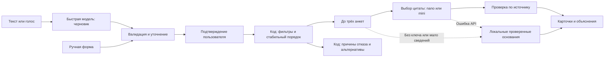

# LPV Match

Проект команды **LPV StartUp** для задачи Firebird, трек «Креативные индустрии». **AI-агент подбора подрядчиков через OpenAI API**: понимает текст или голос, уточняет заявку и после подтверждения помогает выбрать до трёх вариантов с индивидуальными основаниями из анкет. Модель выбирает проверяемые цитаты, а код обеспечивает бюджет, занятость и стабильный порядок. Локальный интерфейс демонстрирует AI-режим агрегатора; подключение к его промышленной системе не заявлено.

**Что получает заказчик:** короткий список с проверенными условиями, конкретной причиной выбора и понятным объяснением отказа. Например, для ведущих это разные основания: оборудование и DJ, опыт событий от 8 до 3000 человек, театральная и музыкальная специализация. Если бюджет или дата мешают выбору, альтернативы проверяются повторным поиском.

**Для жюри:** [пять критериев на 100 баллов и сценарий защиты](docs/JURY-GUIDE.md) · [полная проверка ТЗ](docs/SPEC-AUDIT.md) · [контракт интеграции](docs/ENGINE-API.md). Баллы присваивает жюри; ссылки ведут к проверяемым результатам, а не к самооценке.

## Быстрый запуск для жюри

После клонирования репозитория достаточно:

```sh
npm ci
npm run check
npm start
```

Открыть http://127.0.0.1:3000. `check` проверяет форматирование, тесты, двенадцать сценариев DoD, полный календарь, типы и production-сборку. Форма, готовые запросы и локальные объяснения работают без `.env.local`; данные и изображения уже в репозитории. В закрытой версии для жюри выданный организаторами ключ уже настроен в `.env`: чат, AI-объяснения и аудио работают после запуска при доступе к интернету. Создавать `.env.local` не нужно.

Проверка именно этой передачи жюри: [JUDGE-STARTUP-CHECK.json](docs/JUDGE-STARTUP-CHECK.json). В отдельной копии без `.env.local` успешно выполнены разбор текста, AI-объяснения и реальная транскрипция синтетической записи через ключ из `.env`. Более ранний протокол без ключа сохранён как проверка локального режима.

## Команда

- Ербол — [iamerbol](https://github.com/iamerbol): разработка, движок подбора, AI-интеграция и проверки.
- [kjhgkira](https://github.com/kjhgkira): документация и сценарий демонстрации.

## Текущее состояние

Работает локальное веб-приложение на Next.js. Реализованы:

- разговорный интерфейс с карточками в ответах и независимый ручной режим с фильтрами и результатами;
- голосовая запись, календарь доступности, демонстрационные запросы и состояния пустой выдачи;
- общее избранное в текущем браузере и единый чат на компьютере и телефоне;
- официальный CSV с 66 анкетами и 120 дополнительных синтетических профилей LPV; воспроизводимые импорт и генерация;
- TypeScript-контракты и валидация анкет и поисковых запросов;
- строгие фильтры, стабильное ранжирование, выдача до трёх анкет и причины исключения кандидатов;
- проверяемые предложения изменить дату или бюджет и локальные объяснения по фактам из анкет;
- AI-разбор свободного текста, уточняющие вопросы и объяснения с проверкой цитат;
- панель выполнения с использованными моделями, токенами, временем и оценкой стоимости;
- кеш ответов, локальный режим без ключа и сохранение результатов при отказе AI;
- тесты подбора и AI-интеграции, двенадцать сценариев приёмки, команды проверки типов, форматирования и сборки;
- конфигурация для жюри в `.env` и исключение личных переопределений `.env.local` из Git.

**Для поиска через форму API-ключ не нужен.** Для помощника и AI-объяснений используется выданный организаторами ключ из `.env`. Статус этапов — в [ROADMAP.md](ROADMAP.md), подробный сценарий демонстрации — в [RUNBOOK](docs/RUNBOOK.md).

Интерфейс подключён к `/api/brief`, `/api/calendar`, `/api/transcribe` и `/api/search`. **Распознавание текста или голоса заполняет черновик; подбор выполняется только после явного действия пользователя.** Старый `/api/agent` удалён; для интеграции используйте текущий [контракт движка](docs/ENGINE-API.md).

## Как пользоваться

1. Нажмите готовый запрос для немедленного поиска по показанным условиям. С включённым API можно описать событие в чате либо голосом: ассистент уточнит недостающие поля. Новая заявка изначально пустая, неизвестные дата и бюджет не подставляются.
2. Для своего запроса укажите город, категорию, формат, дату и бюджет на одного подрядчика в тенге; дополнительно — язык, длительность и пожелания. Проверьте черновик и нажмите **«Подобрать варианты»** в чате.
3. До трёх карточек появятся прямо в ответе ассистента. После поиска блок подтверждения скрывается до изменения заявки. Предыдущие поисковые ответы в истории текущей страницы сохраняют свои условия и карточки.
4. Для поиска через форму откройте **«Ручной режим»**, задайте условия и нажмите **«Найти до 3 вариантов»**. Результаты появятся ниже фильтров в том же окне. Дату можно выбрать в поле или через кнопку «цены», открывающую календарь.
5. Сохраните карточку сердечком и откройте **«Избранное»** в шапке. Это общее окно для результатов обоих режимов. «Повторить подбор на эту дату» запускает новый поиск в чате по сохранённым условиям.

При первом открытии ручная форма копирует текущую заявку чата; далее её фильтры и результаты независимы и сохраняются при закрытии окна до перезагрузки страницы. Кнопка «Сбросить» очищает ручную форму, а «Новый подбор» — заявку и диалог чата. Избранное сохраняется в обоих случаях. После изменения условий нужен новый поиск; нажатие предложенной альтернативы сразу применяет её и выполняет подбор в соответствующем режиме.

Алгоритм и интерфейс различают три результата: `matched` — найдены подходящие анкеты; `no_category` — в городе нет нужной категории; `no_matches` — категория есть, но никто не проходит ограничения. Если кандидатов меньше трёх, сводка сразу показывает количество анкет категории, число прошедших условия и причины исключения. Причины могут пересекаться. Если все заняты на дату, это указано явно: увеличение бюджета не предлагается как решение занятости.

## Архитектура MVP

Одно локально запускаемое приложение на **Next.js, React и TypeScript** содержит интерфейс и серверные API. Отдельная база данных и GPU не нужны.



| Компонент | Ответственность | Статус |
| --- | --- | --- |
| Локальный каталог | Импорт и проверка официального CSV с анкетами | Реализовано |
| Алгоритм подбора | Проверка города, категории, даты, бюджета, формата, языка и длительности; стабильное ранжирование | Реализовано |
| Локальные объяснения и альтернативы | Факты и выдержки из анкет; повторный поиск при предложенном изменении даты или бюджета | Реализовано |
| LLM на сервере | Разбор свободного запроса, уточнения и выбор подтверждающих цитат | Реализовано; ключ настроен для жюри |
| Интерфейс | Карточки в ответах чата, независимая ручная форма с выдачей под ней, основания и причины отсутствия результатов | Реализовано |
| Учёт API | Модель, назначение запроса, токены, задержка, кеш и оценочная стоимость | Реализовано в панели выполнения |
| Черновик, календарь и аудио | Поэтапное заполнение заявки, доступность по дням и расшифровка записи | Подключены к интерфейсу |
| Избранное | Карточки, условия сохранённого запроса и объяснения | Локально в текущем браузере |

Модель не должна отменять ограничения, проверенные кодом. Для одинаковых входных полей алгоритм сохраняет порядок результатов; при равных баллах сортирует по идентификатору анкеты. Ранжирование учитывает запас бюджета и совпадения пожеланий с описанием, не ослабляя строгие фильтры. Каждая предложенная альтернатива меняет только дату или только бюджет и проходит полный повторный поиск.

Альтернативы теперь доступны и при успешном подборе: увеличение бюджета должно добавить кандидатов, а другая дата — расширить выбор или снизить минимальную начальную цену среди подходящих анкет. Это изменение состава доступных подрядчиков, а не скидка или изменение тарифа одного подрядчика.

Доменный модуль не обращается к LLM. При отсутствии ключа, отключении AI-объяснений или ошибке объясняющей модели сохраняется локальный подбор с цитатами из каталога. Ошибка разбора свободного текста сообщается явно: помощник не заменяет запрос произвольными параметрами.

Подбор и отбор цитат — отдельные TypeScript-модули, не зависящие от интерфейса. `/api/search` возвращает `summary` с объяснением состава выдачи и `explanationEvidence`: точный фрагмент, источник `description`, способ выбора `code` или `model` и `quality: specific | limited`. При `limited` фрагмент сохраняется как источник, а объяснение сообщает о недостатке конкретных сведений. В `availability.busyCandidates` перечислены ID и имена занятых на дату анкет нужной категории в городе; у них могут одновременно нарушаться и другие ограничения. Интерфейс показывает эти имена среди причин исключения.

Для кратких описаний в `explanationEvidence[id].comparison` может добавляться сравнение по полям каталога: текст, источник `catalog_fields` и `peerIds` остальных показанных анкет. Оно вычисляется кодом без LLM и относится к текущей выдаче. Если сравнивать нечего, отличие не выдумывается; единственный вариант так обозначается лишь когда всего условиям соответствует одна анкета.

### Как используется AI

- `/api/brief` получает текст, частичную заявку и до четырёх сообщений истории. Из сообщений передаются только роль и текст; вложенные карточки, анкеты и результаты поиска остаются в интерфейсе. Быстрая модель вызывает `update_brief`; поля проверяются схемой Zod, а недостающие значения остаются незаполненными. Сам этот вызов не запускает поиск.
- `/api/search` выполняет поиск по структурированным полям. Модель не изменяет состав кандидатов и порядок ранжирования.
- Для объяснений код отбирает точные фрагменты описания по конкретности деталей и отличиям от анкет той же категории в городе; среди конкретных фактов приоритет получают связанные с пожеланием. Модель получает основания и до четырёх вариантов цитат для каждого из максимум трёх кандидатов с `quality: specific`; её выбор должен точно совпасть с допустимым фрагментом. Для остальных сохраняется локальное объяснение, а при отклонении AI-цитат показывается уведомление. Анкеты с `quality: limited` не передаются модели для выбора цитаты.
- Объяснение содержит дату, начальную цену, бюджет, формат и заданные язык и часы. При достаточном описании добавляется конкретный факт из анкеты; иначе явно обозначается нехватка сведений. Выявленный конфликт стиля с пожеланием выводится как ограничение, даже если строгие фильтры пройдены. Цитата подтверждает наличие утверждения в источнике, а не его независимую проверку.
- Для сложных объяснений используется `OPENAI_MODEL_REASONING`, для коротких — `OPENAI_MODEL_FAST`. Сложность определяется пожеланиями длиннее 15 символов либо одновременно заданными языком и длительностью.
- Ответы текстовых моделей кешируются на 30 минут в памяти процесса, максимум 150 записей. Кеш исчезает после перезапуска; повторное использование ответа не создаёт нового вызова модели. Аудио и результат его расшифровки не кешируются.
- Панель «Модели и расход API» показывает этапы, модели, фактическое `usage`, время и расчётную стоимость. Статистика относится к текущей вкладке, а не всему аккаунту; для неизвестного тарифа стоимость не вычисляется.

Подробности и критерии проверки: [план реализации](docs/IMPLEMENTATION.md).

### Черновик, календарь и голос

| POST-маршрут | Вход | Результат |
| --- | --- | --- |
| `/api/brief` | JSON: `message`, частичный `brief`, необязательная `history` до четырёх сообщений | Валидированный черновик, недостающие поля, следующий вопрос и расход модели |
| `/api/calendar` | JSON с частичными полями заявки без дополнительной обёртки | Для каждого дня: `available`, `withinBudget`, `minPrice`; до заполнения города, категории и формата — `ready: false` |
| `/api/transcribe` | `multipart/form-data`, поле `file` | Распознанный текст и статистика вызова |

`/api/brief` использует `OPENAI_MODEL_FAST`, сохраняет отсутствующие дату и бюджет незаполненными и **никогда не выполняет поиск**. Интерфейс отправляет `/api/search` после подтверждения. Если во время обработки пользователь изменил поля, устаревший ответ не затирает правки: разобранный вариант предлагается применить отдельно.

Календарь работает локально и охватывает 100 дней, с 23.09 по 31.12.2026. При подсчёте доступных анкет учитываются формат, язык и длительность; количество укладывающихся в бюджет показывается отдельно. Если бюджет не задан, `withinBudget` равен `null`; если подходящих анкет на дату нет, `minPrice` равен `null`.

Для голосового ввода используется `OPENAI_API_KEY` из `.env`; нужны разрешение на микрофон и поддержка `MediaRecorder` в браузере на localhost или HTTPS. Кнопка микрофона находится в чате рядом с отправкой сообщения; первое нажатие включает запись, второе завершает её и отправляет. Есть отмена и автоматическая остановка через **60 секунд**. Во время голосовой обработки приложение не переводит фокус в поля и не прокручивает диалог автоматически; уведомление позволяет перейти к обновлённой заявке отдельным нажатием.

API принимает непустой файл до **8 МБ** с поддерживаемым MIME-типом WebM, MP4/M4A, MP3 или WAV. Запись передаётся в OpenAI; приложение держит её только в памяти текущего запроса и не сохраняет на диск или в кеш. Таймаут обращения — 20 секунд. Стоимость аудио пока неизвестна: тариф текстовой модели к нему не применяется. Команда проверила реальную транскрипцию синтетической записи; физический микрофон пользователя при проверке не записывался. Подробности — в [VOICE-AND-BRIEF.md](docs/VOICE-AND-BRIEF.md).

### Избранное и иллюстрации

Избранное сохраняется в `localStorage` этого браузера и переживает перезагрузку страницы. Сохраняются анкета, условия запроса, объяснение и время добавления; это не бронирование и не подтверждение актуальной доступности. Для повторной проверки есть «Повторить подбор на эту дату». Синхронизации между устройствами нет; при запрете хранилища отметки доступны только до закрытия страницы.

Изображения карточек — локальные **AI-иллюстрации**, а не фотографии подрядчиков или подтверждённое портфолио. Они не влияют на отбор и ранжирование. Происхождение и назначение изображений описаны в [VISUALS.md](docs/VISUALS.md).

## Данные и ограничения

В репозиторий добавлен каталог организаторов: **66 анкет с уникальными идентификаторами, из них 13 отмечены как синтетические**. Исходный [CSV](data/contractors.csv) преобразуется в [JSON](data/contractors.json) с валидацией полей и проверкой числа и уникальности идентификаторов. Повторный импорт воспроизводит сохранённый JSON без изменений. Происхождение данных описано в [data/SOURCE.md](data/SOURCE.md).

**Каталог приложения — 186 анкет:** 66 исходных и 120 созданных командой. Дополнение лежит отдельно в [contractors.synthetic.json](data/contractors.synthetic.json), все его записи имеют `synthetic: true` и ID `LPV-SYN-*`. В карточках и профиле видна метка «синтетика LPV». Услуги, цены и календари этих профилей вымышлены для демонстрации; контакты и отзывы не добавлены. Для регенерации: `npm run data:generate`, для проверки: `npm run data:check`. Распределение по категориям и правила календарей — в [SOURCE.md](data/SOURCE.md).

Контракт [Contractor](src/domain/types.ts) предусматривает начальную цену `price_from_kzt`, даты занятости `busy_dates`, допустимые форматы, языки и максимальную длительность. Метки `synthetic`, `city_imputed` и `price_imputed` сохраняют сведения о происхождении данных.

- Бюджет задаётся в KZT, дата — в формате `YYYY-MM-DD`.
- Цена в анкете — начальная, а не окончательное коммерческое предложение.
- Поиск принимает даты только с **23 сентября по 31 декабря 2026 года**. Отсутствие даты в `busy_dates` означает доступность в рамках учебного календаря; интеграции с живым календарём нет.
- `max_hours: null` означает, что услуга не привязана к присутствию по часам; это не обещание неограниченной работы.
- Бронирование, отправка заявок и уведомления подрядчикам не входят в MVP.
- Дообучение модели не планируется.

## Подготовка и запуск

Требования: **Node.js 22.9 или новее**, npm, Git и доступ к этому репозиторию. Проверено на Node.js 22.22.3 и npm 10.9.8.

```sh
git clone https://github.com/BAITC-Hacks/hack-4ccbaf28-lpv-startup.git
cd hack-4ccbaf28-lpv-startup
npm ci
npm run dev
```

Откройте **http://127.0.0.1:3000**. Без ключа доступны «Ручной режим», готовые примеры, календарь, строгий поиск, альтернативы, локальные объяснения и избранное; ввод текста в AI-чат и запись голоса отключены. JSON уже включён в репозиторий: повторный импорт для запуска не требуется.

Для запуска production-сборки остановите dev-сервер, затем выполните:

```sh
npm run build
npm start
```

Команды выполняются из корня репозитория. Сервер слушает только `127.0.0.1`. Другой порт: `npm run dev -- --port 3001` или `npm start -- --port 3001`.

### Настройка OpenAI

Выданный организаторами ключ включён в `.env` по прямому разрешению владельца команды для проверки этого **закрытого** репозитория. Next.js автоматически загружает файл при запуске; чат, объяснения и транскрипция используют один ключ на сервере. Ключ не передаётся в JavaScript браузера.

Для собственного ключа создайте `.env.local` и задайте `OPENAI_API_KEY`: этот файл имеет приоритет и остаётся вне Git. Не копируйте пустой шаблон поверх готовой конфигурации перед демонстрацией. Ключ в истории репозитория доступен всем его участникам; перед публичным распространением он должен быть отозван и заменён.

Переменные из [.env.example](.env.example):

| Переменная | Назначение | Значение в примере |
| --- | --- | --- |
| `OPENAI_API_KEY` | Ключ для серверных обращений к OpenAI | Пустое |
| `OPENAI_MODEL_FAST` | Разбор запроса и короткие объяснения | `gpt-5.4-nano` |
| `OPENAI_MODEL_REASONING` | Объяснения для сложных запросов | `gpt-5.4-mini` |
| `OPENAI_MODEL_TRANSCRIBE` | Расшифровка аудио через `/api/transcribe` | `gpt-4o-mini-transcribe` |

Команда описала реальные вызовы текстовых моделей и транскрипции в [RUNBOOK](docs/RUNBOOK.md) и [VOICE-AND-BRIEF.md](docs/VOICE-AND-BRIEF.md); доступность на вашем аккаунте может отличаться. При замене текстовой модели требуется совместимость с используемыми Responses API, function calling, Structured Outputs и `reasoning.effort: none`. Текстовые вызовы ограничены таймаутом 6,5 секунды и длиной ответа — максимум 1100 выходных токенов; для объяснений лимит 1000. Модель расшифровки используется отдельно через API транскрипции; в автоматических тестах ответы всех провайдеров имитируются.

API ограничен 30 запросами в минуту на локальный процесс. В MVP нет регистрации, бронирования и интеграции NVIDIA.

## Демонстрация

**Бюджетный пример:** Алматы, 15 октября, Ведущий, корпоратив, 100 000 ₸, без дополнительных ограничений — Данияр (55 000 ₸) и Ильяс (85 000 ₸), оба с пакетами до 4 часов. В Астане на ту же дату выводятся три варианта. На 8 часов в этом бюджете совпадений нет: синтетические профили не обходят фильтры.

Готовые запросы «Ведущий на корпоратив», «Флорист на корпоратив» и «Ведущий до 100 тыс. ₸» показывают условия и **сразу запускают поиск по нажатию**. Во всех примерах явно указана фиксированная дата **15 октября 2026**, ограничения языка, часов и пожеланий не заданы. Для свободного текста помощник получает текущую дату по `Asia/Almaty`. Черновик чата и ручная форма запускают поиск по отдельной кнопке.

Для воспроизводимого сценария из отчёта задайте через «Ручной режим»: Алматы, Ведущий, корпоратив, **15.10.2026**, бюджет **1 000 000 ₸**, русский, 6 часов, пожелания «Интеллигентная, ненавязчивая подача и живой юмор». Нажмите «Найти до 3 вариантов». Следующая таблица использует эти условия; набор из готовой кнопки может отличаться, поскольку в ней не заданы дополнительные ограничения и пожелания.

| Сценарий | Действие | Ожидаемый результат |
| --- | --- | --- |
| Массовая категория | Задать перечисленные выше параметры → подтвердить | Мицури Канроджи, Буллма, Хаул — в этом порядке |
| Занятость | В ручном режиме выбрать 17.10.2026 через поле даты или календарь «цены» → «Найти до 3 вариантов» | Мицури исключён; Буллма, Хаул, Марат (`LPV-SYN-008`) |
| Редкая категория | Алматы, Флорист, корпоратив, 15.10.2026, 400 000 ₸; язык и часы не заданы, пожелания «Авторское цветочное оформление» → подтвердить | Одна анкета — Тони Тони Чоппер; объяснение сокращённой выдачи |
| Пустая выдача | В массовом сценарии уменьшить бюджет до 10 000 ₸ → подтвердить | Нет совпадений; возможные изменения даты или бюджета проходят повторный поиск |
| Нет категории | В ручной форме с условиями флористики выбрать «Зарубежье» → «Найти до 3 вариантов» | Отдельное сообщение об отсутствии категории |
| Избранное | Нажать сердечко, перезагрузить страницу, открыть «Избранное» | Карточка и условия сохранённого запроса остаются в браузере |

Для AI-сценария и показа расхода API следуйте [плану демонстрации](docs/RUNBOOK.md#сценарий-демонстрации-34-минуты). Результаты выше относятся к текущему учебному каталогу.

## Структура репозитория

```text
README.md                  — описание проекта и текущего состояния
ROADMAP.md                 — этапы и проверяемые условия готовности
.env                       — разрешённая конфигурация для жюри закрытого репозитория
.env.example               — шаблон для собственного ключа
package.json               — зависимости и команды проекта
data/                      — исходный CSV, каталог JSON и описание источника
docs/IMPLEMENTATION.md      — архитектура и технический план MVP
docs/README-HANDOFF.md      — материалы команды для документации
docs/JURY-GUIDE.md          — критерии оценки, сценарий защиты и планы развития
docs/REPRODUCIBILITY.json   — протокол команды для отдельной чистой копии
docs/RUNBOOK.md             — команды запуска, сценарий защиты и ограничения
docs/ENGINE-API.md          — контракт интеграции движка
docs/DEFINITION-OF-DONE.md   — сценарии приёмки и границы проверки качества
docs/DOD-RESULTS.json       — сохранённый отчёт команды о реальных API-вызовах
docs/SPEC-AUDIT.md          — сверка с ТЗ и границы качества объяснений
docs/SPEC-CHECK-RESULTS.json — отчёт проверки условий по всему календарю
docs/VOICE-AND-BRIEF.md      — новые API и критерии голосового интерфейса
docs/VISUALS.md             — происхождение демонстрационных иллюстраций
public/demo/               — локальные изображения для карточек
scripts/import-catalog.ts  — импорт и валидация каталога
scripts/generate-synthetic.ts — воспроизводимая генерация дополнения LPV
scripts/verify-dod.ts       — проверка двенадцати сценариев приёмки
scripts/verify-spec.ts      — независимая проверка 91 800 сочетаний условий
src/app/                   — страницы, стили и маршруты API
src/components/            — форма, карточки и панель выполнения
src/domain/                — типы, схемы, подбор, альтернативы и объяснения
src/server/                — каталог, разбор черновика, вызовы моделей и учёт расхода
tests/                     — проверки подбора и AI-интеграции
```

## Проверки

Единая команда полной локальной проверки: `npm run check`. В [протоколе команды](docs/REPRODUCIBILITY.json) отдельная чистая копия на macOS ARM64 прошла установку из lock-файла, проверки, сборку и HTTP-проверку без API-ключа. Зависимости устанавливались из локального кеша npm; протокол не является проверкой на второй машине или с пустым кешем.

Полная сверка с ТЗ: [SPEC-AUDIT.md](docs/SPEC-AUDIT.md). Дополнительный независимый прогон `verify:spec` проверил **91 800 запросов по всем 100 датам**, городам, категориям и форматам каталога при бюджетах 100 000, 1 000 000 и 10 000 000 ₸. Расчёт по исходным полям сверяет статус, количество и допустимость карточек без LLM; язык, длительность, некорректные входы и отказы API отдельно покрывает `npm test`. [Отчёт команды](docs/SPEC-CHECK-RESULTS.json).

Тесты отбора цитат проверяют, что метафоры об атмосфере и обещание вспомнить фотографии «через 10 лет» не принимаются за оборудование или стаж. В прогоне каталога без пожеланий семь описаний отмечены как `limited`: эвристика не нашла достаточно конкретного отличия. Эта метка не является экспертной оценкой подрядчика; человеческая оценка полезности объяснений остаётся отдельной задачей. При наличии различий добавляется проверяемое сравнение цены, указанного языка или лимита часов среди показанных анкет. Источник сравнения — `catalog_fields`; более высокая цена не выдаётся за признак лучшего качества.

```sh
npm test
npm run verify:dod
npm run verify:spec
npm run typecheck
npm run format:check
npm run build
```

Проверено локально: установка из lock-файла, **45 из 45 тестов**, двенадцать сценариев `verify:dod`, типы, форматирование и production-сборка проходят. В браузере проверены карточки в ответе чата, скрытие подтверждения после поиска, независимый ручной поиск с другим бюджетом и общее окно избранного. Календарь со сменой даты и сохранение избранного после перезагрузки проверены на предыдущем этапе интерфейса. Пустая выдача, редкая категория и отказ API также покрыты проверками доменного и серверного кода.

Тесты охватывают каталог, состояния поиска, строгие ограничения, стабильный порядок, календарь и альтернативы. Один тест выполняет **6600 запросов** по официальному календарю. AI-тесты проверяют недопустимые цитаты, сохранение состава кандидатов, кеш, отказ провайдера, уточнения, валидацию аргументов, проверку источника HTTP-запроса и расчёт стоимости.

Новые тесты проверяют неполный черновик без выдуманных значений и автоматического поиска, доступность и минимальную цену по всем 100 датам, полезность альтернатив после успешной выдачи, проверку аудиофайлов и отсутствие кеша транскрипции. Защита от устаревшего ответа помощника подключена к интерфейсу; функция сравнения версий проверена отдельно. Тест избранного проверяет сохранение, удаление дубликатов и отклонение повреждённых данных.

Тесты объяснений проверяют принадлежность цитат конкретной анкете, различия между карточками, отклонение общей фразы вместо конкретного факта и исключение занятых исполнителей при смене даты. Разбор черновика отклоняет недопустимые даты и неполную структуру аргументов инструмента; перестановка ключей объекта сама по себе не помечает заявку как изменённую.

Тесты подтверждают фиксированную дату готовых примеров, отсутствие скрытых ограничений и вычисление текущего дня по Алматы для относительных дат. Отдельный тест проверяет, что в историю `/api/brief` попадают только последние четыре текстовые реплики без вложенных результатов и анкет.

На собранном сервере без ключа дополнительно проверены ответы календаря для неполных и достаточных параметров, ошибка `/api/brief` при отсутствии ключа и отклонение неподдерживаемого файла в `/api/transcribe`. Реальное аудио провайдеру при этих проверках не отправлялось.

`npm test` использует имитацию ответов провайдера, а `npm run verify:dod` проверяет движок локально; обе команды не требуют ключа. В двенадцать сценариев входят массовая категория, повтор запроса, другая дата, редкая категория, отсутствие совпадений, отсутствие категории в городе, фотографы, два свободных зала, все занятые залы в декабре, редкая выдача из двух анкет и бюджетные ведущие в Алматы и Астане. Проверяются порядок, строгие ограничения, источник и различимость цитат, причина исключения по дате и время каждого ответа менее 10 секунд.

Для проверки с реальными вызовами с настроенным ключом выполните `npm run verify:dod:live`. Эта команда дополнительно требует реальную AI-обработку каждого сценария с совпадениями и кешированный повтор; она расходует API. Отчёт можно сохранить флагом `--report <путь-к-json>` после `--`.

В [отчёте команды](docs/DOD-RESULTS.json) за 23.09.2026 двенадцать сценариев с реальным API прошли: максимум 1,982 с, повтор из кеша — 11 мс, суммарная оценка текстовых вызовов — около $0,00496. Этот результат не гарантирует такую же задержку и стоимость других запросов. Автоматические проверки подтверждают опору на источник; полезность объяснений для человека остаётся предметом ручной оценки. Критерии и сценарий защиты — в [DEFINITION-OF-DONE.md](docs/DEFINITION-OF-DONE.md).

Транскрипция синтетической записи и мобильный экран 390×844 отдельно проверены командой; наблюдения зафиксированы в [VOICE-AND-BRIEF.md](docs/VOICE-AND-BRIEF.md).

Для повторного импорта: `npm run data:import`. Команда валидирует CSV и перезаписывает `data/contractors.json`.
