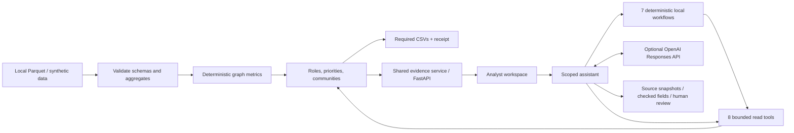

<p align="center">
  
</p>

# Aqsha Lens

**Explain the money graph. Show the evidence.**

An investigation workspace for the **Freedom Finance track at HackAlem AI**. Aqsha Lens turns the supplied transaction graph into explainable account roles, communities, a ranked review queue, and the three required CSVs. Inspect the numbers behind a result, follow directed transfers, compare role rules, and build an evidence-backed investigation brief.

The complete graph workflow runs locally with **no API key, GPU, database service, or subscription**. An original synthetic dataset makes the repository runnable without organizer files.

[Run locally](#run-locally) · [Deployment](#deployment) · [Required outputs](#required-outputs) · [Track coverage](#track-coverage) · [Architecture](#architecture) · [Verify](#verify-the-submission)


*Synthetic demo. Select an account, inspect the observed transfers, and open its evidence or assistant.*

> [!IMPORTANT]
> Roles are hypotheses about visible transaction structure. Scores measure heuristic role fit and review priority—not probability of crime. A depth-four account with no visible outflow is an **observation boundary**, not an established final beneficiary.

## Run locally

**Prerequisites:** Git, [uv](https://docs.astral.sh/uv/getting-started/installation/), and Node.js **22.12+** with npm. Use Bash on Linux/macOS or WSL on Windows. The first installation needs internet; uv installs Python 3.12 when needed.

```bash
git clone https://github.com/BAITC-Hacks/hack-5263c4cc-webspace.git
cd hack-5263c4cc-webspace
./scripts/dev.sh
```

Open **[http://127.0.0.1:8000](http://127.0.0.1:8000)**. The script installs locked dependencies, builds the interface, and starts the local service. With no data directory configured, expect **108 synthetic accounts, 114 directed relationships, and 447 transactions**, visibly labeled “Synthetic demo.”

After the initial build, restart with `uv run --frozen moneygraph serve`. For official data, retain `--data /absolute/path/to/data` or set `MONEYGRAPH_DATA_DIR` in `.env`. If port 8000 is occupied, use `PORT=8001 ./scripts/dev.sh` and open port 8001. API documentation is available at `/docs`.

### Use the official data

Extract the organizer's dataset locally. Point to the directory containing these files:

```text
data/
├── nodes.parquet         # gid, depth, is_seed
├── edges.parquet         # src, dst, sum_kzt, n_tx, depth
└── transactions.parquet  # src, dst, date, sum_kzt
```

```bash
MONEYGRAPH_DATA_DIR=/absolute/path/to/data ./scripts/dev.sh
```

The official dataset has **2,248 accounts, 3,119 directed relationships, 4,840 transactions, and 81 seeds**. Data is loaded at process startup; restart after changing it. Invalid schemas, duplicate IDs, missing endpoints, and inconsistent transaction aggregates fail explicitly instead of silently substituting demo data.

Account IDs travel through the API and browser as **exact decimal strings**, preserving int64 values above JavaScript's safe-integer limit. Engine calculations and required CSV identifiers retain integers; community IDs and numerical metrics remain numbers.

Organizer records, credentials, and generated exports are excluded from Git. The repository contains synthetic fixtures generated by the implementation, not redistributed bank records.

## Deployment

**Supported deployment:** one local machine or a private Linux server accessed through an SSH tunnel. One Python process serves both the compiled interface and `/api`; no separate frontend host, reverse proxy, GPU, or database server is required. The application has no multi-user login or tenant isolation, and its allowed hosts are restricted to loopback. A public domain or `0.0.0.0` binding is not a supported production deployment.

### Install, configure, and start

Run these commands from the repository checkout created above. A private repository requires a GitHub account with read access. Use Node.js **22.12+**, npm, and uv; the repository selects Python **3.12**.

```bash
uv sync --frozen --no-dev
npm --prefix web ci --include=dev --no-audit --no-fund
npm --prefix web run build
```

Keep uv's default **editable install** and the complete checkout, including `web/dist`. The service locates the interface relative to its Python source; a wheel-only or `--no-editable` installation does not package the frontend. Build-time npm dependencies are required even when `NODE_ENV=production`; `--include=dev` ensures TypeScript and Vite are installed. Node is needed for building, not for the running Python service. No Dockerfile or hosted-platform deployment configuration is included.

Create private configuration without replacing an existing file:

```bash
test -f .env || (umask 077; cp .env.example .env)
chmod 600 .env
```

Edit `.env` on the deployment machine. Do not put credentials in Git, a browser environment variable, a command argument, or a systemd unit.

| Setting | Default / deployment behavior |
|---|---|
| `MONEYGRAPH_DATA_DIR` | Unset: synthetic demo. For official data, use the absolute directory containing the three Parquet files. The service account must be able to read them. |
| `MONEYGRAPH_OUTPUT_DIR` | `outputs`; used by the export CLI, not as a database or frontend directory. |
| `MONEYGRAPH_AI_ENABLED` | `false`; local investigation actions work without a provider. |
| `MONEYGRAPH_ALLOW_EXTERNAL_AI` | `false`; both AI flags must be `true` before bounded evidence can leave the machine. |
| `OPENAI_API_KEY` / `OPENAI_MODEL` | Optional server-side credential and model. See [Investigation assistant](#investigation-assistant). |
| `MONEYGRAPH_MEMORY_PATH` | Unset: process memory. Optional private SQLite file; prefer an absolute path outside the checkout. This does not persist the browser's conversation list. |
| Request budgets | Defaults and supported names are listed in [`.env.example`](.env.example). Limits are per process. |

Already-exported environment variables override `.env`. Restart after changing data, configuration, or code. Keep **one process**: additional workers duplicate the graph and do not share request budgets or default conversation memory.

```bash
.venv/bin/moneygraph serve --host 127.0.0.1 --port 8000
```

Keep this terminal open; unattended operation requires a service manager. Open **http://127.0.0.1:8000**. To change the CLI port, pass `--port 8001`; `PORT=8001` applies only to `scripts/dev.sh`. The CLI disables access logging and proxy-header rewriting. Do not use the Vite development or preview server as the deployed application.

In another terminal, verify readiness:

```bash
curl --retry 10 --retry-connrefused --retry-delay 1 -fsS http://127.0.0.1:8000/api/health
curl -fsS http://127.0.0.1:8000/api/copilot/status
curl -fsS http://127.0.0.1:8000/ | grep -qi '<!doctype html'
```

Health must report `status: "ok"` and the intended `dataset_kind`. Copilot status checks configuration, not provider availability. Open the UI and inspect an account; for a credential-free check, run a local investigation action. An API-only JSON message at `/` means the frontend build is missing. The investigation UI works offline after installation; the optional `/docs` page uses external CDN assets.

### Private Linux server

Use a normal, dedicated login account with GitHub repository access, uv, Node.js 22.12+, and npm installed. On the server, use this checkout location so the service definition below works unchanged:

```bash
mkdir -p "$HOME/apps"
git clone https://github.com/BAITC-Hacks/hack-5263c4cc-webspace.git "$HOME/apps/aqsha-lens"
cd "$HOME/apps/aqsha-lens"
```

Complete **Install, configure, and start** above in this directory. Verify the foreground server, then stop it with **Ctrl+C** before starting the managed service. Keep data and any optional SQLite file readable/writable only by the service account. SQLite needs a writable parent directory and a regular, non-symlink database file; it is initialized on the first session request.

Create a systemd **user service** on the server:

```bash
mkdir -p "$HOME/.config/systemd/user"
cat > "$HOME/.config/systemd/user/aqsha-lens.service" <<'UNIT'
[Unit]
Description=Aqsha Lens investigation workspace

[Service]
Type=simple
WorkingDirectory=%h/apps/aqsha-lens
ExecStart=%h/apps/aqsha-lens/.venv/bin/moneygraph serve --host 127.0.0.1 --port 8000
Restart=on-failure
RestartSec=5
UMask=0077

[Install]
WantedBy=default.target
UNIT
systemctl --user daemon-reload
systemctl --user enable --now aqsha-lens.service
systemctl --user status aqsha-lens.service --no-pager
```

`%h` expands to the service user's home directory. The CLI loads the checkout's `.env`; the unit contains no credentials and performs no dependency installation at startup. For service startup after reboot and operation after logout, an administrator must enable user lingering if server policy allows it:

```bash
sudo loginctl enable-linger "$USER"
```

From **your own computer**, open an SSH tunnel. Replace `your-user@your-server` with your server login:

```bash
ssh -N -o ExitOnForwardFailure=yes \
  -L 127.0.0.1:18000:127.0.0.1:8000 your-user@your-server
```

Keep the SSH session running and open **http://127.0.0.1:18000** locally. Port 18000 is on your computer; port 8000 remains on the server's loopback interface. If 18000 is occupied, change only the first port and the browser URL. Do not open application port 8000 to the internet. SSH access is the access boundary for this deployment; it does not add in-app user identities. [OpenSSH local-forwarding reference](https://man.openbsd.org/ssh#L).

Useful server commands:

```bash
journalctl --user -u aqsha-lens.service -n 100 --no-pager
systemctl --user restart aqsha-lens.service
systemctl --user stop aqsha-lens.service
```

The server's health check uses `http://127.0.0.1:8000/api/health`; the equivalent check through your tunnel uses local port 18000. Test a local assistant action after setting `MONEYGRAPH_MEMORY_PATH`, because health alone does not initialize conversation storage. This service template and tunnel syntax are provided for Linux administration; no remote server was provisioned or SSH deployment performed as part of the submission.

### Update or roll back a deployment

Use a maintenance window. Stop the running service before replacing its code or assets; old browser tabs may reference removed JavaScript chunks. Save any evidence packets you need before reloading, because browser conversations do not survive refresh. Preserve `.env`, organizer data, exports, and any private SQLite file separately from the code checkout. Back up SQLite only while the application is stopped.

For the Linux service above, first confirm `git status --short` is empty. Resolve local source edits before continuing; these instructions do not discard them. Record the current revision and update from `main`:

```bash
cd "$HOME/apps/aqsha-lens"
git status --short
AQSHA_PREVIOUS_REV=$(git rev-parse HEAD)
printf '%s\n' "$AQSHA_PREVIOUS_REV"
(
  set -e
  test -z "$(git status --porcelain)" || { echo "Resolve local source changes first." >&2; exit 1; }
  git fetch origin main
  systemctl --user stop aqsha-lens.service
  git switch --detach origin/main
  uv sync --frozen --no-dev
  npm --prefix web ci --include=dev --no-audit --no-fund
  npm --prefix web run build
  systemctl --user start aqsha-lens.service
)
```

Keep the printed revision for rollback; the shell variable lasts only for this terminal session. A detached checkout pins the deployed revision without rewriting repository history. `set -e` stops the update on the first failure. If installation or build fails after the service is stopped, keep it stopped until the previous revision is rebuilt successfully.

After startup, repeat the health, HTML, and UI checks above, then reload existing browser tabs. A new analysis version invalidates old conversation scopes. If you need to return to the recorded revision in the same terminal:

```bash
(
  set -e
  : "${AQSHA_PREVIOUS_REV:?Set this to the revision recorded before updating}"
  test -z "$(git status --porcelain)" || { echo "Resolve local source changes first." >&2; exit 1; }
  systemctl --user stop aqsha-lens.service
  git switch --detach "$AQSHA_PREVIOUS_REV"
  uv sync --frozen --no-dev
  npm --prefix web ci --include=dev --no-audit --no-fund
  npm --prefix web run build
  systemctl --user start aqsha-lens.service
)
```

Rollback changes application code and dependencies; it does not restore changed datasets, configuration, or conversation storage. Retain matching backups if those change. For a foreground deployment, use the same fetch/build sequence with **Ctrl+C** and the `moneygraph serve` command in place of `systemctl`.

### Deployment troubleshooting

| Symptom | Check and recovery |
|---|---|
| `uv` / `npm` not found, or unsupported Node version | Install [uv](https://docs.astral.sh/uv/getting-started/installation/) and [Node.js 22.12+](https://nodejs.org/en/download). Reopen the shell; check `uv --version`, `node --version`, and `npm --version`. |
| Health works, but `/` returns API-ready JSON | Build `web/dist` from the same checkout, then restart Python. Static assets are registered at application startup. |
| Blank or stale page after rebuilding | Reload the tab after the backend and frontend are updated together. The recovery screen offers **Reload workspace**; this clears browser conversations. |
| Port already in use | Stop the previous instance or use `--port` with the CLI. For SSH, change the local forwarded port; keep the remote destination aligned with the server. |
| `400 Invalid host header` | Open the documented localhost URL or SSH tunnel. Public DNS hosts are not enabled by a configuration variable. |
| Copilot/session request returns `403` | Use the same application origin. For development, the supported Vite origins use port 5173 and its proxy targets backend port 8000. |
| Wrong or synthetic dataset | Check the absolute `MONEYGRAPH_DATA_DIR`, service-user permissions, and whether a shell/service variable overrides `.env`; restart after correction. |
| Invalid dataset prevents startup | Fix the named schema/aggregation validation problem. The application does not fall back silently to synthetic data. |
| Assistant stays offline or returns fallback | Both AI flags and the server-side key are required. `/api/copilot/status` reports configuration only; inspect the sanitized fallback reason for provider/validation failure. Local actions remain available. |
| Session creation returns `503` | Check the private SQLite parent directory, ownership, write permissions and absence of a database symlink; restart after correcting configuration. |
| `429 Too Many Requests` | Respect `Retry-After`. Budgets are per process; adding workers is not a supported workaround. |
| User service stops on logout or does not start after reboot | Check user lingering and `systemctl --user status`; enabling lingering requires the server administrator's policy. |

**Verification scope:** the repository's frozen CLI was smoke-tested on a separate loopback port with synthetic data and AI disabled: health, expected dataset counts, compiled HTML, all 14 entry assets, and a local assistant action passed. Missing-build behavior and the CLI port rules were checked separately. The latest full application gate is recorded under [Verify the submission](#verify-the-submission). All Bash examples passed syntax checks, and the service unit passed `systemd-analyze --user verify` with the local checkout path substituted. Systemd supervision, SSH connectivity, and a remote host were not exercised by that smoke test.

## Required outputs

From raw Parquet to all three required CSVs in one command:

```bash
uv run --frozen moneygraph export --data /absolute/path/to/data --out outputs/submission
```

For the synthetic demo, leave `MONEYGRAPH_DATA_DIR` unset and omit `--data`.

| File | Exact columns |
|---|---|
| `nodes_roles.csv` | `gid, role, role_score, cluster_id, priority_score, evidence` |
| `clusters.csv` | `cluster_id, n_nodes, n_seed, sum_kzt_internal, top_gids, hypothesis` |
| `top_nodes.csv` | `rank, gid, role, priority_score, why` |

Every input account receives a role and cluster, including isolated seeds. Exported scores are in **[0, 1]**; the interface displays them on a 100-point scale. `evidence` is nonempty numerical text, at most 200 characters. `top_gids` is encoded as a JSON array within its CSV field. The official dataset produces 100 ranked accounts, exceeding the required minimum of 20.

A separate `provenance.json` records canonical input, algorithm, and output hashes. It supplements the required files; it does not change their schemas or certify the conclusions. Role `evidence` explains structural fit; the ranked shortlist's `why` explains priority contributions and observation adjustments.

**Measured official-data run, 23 September 2026:** **0.901 seconds** for a fresh offline Python process to analyze and export the supplied data, with dependencies already installed. Host: Linux x86_64, Python 3.12.12, eight logical CPUs. Installation is excluded; this is a local measurement, not a portability or million-node guarantee. [Current measurement and scope](docs/readme-current-verification.md).

| Verified official-data result | Value |
|---|---:|
| Accounts retained in role export | 2,248 / 2,248 |
| Communities / ranked accounts | 91 / 100 |
| Depth-four boundaries labeled `boundary_unknown` | 444 / 444 |
| Isolated seeds retained | 19 / 19 |
| Longest evidence string | 105 characters |

## Track coverage

The [official brief](https://docs.google.com/document/d/1JPLU-G6R25Ge2hVaY2J9cqvrx7FGExj87XKwJPaMz3o/edit) requires five core capabilities. Each has a direct inspection path:

| Required capability | Where to verify |
|---|---|
| Reproducible pipeline under five minutes | Export command and measured results above |
| Role, score, and explanation for every account | `nodes_roles.csv`; **Entities** search, including isolated seeds |
| Defensible role criteria and thresholds | Rules below; selected account's evidence and score decomposition |
| Network communities with statistics | **Communities** and `clusters.csv` |
| Ranked shortlist and interactive directed graph | **Overview**, **Investigation**, and `top_nodes.csv` |

All **eight optional categories** are implemented with explicit observation limits:

| Optional capability | Analyst action |
|---|---|
| Graph-cutoff handling | Inspect a depth-four account and its missing-outflow warning |
| Temporal patterns | Compare daily flows, spikes, and same-day multiple payers |
| Repeated routes and return flows | Inspect dated two-step routes and bounded cycle examples |
| Anomalies | Review depth-peer outliers and repeated-payment motifs |
| Network resilience | Compare connectivity after simulated removal of top-priority accounts |
| Natural-language assistant | Ask about a selected account or cohort of up to five; inspect checked fields, sources, and tool trace |
| Generated account card | Download an evidence dossier as Markdown |
| Completeness assessment | Read missing evidence and prioritized next requests |

[The complete criterion matrix](docs/criteria-matrix.md) links these features to implementation, tests, and search bounds. Additional work includes shared-collector path evidence, exact transfer tables, graph PNG export, and reproducibility receipts. Feature coverage does not establish detection accuracy.

The published rubric weights functionality **25%**, technical implementation **25%**, README/reproducibility **25%**, practical value **15%**, and development potential/originality **10%**. [Source audit](docs/research/readme-track-requirements.md).

## How roles and priorities work

The engine computes directed degrees, visible KZT sums, upstream seed reach, weighted PageRank, sampled directed betweenness, and daily flow overlap. Seeded, weighted Louvain clustering assigns every account to a community. Sorted inputs and deterministic tie-breaking make repeated exports reproducible.

| Role | Main eligibility rule |
|---|---|
| `consolidator` | At least 3 distinct incoming payers |
| `transit` | Non-seed with visible outflow; outflow/inflow ratio between 0.65 and 1.35 |
| `distributor` | At least 8 distinct outgoing recipients |
| `terminal` | Non-seed below the observation boundary, with inflow and no visible outflow |
| `coordinator` | Non-seed with at least 2 incoming and 2 outgoing counterparties, 2 neighboring communities, 2 upstream seeds, and positive betweenness at or above its 90th percentile |
| `peripheral` | No stronger eligible rule; includes isolated accounts |
| `boundary_unknown` | Depth ≥ 4 and no visible outflow; documented extension allowed by the brief |

Eligible roles receive explicit rule-fit scores; the strongest wins with a fixed tie order. Priority combines **20% PageRank + 20% betweenness + 20% seed reach + 15% incoming counterparties + 15% visible volume + 10% temporal overlap** after normalization. Boundary priority is multiplied by 0.65; isolates receive zero. [Exact formulas, normalization, and caveats](docs/methodology.md).

Optional signal searches and AI answers do **not** modify roles, rankings, or submitted CSVs. No model is trained on invented ground-truth labels.

## Architecture



| Layer | Shipped components | Code |
|---|---|---|
| Data and analysis | Polars, NetworkX, explicit rules | [`engine.py`](src/moneygraph/engine.py), [`signals.py`](src/moneygraph/signals.py) |
| Evidence and delivery | Shared read facade, FastAPI/Pydantic contracts, canonical CSV bytes | [`evidence.py`](src/moneygraph/evidence.py), [`http_contracts.py`](src/moneygraph/http_contracts.py), [`exports.py`](src/moneygraph/exports.py) |
| Assistant | Local workflows, optional OpenAI SDK, field checks, scoped memory | [`agent/`](src/moneygraph/agent/), [`copilot.py`](src/moneygraph/copilot.py) |
| Interface | React, Base UI/shadcn, assistant-ui, Phosphor, React Flow/Dagre, Recharts | [`web/src/`](web/src/) |

One Python service serves the compiled web app. HTTP and AI reads share derived signals; CLI downloads, HTTP downloads, and receipt hashes share a CSV serializer. OpenAPI schemas and generated TypeScript contracts have a drift check. Dependencies are locked in [`uv.lock`](uv.lock) and [`web/package-lock.json`](web/package-lock.json). [Architecture decisions](docs/architecture.md) and [module boundaries](docs/modular-monolith.md) explain the design. LangGraph, LangChain, Chroma, and Mem0 are researched options; the shipped runtime uses explicit Python modules and SQLite rather than those frameworks.

### Investigation assistant

The assistant is available from the header, sidebar, or **Ctrl/⌘ J**. It supports conversations, editing, retry, version navigation, copy, export, and stop-waiting controls. Each conversation keeps its selected account/cohort; opening a different graph node does not silently retarget it.

**Without API credentials**, choose one of seven local actions. These run deterministic evidence reads and templates:

| Action | What it returns |
|---|---|
| Explain priority | Score contributions and observation adjustments |
| Inspect patterns | Bounded routes, cycles, dated signals, and search limits |
| Find collectors | Common reachable accounts and directed path evidence |
| Test resilience | Structural changes after removing the top five accounts |
| Missing evidence | Prioritized requests needed to test the hypothesis |
| Challenge hypothesis | Observations, competing explanations, and unresolved questions |
| Investigation brief | A compact separation of facts, hypotheses, and next checks |

Use the action menu or recognized requests; unrelated questions receive a labeled account summary. This local mode is not a general-purpose language model.

To enable provider-backed answers, copy `.env.example` to `.env` and configure these server-side values, then restart:

```dotenv
OPENAI_API_KEY=your_key_here
OPENAI_MODEL=gpt-6-sol
MONEYGRAPH_AI_ENABLED=true
MONEYGRAPH_ALLOW_EXTERNAL_AI=true
```

Enable external processing only for data you are permitted to send. Provider or answer-validation failures return a labeled local summary and a sanitized fallback reason.

The model has **eight allowlisted read tools**, **3 model rounds**, **4 tool calls**, two concurrent runs, and bounded output/context/time budgets. It cannot execute arbitrary SQL, shell commands, URLs, or files. References must belong to the current run. Up to eight typed observations must match retrieved scalar fields; unsupported numerical literals trigger fallback. These checks do **not** establish semantic entailment, causality, ownership, or criminal intent.

Expand a reference to inspect its bounded source snapshot, exact canonical JSON, SHA-256 hash, and evidence version. Download an **unreviewed evidence packet** containing the answer, available sources, checks, and limitations. Hashes identify the supplied snapshots; they do not authenticate an analyst's conclusion. Session capabilities are excluded.

Follow-ups retain at most **6 messages / 12,000 characters**, bound to the dataset, code version, and selected accounts. Context defaults to process memory and expires **24 hours from creation**, with pruning on store operations. `MONEYGRAPH_MEMORY_PATH` optionally enables private SQLite storage; browser conversations disappear on refresh. A session handshake precedes the first remembered question; deletion and revision checks prevent late responses from restoring deleted context. Stop cancels browser waiting and does not guarantee cancellation of provider work. [Memory and execution limits](docs/architecture.md#scoped-conversation-memory).

> [!NOTE]
> Keep private data and paid API access on loopback. Browser-origin checks, a 96 KiB request-body limit, and per-process request budgets are implemented; multi-user authentication and tenant isolation are not. Default copilot limits are 12 requests/minute per peer and 30 globally, with matching burst sizes. See [`.env.example`](.env.example). OpenAI requests use `store=False`, which is not a Zero Data Retention guarantee.

## Verify the submission

```bash
./scripts/check.sh
uv run --frozen python scripts/evaluate_copilot.py
```

The first command installs frozen dependencies, runs backend and client tests, checks generated API contracts, and builds the production frontend. The evaluation script runs seven synthetic scenarios offline. With AI configuration enabled, `--live` attempts the paid provider checks on synthetic evidence only; fallback does not count as a successful live evaluation.

**Latest measured checks:** 263 backend tests, 10 client tests, generated-contract checks, and the production build passed. Seven offline scenarios passed; a separate synthetic live run completed all seven model cases with 39 checked observation fields and no fallback. These are engineering checks, not detection-accuracy or semantic-safety scores. [Current verification](docs/readme-current-verification.md) records commands and scope. The earlier [clean-checkout startup verification](docs/readme-verification.md) remains pinned to its original revision.

**Five-minute walkthrough:**

1. Run the official-data export live; inspect the three CSV headers and full account coverage.
2. Explain three reviewer-selected account IDs within one minute using visible counterparties, amounts, score factors, and [exact rules](docs/methodology.md). Walk through two or three in depth during the overall demo.
3. Include a depth-four boundary and an isolated seed; explain what the dataset cannot establish.
4. Follow a route or shared collector, inspect a dated signal, and compare a removal scenario.
5. Run **Challenge hypothesis** or **Investigation brief** without AI credentials; inspect a source and download its evidence packet. If enabled, show the model's checked fields separately from its interpretation.

For frontend development, run `uv run --frozen moneygraph serve` and `npm --prefix web run dev` in separate terminals. The Vite proxy forwards `/api` to the local backend.

After changing HTTP contracts, run `npm --prefix web run api:generate`; verify committed schema/types with `npm --prefix web run api:check`. After updating application code, rebuild and restart the backend together, then reload the browser so its API contract and JavaScript assets match.

## Limits and next steps

The official data is a **July 2026 outgoing intra-bank crawl**, limited to four hops and transfers of at least **5,000 KZT**. Outside inflows, other banks, smaller transfers, and later activity are missing. Visible sums are not balances; daily overlap cannot prove intraday order or trace the same funds. Communities do not prove affiliation. There are no ground-truth role labels, so precision, recall, AUC, and probabilities of wrongdoing are not reported.

At approximately **one million accounts**, move aggregation to partitioned Parquet, precompute versioned features and rankings, sample expensive centrality, and serve indexed bounded neighborhoods. Benchmark graph backends before selecting CPU/GPU infrastructure. Then evaluate usefulness against amount-only and degree-only baselines with domain reviewers. These are documented next steps, not measured capabilities. [Scaling decision](docs/architecture.md#adr-2-polars--networkx-at-this-scale).

## Documentation and sources

- [Official track brief](https://docs.google.com/document/d/1JPLU-G6R25Ge2hVaY2J9cqvrx7FGExj87XKwJPaMz3o/edit) · [Hackathon rules](https://edu.astanahub.com/hackathons/df4743f5-c492-415c-b45a-1f13adb78e06?tab=tracks)
- [Criterion coverage](docs/criteria-matrix.md) · [Methodology](docs/methodology.md) · [Architecture](docs/architecture.md)
- [Acceptance and evaluation plan](docs/acceptance.md) · [Measured validation](docs/validation.md)
- [Track requirements and judging source audit](docs/research/readme-track-requirements.md) · [README research and reference review](docs/research/readme-practices-sources.md)
- [Agent architecture research](docs/research/architecture-agent-hardening-2026.md) · [Framework and project comparison](docs/research/ecosystem-2026.md)
- [Third-party components and attribution](THIRD_PARTY.md) · [Engineering invariants](AGENTS.md)

The task-specific analysis, observation-boundary treatment, and export contracts were built for this case. Reused libraries and components are disclosed; organizer archives and third-party applications are not presented as an original finished solution.
