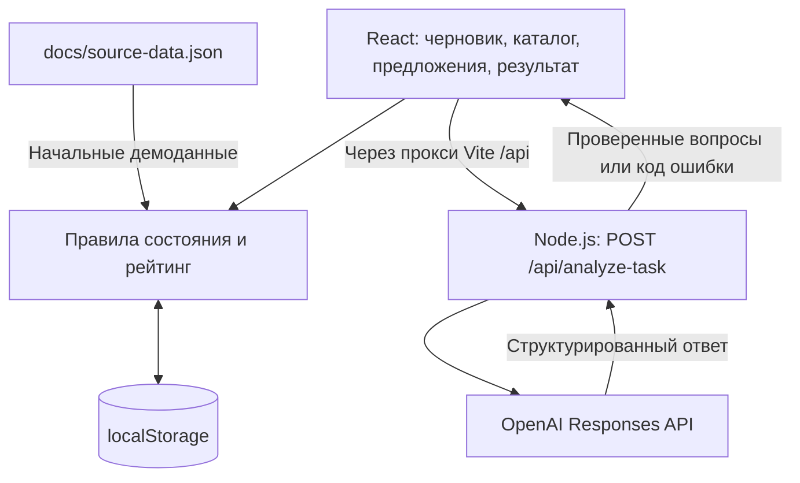

# NomadEX

**NomadEX — прототип платформы, которая помогает бизнесу сформулировать понятную задачу, получить предложения студенческих команд и подтвердить результат работы.**

Бизнесу бывает сложно описать проблему, ожидаемый результат и критерии приёмки так, чтобы команда могла предложить решение. NomadEX проводит пользователя от исходного описания через уточняющие вопросы к структурированной карточке и общему каталогу. Команды предлагают свои подходы, а окончательное решение принимает представитель бизнеса.

Текущая версия в `main` — локальная демонстрация для одного браузера: один профиль бизнеса и пять профилей команд переключаются в интерфейсе. Это не многопользовательский сервис с общей базой данных.

## Что реализовано

- Создание и редактирование нескольких черновиков: название, описание, отрасль и 11 полей постановки задачи.
- Анализ через OpenAI: определение недостающих сведений и 3–6 уточняющих или проверочных вопросов с объяснением их назначения. Ответы добавляются в поля карточки отдельной кнопкой пользователя.
- Локальные шаблонные вопросы по кнопке или при ошибке AI. Интерфейс явно отличает их от ответа OpenAI.
- Рейтинг готовности карточки от 0 до 100 с разбивкой по критериям.
- Подтверждение карточки человеком и публикация в каталоге. Любая правка черновика сбрасывает подтверждение; опубликованная карточка фиксируется.
- Общий для демопрофилей каталог: сортировка по убыванию рейтинга, затем по новизне публикации, при равенстве — по идентификатору.
- Одно предложение от каждой команды на задачу: идея, ожидаемый результат, план, срок, навыки и ссылка на прототип.
- Сравнение предложений бизнесом и выбор одной, нескольких или ни одной команды с отдельным подтверждением. Решение закрывает приём откликов.
- Отправка одного текстового результата выбранной командой и подтверждение бизнесом. Каждый подтверждённый результат даёт команде **+10 баллов** без повторного начисления.
- Сохранение задач, ответов, откликов и результатов в `localStorage`, восстановление после перезагрузки и явный сброс демоданных.

### Как считается рейтинг

| Критерий | Поля | Баллы |
|---|---|---:|
| Контекст и потребность | problemContext + need | 20 |
| Данные и материалы | resources | 20 |
| Ожидаемый результат | expectedResult | 15 |
| Критерии успеха | acceptanceCriteria | 15 |
| Ограничения | scope + timingConstraints | 10 |
| Пользователи | users | 10 |
| Связь с бизнесом | businessContact + interactionFormat + feedbackProcess | 10 |

Вес группы начисляется целиком, если все её поля известны после нормализации. Пустые значения и «не знаю» не дают баллов. До проверки человеком интерфейс показывает **предварительный расчёт**; после подтверждения всех заполненных полей — **подтверждённую готовность**. Правка снимает подтверждение. Рейтинг отражает заполненность, а не правдивость сведений; содержательную проверку проводит человек. AI не выставляет баллы.

Уровни: 0–39 — «Черновик — требует уточнения», 40–69 — «Рабочая», 70–89 — «Готовая», 90–100 — «Приоритетная». Последний уровень выделен в каталоге. Уровень «Черновик» у опубликованной задачи не означает скрытый статус draft: такая карточка доступна всем командам.

Каталог доступен всем демокомандам и содержит фильтры по теме/отрасли и уровню готовности. Фильтры комбинируются; «Сбросить фильтры» возвращает все публикации. Низкий рейтинг не мешает публикации и откликам, баллы команд не меняют порядок каталога.

## Как работает решение

1. Представитель бизнеса создаёт черновик и описывает проблему.
2. Запускает анализ, отвечает на вопросы и переносит нужные ответы в поля карточки.
3. Проверяет текущую версию, подтверждает её и публикует задачу.
4. Команды открывают каталог и отправляют предложения.
5. Бизнес сравнивает подходы, планы и сроки, затем подтверждает выбор команд.
6. Выбранная команда отправляет описание выполненной работы.
7. Бизнес подтверждает результат; команда получает 10 баллов.

AI участвует только в уточнении постановки задачи. Публикация, выбор исполнителей и подтверждение результата остаются действиями человека.

## Технологии

| Часть | Реализация |
| --- | --- |
| Язык | TypeScript |
| Интерфейс | React 18, React DOM, обычный CSS |
| Разработка и сборка | Vite 6, TypeScript 5.7, `tsx`, `concurrently` |
| Состояние и хранение | React `useReducer`, браузерный `localStorage` |
| Проверка данных | Zod 3: запросы, ответы AI, сохранённое состояние и связи сущностей |
| Сервер анализа | Node.js, встроенный модуль `node:http`, `dotenv` |
| AI-интеграция | Официальный SDK `openai` 7.23.0, Responses API, Structured Outputs с JSON Schema |
| Модель | Задаётся через `OPENAI_MODEL`; в `.env.example` указана `gpt-4o-mini` |
| Тесты | Встроенный `node:test`, запуск TypeScript-тестов через `tsx` |

## Архитектура



Бизнес-данные обрабатываются в браузере. Сервер предоставляет только анализ описания: проверяет вход, обращается к OpenAI и проверяет выход. Он не хранит задачи и не обслуживает аккаунты. При ошибке клиент формирует локальные вопросы и показывает причину перехода на резервный режим.

| Путь | Назначение |
| --- | --- |
| `src/App.tsx` | Переключение демопрофилей, разделов и задач |
| `src/DraftEditor.tsx`, `src/TaskView.tsx` | Редактор и опубликованная карточка |
| `src/Proposals.tsx`, `src/ResultPanel.tsx` | Отклики, решение бизнеса и результаты |
| `src/store.ts` | Схема состояния, правила действий, каталог, баллы и сохранение |
| `src/rating.ts`, `src/analysis.ts` | Расчёт рейтинга и клиент анализа с резервными вопросами |
| `src/storage.ts` | Чтение и перенос прежних локальных черновиков |
| `shared/contract.ts`, `shared/prompt.ts` | Общий AI-контракт и системный промпт |
| `server/app.ts`, `server/index.ts` | HTTP endpoint и запуск сервера |
| `docs/source-data.json` | Исходный демонстрационный набор |
| `tests/`, `scripts/check-openai.ts` | Автотесты и отдельная проверка реального AI-запроса |

## Установка и запуск

### 1. Подготовить окружение

Нужны **Node.js 22.12.0 или новее** и npm. Выполняйте команды из терминала. Если PowerShell блокирует `npm.ps1`, используйте `npm.cmd` вместо `npm` во всех командах ниже.

```sh
git clone https://github.com/BAITC-Hacks/hack-6669e5b1-nomadex.git
cd hack-6669e5b1-nomadex
npm ci
```

Если репозиторий уже скачан, перейдите в его папку и выполните только `npm ci`.

### 2. Настроить AI при необходимости

Для демонстрации с локальными подсказками ключ не требуется. Для реального анализа скопируйте `.env.example` в `.env`:

```powershell
# Windows PowerShell
Copy-Item .env.example .env
```

```sh
# macOS / Linux
cp .env.example .env
```

Заполните `.env`:

```dotenv
OPENAI_API_KEY=ваш_ключ
OPENAI_MODEL=gpt-4o-mini
PORT=8787
```

| Переменная | Назначение |
| --- | --- |
| `OPENAI_API_KEY` | Ключ для реальных запросов к OpenAI |
| `OPENAI_MODEL` | Доступная вашему проекту модель с поддержкой используемого формата ответа; для AI обязательна |
| `PORT` | Порт локального сервера анализа, по умолчанию `8787` |

`.env` исключён из Git. Ключ используется только сервером; его не нужно добавлять в клиентский код или переменные `VITE_*`. После изменения настроек перезапустите приложение. Реальный анализ требует сети и доступного лимита OpenAI API.

### 3. Запустить приложение

```sh
npm run dev
```

Команда одновременно запускает интерфейс и сервер анализа. Откройте [http://127.0.0.1:5173](http://127.0.0.1:5173). Сервер анализа слушает `127.0.0.1:8787`, если порт не изменён. Vite проксирует `/api` на этот сервер. Порт `5173` должен быть свободен: автоматический переход на другой порт отключён.

Без ключа можно нажать **«Локальные подсказки»**. Кнопка **«Найти пробелы и вопросы»** при отсутствии конфигурации также покажет локальные вопросы с пояснением.

### 4. Проверить сборку

```sh
npm run check
```

Команда последовательно проверяет типы, запускает тесты и собирает интерфейс в `dist/`. Тесты AI используют подменённый транспорт и не делают внешних запросов.

Для просмотра собранного интерфейса запустите в двух терминалах:

```sh
# Терминал 1
npm run server
```

```sh
# Терминал 2, после npm run build или npm run check
npm run preview
```

Откройте адрес, выведенный Vite. `preview` предназначен для локальной проверки сборки; сервер анализа запускается отдельно.

## Как проверить решение: сценарий для жюри

Для защиты подготовлен [сценарий на 4 минуты 40 секунд](docs/demo.md) с одним примером и запасом до пяти минут. Ниже — подробная проверка. Сценарий выполняется в одной вкладке с переключением поля **«Демо-профиль»**. При необходимости начните со **«Сбросить демоданные»**: это удалит созданные в приложении задачи и изменения, вернув исходный набор.

1. В профиле **«Представитель бизнеса»** нажмите **«Новая задача»**. Название: `Единый список заявок`. Описание: `Заявки приходят из разных каналов и теряются между таблицами. Менеджерам нужен единый список со статусами.`
2. Нажмите **«Локальные подсказки»** либо, при настроенном ключе, **«Найти пробелы и вопросы»**. Ожидаемый результат: 3–6 вопросов, обозначение режима и отсутствие автоматических изменений полей.
3. Ответьте на один вопрос и нажмите **«Добавить ответ в поле…»**. Затем заполните 11 полей по примеру:

   | Поле | Пример значения |
   | --- | --- |
   | Проблема и контекст | Менеджеры вручную сводят заявки из нескольких таблиц и пропускают обращения. |
   | Потребность | Нужен единый список заявок со статусами. |
   | Пользователи | Менеджеры клиентского сервиса. |
   | Рабочий контакт бизнеса | demo-business@example.com (вымышленный контакт). |
   | Формат консультаций | Онлайн, 20 минут по согласованию. |
   | Порядок обратной связи | Проверка демонстрации и замечания в течение двух рабочих дней. |
   | Ожидаемый результат | Веб-прототип списка заявок со статусами и краткая инструкция. |
   | Критерии приёмки | На 10 тестовых заявках можно создать запись, изменить статус и найти заявку. |
   | Границы задачи | Список и статусы входят в первую версию; платежи и CRM-интеграция исключены. |
   | Данные и ресурсы | Используем 10 вымышленных заявок, реальные данные не требуются. |
   | Сроки и ограничения | Демонстрация через неделю; работа только с тестовыми данными. |

   Ожидаемый рейтинг — **100/100**. До подтверждения это предварительный расчёт. Встроенный пример заявок демонстрирует идею отклика; платформа не является полноценной CRM.
4. Отметьте **«Я проверил все заполненные поля и подтверждаю рейтинг карточки»**, затем измените любое поле: подтверждение должно сброситься. Подтвердите повторно и нажмите **«Опубликовать в каталоге»**. Карточка появится в каталоге без возможности редактирования.
5. Переключитесь на **DataCraft**, откройте созданную задачу и заполните предложение: идея — `Сделаем таблицу заявок со статусами`; результат — `Веб-прототип`; план — `Согласовать поля`, `Собрать прототип`, `Проверить сценарий` (каждый шаг с новой строки); срок — `Одна неделя`; ссылка — `/prototypes/demo.html?example=requests` (работающий встроенный пример). Нажмите **«Отправить предложение»**. Повторный отклик этой команды недоступен.
6. Вернитесь в профиль бизнеса, откройте задачу, отметьте DataCraft, нажмите **«Проверить решение»**, затем **«Подтвердить выбор команд»**. Приём новых предложений закроется. Для проверки сравнения до этого шага можно отправить второй отклик от Interface Lab.
7. В профиле DataCraft откройте эту же задачу и отправьте текст результата, например `Подготовлен демонстрационный прототип; сценарий проверен на 10 вымышленных заявках`. До подтверждения бизнеса баллы команды остаются **0** при исходном состоянии демо.
8. От имени бизнеса нажмите **«Подтвердить результат и начислить +10»**. Переключитесь на DataCraft: должно быть **10 баллов**. Перезагрузите страницу на том же адресе: задача, результат и баллы сохранятся, рейтинг задачи останется **100/100**.

Дополнительно в любом черновике раскройте **«Проверка AI для демонстрации»** и нажмите **«Проверить неверный ответ»**. Некорректный ответ должен быть отклонён, карточка сохранена, а вопросы заменены локальными.

### Отдельная проверка реального OpenAI

После настройки `.env` выполните:

```sh
npm run check:openai
```

Скрипт поднимает временный локальный endpoint и отправляет один синтетический пример. Успех — код выхода `0`, `mode: "openai"` и валидные вопросы. Без ключа или модели возвращается код `2`, при ошибке проверки — `1`; локальный резерв здесь не используется. Проверка делает реальный API-запрос.

В [протоколе проверки MVP](docs/mvp-verification.md) за 23 сентября 2026 года зафиксированы 56 пройденных тестов, успешная сборка, сквозной браузерный сценарий и отдельные реальные запросы OpenAI. Это сохранённый протокол; доступность модели и ключа в новом окружении проверяется отдельно.

Тест совпадения промпта теперь нормализует окончания строк и проверяет LF и CRLF. Прежняя ошибка на CRLF устранена; запуск всей среды Windows отдельно не повторялся.

## Данные и интеграции

- **Исходные данные:** [docs/source-data.json](docs/source-data.json) — один вымышленный бизнес, пять черновиков, пять опубликованных задач, пять команд и пять откликов. Результаты изначально отсутствуют. Набор подключён непосредственно в коде приложения.
- **Описание и дополнительный формат:** [source-data.md](docs/source-data.md) и [source-data.csv](docs/source-data.csv). CSV не является работающим импортом через интерфейс. Упомянутые в примерах таблицы, расписания и отзывы не приложены как реальные материалы заказчиков.
- **Пользовательский ввод:** описание задачи, поля карточки, ответы на вопросы, предложения и тексты результатов. Основное сохранение — ключ `nomadex-state-v3` в `localStorage` для текущего адреса приложения. Старое сохранение v2 переносится с сохранением исходной копии; новые поля остаются неизвестными, рейтинг пересчитывается, черновики требуют повторного подтверждения.
- **Внешний сервис:** OpenAI Responses API. При анализе передаются описание, 11 полей карточки и предыдущие ответы. Запрос использует `store: false`; серверный таймаут — 15 секунд, автоматические повторы SDK отключены. Ответ проверяется на сервере и клиенте.
- **Локальный API:** `POST /api/analyze-task`, JSON на входе, проверенный анализ либо `{ "code": "…" }` при ошибке. Полная схема описана в [AI-контракте](docs/ai-contract.md).
- **Ссылки предложений:** новые предложения принимают HTTP(S)-ссылки на прототипы или один из пяти разрешённых локальных примеров. Встроенные примеры позволяют добавлять заявки и менять статусы, фильтровать остатки/отзывы, искать инструкции и выбирать время. Изменения примеров не сохраняются после перезагрузки и не начисляют баллы. Внешние ссылки приложение не загружает автоматически.

## Статус backend и незавершённые возможности

Backend развивается в отдельной ветке [codex/p0-backend-database-permissions](https://github.com/BAITC-Hacks/hack-6669e5b1-nomadex/tree/codex/p0-backend-database-permissions). По состоянию на коммит `ac1cd46` базовые функции P0 уже реализованы в этой ветке, но ещё не включены в `main`. Архитектура, инструкции запуска и сценарий с демопрофилями выше относятся к `main`.

| Возможность | В `main` | В ветке P0 |
|---|---|---|
| Серверная часть | Частично: только AI endpoint; бизнес-правила выполняются в браузере | API задач, откликов, решений и результатов; правила проверяются сервером |
| Общее хранение | Локальный `localStorage`, без общей БД | Общая SQLite, транзакции и миграции; интерфейс подключён к API |
| Аккаунты и права | Демопрофили и клиентские проверки; настоящей авторизации нет | Регистрация, вход, сессии и серверные проверки роли/владельца |
| Одновременная работа | Конфликты изменений не обрабатываются | Проверка ревизии, ответ 409 при конфликте, защита от повторного выполнения запроса |
| Аудит и восстановление | Не реализованы | Журнал действий и команды резервного копирования/восстановления; автоматического расписания копий пока нет |

**P0 пока завершён частично как этап подготовки пилота:** код реализован, но публичное развёртывание и проверка на двух физических устройствах ещё не выполнены. В протоколе ветки описана локальная проверка независимых браузерных сессий. Перед включением в основную версию нужны ревью и интеграционная приёмка. Также пока нет подтверждения email, восстановления пароля и автоматического переноса прежнего `localStorage` в серверную БД. SQLite рассчитана на один сервер с локальным диском.

Для запуска ветки P0 нужен **Node.js 24 или новее**; используйте [README этой ветки](https://github.com/BAITC-Hacks/hack-6669e5b1-nomadex/blob/codex/p0-backend-database-permissions/README.md) и [описание backend](https://github.com/BAITC-Hacks/hack-6669e5b1-nomadex/blob/codex/p0-backend-database-permissions/docs/backend-p0.md). В ней используются отдельные аккаунты вместо переключателя демопрофилей.

## Ограничения текущей версии в main

- Нет регистрации, настоящей авторизации, общей серверной БД и синхронизации между устройствами. Демопрофили и проверки ролей обеспечивают сценарий интерфейса, но не защищают данные от владельца браузера.
- Параллельная работа нескольких вкладок и разрешение конфликтов не поддерживаются. Данные относятся к конкретному адресу приложения и могут быть потеряны при очистке хранилища браузера.
- Опубликованные задачи, отправленные предложения и результаты нельзя редактировать; окончательный выбор команд нельзя пересмотреть. На выбранный отклик предусмотрен один результат без возврата на доработку.
- Нет полнотекстового поиска, уведомлений, чата, загрузки файлов и пользовательского импорта/экспорта.
- Рейтинг проверяет заполненность полей, но не их смысловую достаточность. AI-вопросы требуют проверки человеком; текущий результат анализа не сохраняется после закрытия редактора, хотя введённые ответы сохраняются.
- Локальные подсказки — шаблонный резерв, а не результат работы модели. Доступность реального AI зависит от ключа, модели, сети и лимитов внешнего API.
- Сервер слушает только локальный адрес. Публичная эксплуатация с аккаунтами, серверной проверкой прав и защитой от чрезмерных запросов в этой версии не реализована.

Планы развития вынесены в [post-mvp-roadmap.md](docs/post-mvp-roadmap.md); перечисленные там будущие функции не входят в текущую реализацию.

## Развёрнутая версия

Ссылка на публично развёрнутую версию в репозитории не указана. Для демонстрации используйте локальный запуск по инструкции выше.
