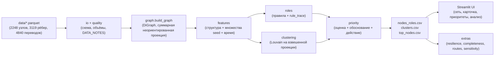

# Граф денег

Локальный инструмент для AML-аналитика: по обезличенной выгрузке исходящих внутрибанковских переводов он строит направленный граф, присваивает каждому узлу проверяемую гипотезу о роли и ранжирует узлы для дальнейшей проверки. Результат отвечает на рабочий вопрос: кого из наблюдаемых клиентов смотреть первым и почему. Роли отражают признаки в ограниченной выборке, а не установленный статус клиента.

Вход: `data/nodes.parquet`, `data/edges.parquet`, `data/transactions.parquet` из предоставленного архива. Выгрузка охватывает 81 исходный gid, 2 248 узлов, 3 119 агрегированных рёбер и 4 840 переводов за июль 2026 года.

## Запуск одной командой

Распакуйте архив так, чтобы три parquet-файла находились прямо в `data/`. Из корня репозитория выполните:

```powershell
python start.py
```

Требуется [Node.js](https://nodejs.org/) (для сборки интерфейса) в дополнение к Python. Команда создаёт `.venv` (если его ещё нет), ставит зависимости из `requirements.txt`, пересчитывает пайплайн, при первом запуске ставит npm-зависимости и собирает `frontend/`, затем поднимает интерфейс и API одним процессом на `http://127.0.0.1:8080`. Повторный запуск быстрее: существующее окружение, `node_modules` и уже собранный `frontend/dist` не трогаются.

**`python start.py` — единая точка входа в проект.** Если вы добавляете зависимость, новый шаг настройки или меняете способ запуска интерфейса (`frontend/`, `run_fingraph.py`, обязательные переменные окружения, обязательные файлы), обновите `start.py` так, чтобы эта команда по-прежнему поднимала весь проект без ручных шагов, и проверьте это на чистом `.venv`/`node_modules` перед пушем.

В поиске введите `gid` или выберите узел в списке «Приоритет проверки». Карточка узла показывает роль, оценку, наблюдаемые потоки и обоснование. Вкладка «Граф» показывает окружение выбранного узла до двух переходов.

### Альтернативный интерфейс (Streamlit)

В репозитории есть второй, независимый интерфейс на Streamlit (`app/`) поверх тех же выгрузок пайплайна — он не запускается через `start.py`:

```powershell
.\.venv\Scripts\python.exe run_pipeline.py
.\.venv\Scripts\streamlit.exe run app/main.py --server.headless true
```

### Пошагово (для проверки, тестов, CI)

```powershell
python -m venv .venv
.\.venv\Scripts\python.exe -m pip install -r requirements.txt
.\.venv\Scripts\python.exe run_pipeline.py
.\.venv\Scripts\python.exe scripts/check_outputs.py --twice --final
.\.venv\Scripts\python.exe -m pytest -q
npm --prefix frontend install
npm --prefix frontend run build
.\.venv\Scripts\python.exe run_fingraph.py
```

Для проверки секретов на машине с Git Bash:

```powershell
& 'C:\Program Files\Git\bin\bash.exe' scripts/secret_scan.sh
```

Пайплайн полностью локален и не требует API-ключа. Необязательный текстовый ассистент в интерфейсе появляется только при наличии `OPENAI_API_KEY` в окружении или в локальном, игнорируемом Git файле `.env`.

## Демо-сценарий (5 минут)

1. `python start.py` на чистой машине — интерфейс и API поднимаются одним процессом на `http://127.0.0.1:8080`, без ручных шагов.
2. «Обзор» — KPI и распределение ролей за один взгляд: 2 248 узлов, 3 119 рёбер, 4 840 транзакций, 365,9 млн KZT оборота.
3. «Граф» — список «Приоритет проверки» слева, интерактивный граф окружения справа. Разбор трёх произвольных узлов (можно взять любой другой gid — карточка справа показывает роль, оценку, наблюдаемые потоки и обоснование для каждого):

   | gid | Роль | Что показать |
   |---|---|---|
   | `100000008165763100` | координатор | Сходятся средства нескольких seed через несколько ветвей. |
   | `100000008477350100` | консолидация | 11+ плательщиков; в графе виден узел с этим gid и его окружение до двух переходов. |
   | `100000005767403100` | граница выгрузки | 4-е колено, исходящие не выгружены — карточка явно говорит, что роль не определима, а не выдаёт это за конечного получателя. |
4. «Кластеры» — 68 кластеров с гипотезой о назначении каждого, приоритетные gid по кластеру.
5. «Аналитика» и «Данные» — сводные показатели набора и выгрузки для скачивания.

Второй интерфейс на Streamlit (`app/`, см. ниже) дополнительно показывает полный `rule_trace` (все правила, включая несработавшие) и раскладку графа по коленам — полезно для более глубокой проверки конкретного узла.

## Как получается результат

`io` проверяет схему parquet, `quality` сверяет размеры и суммы, `graph` строит направленный граф с учётом изолированных seed. Затем `features` и `temporal` считают структурные, потоковые и временные признаки; `roles` применяет правила; `clustering` выделяет сообщества Louvain на явно суммированной неориентированной проекции; `priority` создаёт ранжирование и текстовое объяснение. Проверенный полный пересчёт предоставленного набора, включая чувствительность, занял 20,19 с, что ниже лимита 5 минут из задания. Расчёт детерминирован при `seed=42`.

Правила проверяются в порядке таблицы. Первая прошедшая роль становится основной, остальные успешные сохраняются как вторичные. `rule_trace` хранит **все** проверки, включая неуспешные. Пороговые значения ниже взяты из `moneygraph/thresholds.py`; детали вычисления приведены в [методике](docs/METHODOLOGY.md).

| Роль | Критерий основной роли |
|---|---|
| `coordinator` — кандидат в координаторы | Достижимость от ≥3 seed, ≥3 питающие ветви и прирост схождения ≥1 одновременно. |
| `consolidator` — признаки консолидации | ≥4 разных наблюдаемых плательщика. |
| `distributor` — признаки веерного распределения | Исходящие наблюдаемы и есть ≥6 разных получателей. |
| `transit` — признаки транзита | Исходящие наблюдаемы, узел не seed, входящий поток положителен, `out_sum / in_sum` от 0,7 до 1,3, входящая и исходящая степени ≤3. |
| `terminal` — кандидат в конечные получатели | Исходящие наблюдаемы, узел не seed и не на границе выгрузки, входящий поток ≥50 000 KZT, `out_sum / in_sum` ≤0,3 либо исходящих нет, доля поздних поступлений <0,5. |
| `boundary` — граница выгрузки | Глубина 4, исходящих в выгрузке нет, ни одно предыдущее правило не прошло. |
| `peripheral` — периферия | Ни одно предыдущее правило не прошло. |

`role_score` лежит в диапазоне 0–1 и показывает выраженность условий выбранной роли. Для ранга используется формула:

```text
priority_score = novelty × (
    0.35 × role_weight × role_score
  + 0.30 × pct(seed_flow_in)
  + 0.20 × pct(max(in_sum, out_sum))
  + 0.15 × pct(betweenness)
)
```

`pct` — процентный ранг среди узлов со средним рангом при равенстве. `novelty` равна 0,7 для исходных seed и 1,0 для остальных. Веса ролей: `coordinator` 1,0; `consolidator` 0,9; `distributor` 0,75; `transit` и `terminal` 0,6; `boundary` 0,4; `peripheral` 0,1. `why` называет два крупнейших слагаемых и рекомендуемое действие.

## Выходные файлы

| Файл | Содержание |
|---|---|
| `outputs/nodes_roles.csv` | Основная роль, сила признаков, кластер, приоритет и краткое свидетельство для каждого из 2 248 gid. |
| `outputs/clusters.csv` | Размер, число seed, внутренний объём переводов, ключевые gid и гипотеза о каждом кластере. |
| `outputs/top_nodes.csv` | Топ-30 узлов с рангом и объяснением `why`. |
| `outputs/run_meta.json` | Времена этапов, размеры данных, распределение ролей и проверки качества. |
| `outputs/node_features.parquet` | Полные признаки и `rule_trace` для карточек узлов; создаётся локально и не хранится в Git. |
| `outputs/graph_edges.parquet` | Агрегированные направленные рёбра для интерфейса; создаётся локально и не хранится в Git. |
| `outputs/resilience.csv` | Размер компонент после удаления узлов по разным стратегиям. |
| `outputs/completeness.csv` | Узлы с `censored` или `inflow_incomplete` независимо от роли: запрос исходящих для границы, входящих для неполного входа, обоих направлений при сочетании флагов. Интерфейс показывает и выгружает весь список. |
| `outputs/routes.csv` | Совместимые по датам двухшаговые цепочки через транзитный узел, отдельные однодневные кандидаты и структурные циклы длины 2–4. |
| `outputs/sensitivity.csv` | Анализ изменения порогов; автоматически рассчитывается после основных выгрузок. Ошибка этого этапа не прерывает основной расчёт; при отсутствии файла вкладка «Анализ» показывает пояснение. |
| `outputs/docs/DATA_NOTES.md` | Проверки качества конкретного запуска. При использовании `--out` отчёт сохраняется внутри указанного каталога; тесты не перезаписывают `docs/DATA_NOTES.md` в репозитории. |

## Ограничения данных и трактовка

Граф построен **только по исходящим** переводам от 81 seed на четыре перехода. У 444 узлов глубины 4 исходящие не выгружались; отсутствие ребра у них нельзя считать признаком конечного получателя. Такие узлы получают метку границы, если не прошли более раннее структурное правило. Входящий поток по всей сети является нижней оценкой: переводы из-за пределов обхода отсутствуют, особенно у seed. В текущей проверке данных 377 узлов имеют наблюдаемый исходящий поток выше входящего; это признак неполноты выборки, а не ошибка баланса.

Переводы меньше 5 000 KZT отсутствуют из-за **порога выгрузки**, а не из-за аналитического порога. Период ограничен июлем 2026 года. Поздний входящий перевод мог продолжиться в августе, поэтому правило конечного получателя проверяет долю поступлений у правой границы периода. Даты имеют точность до дня, порядок переводов внутри дня неизвестен. Данные не содержат персональных атрибутов или размеченных истинных ролей, поэтому выводы остаются гипотезами для проверки.

`fast_through_share` — доля исходящей суммы, отправленной в дни наблюдаемых поступлений или в следующие два дня. Входящие и исходящие суммы не сопоставляются: показатель отражает близость активности во времени, а не долю конкретных поступлений, переданных дальше. Значение 100% не означает, что весь исходящий поток профинансирован наблюдаемыми недавними поступлениями.

В `routes.csv` тип `transit_chain` означает наличие пар дат с интервалом 1–2 дня; `same_day_candidate` — совпадение в один день без известного порядка. `n_occurrences` считает различные пары `(дата входа, дата выхода)` для данного пути и типа; несколько переводов в один день сначала суммируются. `days_span` — минимальный интервал среди этих пар. `min_leg_kzt` — максимум меньшей из двух дневных сумм по совместимым парам; суммы разных пар не складываются, поскольку пары могут использовать общие переводы. Это не трассировка происхождения средств. Для `structural_cycle` поле `min_leg_kzt` содержит минимальную месячную сумму ребра, а `days_span` и `n_occurrences` пусты: наличие цикла в агрегированном графе не подтверждает движение денег по нему во времени.

## Проверка чувствительности

Анализ изменяет каждый градуируемый порог до 75% и 125% исходного значения и сравнивает роли и состав топ-20. На полном расчёте из сырых признаков проверено 26 сценариев. Только уменьшение `CONS_PAYERS_MIN` до 75% дало сходство топ-20 ниже 0,7: изменились 106 ролей, коэффициент Жаккара равен 0,667. Порог консолидации стоит рассматривать как чувствительный при ручной проверке кандидатов. Пайплайн вызывает `moneygraph.extras.sensitivity.run` на признаках до округления и сохраняет результат в `sensitivity.csv` выбранного выходного каталога.

Проверка охватывает числовые параметры с окончаниями `_MIN` и `_STRONG`; границы отношений, ограничения степени, доля поздних поступлений и веса приоритета в эти 26 сценариев не входят. Результат характеризует устойчивость к перечисленным изменениям, а не точность определения ролей.

## Масштабирование до миллиона узлов

На графе порядка 1 млн узлов точная посредническая центральность и полный `spring_layout` станут дорогими. Агрегацию переводов следует выполнять по секциям в DuckDB или Spark; достижимость от seed считать пакетным либо инкрементальным обходом; сообщества — алгоритмом Leiden/igraph; центральность — приближённо на фиксированной выборке. Для интерфейса нужен серверный выбор подграфа вокруг gid и заранее сохранённые координаты, а не передача всего графа в браузер. Эти изменения описывают путь масштабирования и не требуются для текущей локальной выгрузки.

## Потенциал развития

За рамками обязательных выгрузок пайплайн уже считает четыре дополнительных анализа, которые отличают решение от базового «роль + приоритет»: устойчивость сети к изъятию топ-узлов (`resilience.csv`), явный список того, каких данных не хватает, с готовым текстом запроса (`completeness.csv`), совместимые по датам маршруты и циклы без ложной трассировки конкретных средств (`routes.csv`), и чувствительность правил к порогам с коэффициентом Жаккара по топ-20 (`sensitivity.csv`). Необязательный AI-ассистент (`moneygraph/extras/llm.py`) отвечает только на основе уже вычисленных признаков графа — не обращается к сырым данным и не может сообщить то, что не прошло через `role`/`evidence`, поэтому его ответы наследуют те же гарантии осторожности формулировок.

Дальнейшие направления: детекция аномалий (дробление сумм ниже порога выгрузки, профили узлов относительно распределения по своему колену); ML-калибровка порогов на размеченной аналитиками выборке вместо фиксированных персентилей; потоковый пересчёт при регулярной выгрузке вместо разового батча; серверный выбор подграфа для масштабирования интерфейса (см. раздел о миллионе узлов ниже).

## Схема



Статическая версия: [схема решения](docs/solution_diagram.png).
