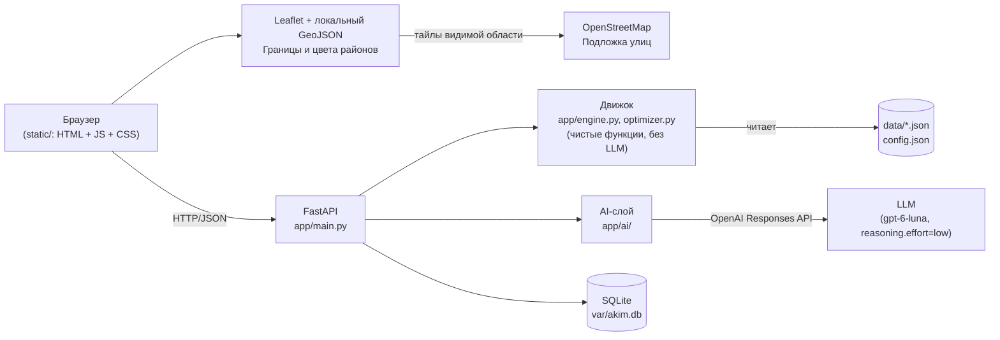

# Аким на 5 часов — AI-симулятор управления городом

## 1. Что это

**Проблема:** при планировании городских мер (транспорт, экология, соцсфера, безопасность, ЖКХ) сложно быстро и прозрачно оценить, как именно конкретный набор из нескольких решений повлияет на качество жизни в разных районах города и где заканчивается бюджет — решения обычно принимаются без наглядного расчёта последствий и без сравнения альтернатив.

**Решение:** «Аким на 5 часов» — веб-симулятор по датасету организаторов хакатона. Вы выбираете ровно 5 городских мероприятий (для районных мер — ещё и район) в пределах бюджета 100 условных единиц; движок детерминированно считает Astana Quality of Life Score, а AI объясняет результат и предлагает проверенное движком улучшение.

Дополнительно: интерактивная карта Астаны с реальными границами районов, анимацией «до/после» и слоем эффекта решений; три цели оптимизации с наглядным сравнением, закрепление важных решений, объяснение формулы Score, отмена изменений и локальное сохранение черновика. Фронтенд работает без CDN и сборки; подложка улиц загружается из OpenStreetMap.

**Технологии:**

- Бэкенд: Python 3.11, FastAPI, Pydantic, uvicorn
- Движок и оптимизатор: чистые детерминированные функции Python, без LLM и без случайности
- Хранилище: SQLite (`var/akim.db`)
- AI: OpenAI Responses API, модель по умолчанию `gpt-6-luna` (`reasoning.effort`, tool calling, строгие JSON-схемы); меняется через `.env` без правки кода
- Фронтенд: ванильные HTML/CSS/JS + локальный Leaflet 1.9.4, без сборки и npm
- Инфраструктура и проверка: Docker + Docker Compose, pytest, встроенный `node:test`, GitHub Actions CI


[Карта на телефоне](docs/screenshots/map-mobile.png) · [Сравнение трёх стратегий](docs/screenshots/strategies-desktop.png) · [Источники и проверка карты](docs/MAP.md) · [Протокол проверки](docs/VALIDATION.md)

## 2. Быстрый старт

```bash
cp .env.example .env
# при желании впишите свой ключ в LLM_API_KEY внутри .env
docker compose up --build -d --wait
# откройте http://localhost:8000
```

Без ключа всё работает, AI-тексты заменяются шаблонными.

Требования: Docker с Compose v2. В PowerShell вместо `cp` можно использовать `Copy-Item .env.example .env`. Если `.env` уже настроен, не перезаписывайте его. `LLM_API_KEY` — ключ OpenAI; модель и таймаут задаются в `.env.example`. Ключ используется только сервером; `.env` исключён из Git и Docker-образа.

Проверка запуска: откройте `http://localhost:8000/api/health` — ожидается `status: "ok"`. `ai_mode` в health показывает наличие ключа; фактическое использование AI подтверждается полем `ai_mode` в ответе анализа или оптимизации. Логи: `docker compose logs --tail=50 app`. Остановка: `docker compose down` (сценарии сохраняются в `var/akim.db`).

Запуск без Docker, Python 3.11+:

```bash
python -m venv .venv
# Linux/macOS: source .venv/bin/activate
# PowerShell: .venv\Scripts\Activate.ps1
python -m pip install -r requirements.txt
python -m uvicorn app.main:app --env-file .env --host 127.0.0.1 --port 8000
```

## 3. Сценарий использования

1. **Выбор решений.** В левой колонке заполните 5 слотов: мера + (для районных мер) район. Недоступные варианты сразу показывают причину («уже выбрано», «лимит направления 2/2», «несовместимо с M3», «не хватает N усл. ед.»).
2. **Превью Score и карта.** При каждом изменении (debounce 150 мс) фронтенд шлёт `POST /api/simulate` — шапка, цвета карты, плитки районов и график вкладов обновляются без обращения к AI. Нажмите район для подробностей, выберите показатель и сравните «До решений», «После решений» или «Эффект». Кнопка «Сравнить» анимирует переход. Границы реальные, все оценки учебные; шестой район, Сарайшык, отмечен как район без данных модели.
3. **Анализ.** Когда набор из 5 решений валиден, кнопка «Рассчитать и проанализировать» становится активной. Она вызывает `POST /api/scenario`: движок считает финальный Result, AI (или фолбэк) пишет разбор — сильные стороны, риски, последствия, главный компромисс.
4. **Агент с ограничениями.** Закрепите нужную меру переключателем «Закрепить» — сохраняются и мера, и район. Выберите цель советника и нажмите «Сравнить стратегии». Три варианта рассчитываются из одного плана с одинаковыми ограничениями; AI участвует в поиске для выбранной цели. В таблице рядом видны исходный план, Score, балл слабейшего района, критические значения и бюджет каждой стратегии. Клик по стратегии открывает подробные изменения по районам и список замен **до применения**. «Применить эту стратегию» меняет план; «Отменить изменение» возвращает предыдущий вариант. Если закреплены все пять решений, поиск отключён.
5. **Лидеры.** Каждый сохранённый сценарий попадает в таблицу `GET /api/leaderboard` (топ-50 по Score); клик по строке разворачивает её 5 решений.

Быстрая демонстрация: «Загрузить пример» → Score **56,54**, бюджет **95/100**, критических значений **0** → «Сравнить стратегии» → посмотреть компромисс цели «Поддержка слабейшего района» → применить → отменить. Затем закрепить школу в Нуре и повторить сравнение: школа сохранится во всех вариантах. Черновик, команда, цель советника и закрепления восстанавливаются после перезагрузки; история отмены хранится до перезагрузки (последние 20 изменений).

| Цель | Основной приоритет | При равном приоритете |
|---|---|---|
| Максимальный Score (`score`, по умолчанию) | Увеличить Astana Quality of Life Score | Сохранить равнозначный найденный план |
| Поддержка слабейшего района (`weakest`) | Увеличить минимальный балл среди всех районов **после** решений | Выбрать больший Score |
| Меньше критических показателей (`critical`) | Уменьшить число пар «район × показатель» со значением строго ниже 40 | Выбрать больший Score |

Цели меняют критерий поиска, а не формулу Score или исходные данные. Для `score` сохраняется гарантия «Score не ниже исходного». Для двух других целей гарантируется, что выбранный критерий не ухудшится, но **Score может снизиться**. Интерфейс отдельно выделяет снижение Score, появление критических значений или снижение минимального балла относительно вашего плана. Поддержка слабейшего района не означает поддержку одного заранее выбранного района: после решений самым слабым может стать другой район.

Если разные цели дали один набор мер, UI прямо сообщает о совпадении. Например, при уже нулевом числе критических значений режим `critical` часто совпадает с `score`. Переключение просмотра стратегии не меняет план и не делает новых AI-запросов. Смена цели советника сбрасывает старые предложения, сохраняя актуальный анализ самого плана.

При изменении плана старый анализ и предложение сбрасываются. Ответы на устаревшие запросы не меняют экран. При ошибке превью итоговые действия заблокированы, доступна повторная загрузка. Чтение/превью ограничены 10 секундами ожидания, AI-действия — 120 секундами; затем кнопки освобождаются. Сохранение сценария не повторяется автоматически: при потере ответа оно могло завершиться, поэтому интерфейс предлагает сначала проверить лидеров. Загрузка лидеров не блокирует уже полученный анализ.

## 4. Архитектура



| Модуль | Назначение |
|---|---|
| `app/main.py` | FastAPI-роуты, раздача `static/`, обработка ошибок |
| `app/models.py` | Pydantic-схемы запросов |
| `app/data_loader.py` | Загрузка и валидация `data/*.json` и `config.json` при старте |
| `app/engine.py` | `simulate()`, `validate()`, `contributions()` — формула Score дословно из спецификации |
| `app/optimizer.py` | Детерминированный поиск: `single_swap_search()`, `hill_climb()`, `brute_force()` |
| `app/storage.py` | SQLite: `save_scenario()`, `leaderboard()` |
| `app/ai/llm.py` | Единственное место вызова LLM (OpenAI SDK, Responses API); смена провайдера или модели — правка только этого файла / `.env` |
| `app/ai/analyst.py` | AI-анализ сценария + шаблонный фолбэк |
| `app/ai/agent.py` | Агент-оптимизатор с инструментами (`simulate`, `list_measures`, `get_district`) + hill_climb-фолбэк |
| `app/ai/prompts.py` | Промпт аналитика из спецификации; промпт агента дополнен выбранной целью и закреплениями |
| `static/city-map.js`, `city-map.css` | Режимы карты, синхронизация с расчётом, выбор района, анимации и резервное отображение |
| `static/data/astana-districts.geojson` | Реальные границы шести районов OSM (ODbL), дата и версия источника; отдельно от синтетических показателей |

## 5. Модель расчёта

Для каждого решения `(measure, district?)` эффект применяется с учётом лага:

```
I = копия базовых показателей районов
для каждого решения:
    f = (H − lag) / H,  H = horizon_quarters = 8
    цели = все районы, если scope == "city", иначе один выбранный район
    I[район][показатель] += эффект × f     # без обрезки на этом шаге
для каждой сработавшей синергии (обе меры пары выбраны):
    I[район хоста][показатель синергии] += бонус
I = clip(I, 0, 100)                          # обрезка один раз, в самом конце
```

```
D_район       = Σ (вес_показателя × I_показатель)               по 10 показателям
D_avg         = Σ (доля_населения_района × D_район)
Score         = 0.7 × D_avg + 0.3 × min(D_район) − 1.0 × N_crit
```

`N_crit` — число пар «район × показатель» строго ниже `crit_threshold` (40) после итоговой обрезки. Обрезка выполняется один раз в конце, поэтому Score не зависит от порядка решений в наборе.

Параметры `config.json`:

| Параметр | Значение | Зачем |
|---|---|---|
| `budget` | 100 | верхняя граница суммарной стоимости 5 решений |
| `decisions_count` | 5 | ровно столько решений в наборе |
| `max_per_direction` | 2 | не даёт «закрыть» весь бюджет одним направлением |
| `horizon_quarters` | 8 | горизонт симуляции в кварталах — определяет, какая доля эффекта меры с лагом успевает реализоваться |
| `lambda` | 0.7 | вес среднего по городу балла против самого слабого района — задаёт компромисс «рост среднего» vs «подтягивание отстающих» |
| `crit_threshold` | 40 | порог, ниже которого показатель считается критическим |
| `crit_penalty` | 1.0 | штраф за каждое критическое значение — стимулирует не оставлять районы без внимания |
| `synergies` | 3 пары | бонус за взаимодополняющие меры (напр. умные светофоры усиливают выделенные полосы) |
| `incompatibilities` | 3 пары | взаимоисключающие меры (конкурирующие технологии или конфликт за участок) |

## 6. Как устроен AI

**Аналитик** (`app/ai/analyst.py`) получает посчитанные движком числа: вклады мер, синергии, критические значения, показатели до/после. Ответ запрашивается по строгой JSON-схеме, полученной из Pydantic-модели. Pydantic дополнительно проверяет непустые строки, списки строк и ограничения длины; названный слабейший район сверяется с расчётным минимумом. При ошибке формата или противоречии расчёту выполняется одна повторная попытка с уточнением; сетевые ошибки, отказ и отсутствие ключа сразу включают шаблонный фолбэк. Свободный текст AI не проходит полную проверку фактической точности: источником числового результата остаётся движок.

**Агент-оптимизатор** (`app/ai/agent.py`) — вызывает `run_tools` с лимитом `AGENT_MAX_TOOL_CALLS` (8). Инструменты:

| Инструмент | Что делает |
|---|---|
| `simulate` | Считает Score движком для гипотезы агента, ничего не выдумывает |
| `list_measures` | Отдаёт каталог мер (опционально по направлению) с их синергиями/несовместимостями |
| `get_district` | Отдаёт показатели и D конкретного района |

Каждый вызов `simulate` попадает в лог гипотез. Пример реального лога (набор организаторов, `POST /api/optimize`, живой вызов `gpt-6-luna` через Responses API — `ai_mode: "llm"`): агент реально вызвал `simulate` инструментом, проверил свою гипотезу, но нашёл вариант хуже, чем `hill_climb`, поэтому корректно уступил ему:

```json
{
  "original_score": 56.54,
  "best_score": 57.21,
  "delta": 0.66,
  "source": "baseline",
  "ai_mode": "llm",
  "hypotheses": [
    {
      "idea": "Сохранить сильные экологические и безопасностные меры, а слабую поликлинику заменить на более дешёвый спорт-хаб в Нуре для поддержки обоих социальных показателей.",
      "score": 55.48,
      "valid": true,
      "error": null
    },
    {
      "idea": "Заменить «Перевод частного сектора на чистое топливо» в Сарыарка на «Линия ЛРТ / расширение» в Нура",
      "score": 57.21,
      "valid": true,
      "error": null
    }
  ]
}
```

Без ключа (или если LLM ошиблась/ответила невалидным набором) та же гипотеза о переносе ЛРТ в Нуру находится детерминированным `hill_climb()`-фолбэком, `ai_mode: "fallback"`.

`best_decisions` всегда прогоняются через `validate()` и `simulate()` движка — Score в ответе не может быть выдуман AI. Сначала для каждой из трёх целей считается `hill_climb()` с одинаковыми закреплениями (до пяти улучшающих раундов одиночных замен). Затем агент ищет вариант для выбранной цели. Его предложение и baseline сравниваются по **той же цели**, по неокруглённым числам; исходный план участвует как нижняя граница качества. `ai_mode: "llm"` и `source: "baseline"` совместимы: AI участвовал, но алгоритмический вариант оказался лучше по выбранному критерию. Обычный режим `score` сохраняет прежнее поведение; дополнительный режим может осознанно обменять Score на приоритетный показатель.

Контракт `POST /api/optimize` расширен обратно совместимо:

```json
{
  "decisions": [
    {"measure_id": "M7", "district_id": "nura"},
    {"measure_id": "M8", "district_id": "nura"},
    {"measure_id": "M10", "district_id": "nura"},
    {"measure_id": "M12", "district_id": null},
    {"measure_id": "M5", "district_id": "saryarka"}
  ],
  "locked_decisions": [{"measure_id": "M7", "district_id": "nura"}],
  "objective": "weakest"
}
```

Поля `locked_decisions` и `objective` необязательны; без `objective` используется `score`. Чужие закрепления или повторы → `422 INVALID_LOCKS`, неизвестная цель → `422`. Ответ содержит выбранную `objective`, `original_result`, `best_result` и `best_decisions` для неё, а также `strategies` — три объекта `{objective, label, description, decisions, result, source, ...}` в порядке `score`, `weakest`, `critical`. Каждый `result` — полный пересчитанный результат своего набора. Расчётный Result содержит `score_components` с вкладами среднего, слабейшего района и штрафов (до/после/дельта). Числа округляются независимо: разность двух показанных Score может отличаться от показанной дельты на 0,01. API-документация доступна по `/docs`.

**Фолбэк без LLM** срабатывает, если нет `LLM_API_KEY`, вызов упал (`LLMUnavailable`) или ответ не прошёл проверку — в любом случае API отвечает `200`, а не `5xx`, с `ai_mode: "fallback"`.

Пустой, повреждённый или не прошедший доменную проверку ответ провайдера не кэшируется: следующий запуск снова обращается к AI. Слабейший район в схеме аналитика ограничен фактическими минимумами движка, включая равные значения. Объяснение итоговой стратегии строится по пересчитанным движком показателям; идеи AI показываются отдельно в журнале гипотез.

Технические ограничения AI-слоя:

- Строгие схемы передаются и для итогового ответа, и для инструментов; используется `text.format` по [официальной документации OpenAI](https://developers.openai.com/api/docs/guides/structured-outputs). Разбирается последнее сообщение ответа, поэтому промежуточный текст не смешивается с JSON.
- Неполная генерация, отказ и ошибка JSON различаются. `ai_status: {code, message}` объясняет резервный режим; логи содержат этап и код ошибки, без ключей, запросов и текста ответа провайдера.
- `AGENT_MAX_TOOL_CALLS` по умолчанию 8, технический предел 16. Неверные аргументы инструмента возвращаются агенту как ошибка для исправления. После исчерпания лимита запрашивается финальный ответ без инструментов.
- `LLM_TIMEOUT_SECONDS` — таймаут сетевого вызова (20 с, максимум 30). `LLM_TOTAL_TIMEOUT_SECONDS` — бюджет цикла агента (60 с, максимум 90); перед каждым вызовом проверяется остаток, запоздавший ответ отклоняется. Скрытые повторы OpenAI SDK отключены. Сетевой таймаут применяется к операциям транспорта, поэтому это не жёсткое прерывание потока ровно на границе общего бюджета.
- Кэш ограничен 128 записями с TTL 10 минут, учитывает модель и схему ответа, защищён блокировкой и возвращает копии данных.
- При запуске проверяются положительные цены, конечность чисел, веса, уникальность идентификаторов, ссылки синергий и лаги. Недопустимый preview с более чем пятью решениями получает `INVALID_COUNT` и `result: null` без расчёта вкладов.

## 7. Проверка требований

| Требование | Как проверить |
|---|---|
| AC1: `docker compose up --build` поднимает приложение на :8000 | `docker compose up --build`, затем `curl localhost:8000/api/health` |
| AC2: одинаковые бюджет и данные у всех | `GET /api/state` детерминирован — `tests/test_api.py::test_state` |
| AC3: нарушение правил → кнопка неактивна, `POST /api/scenario` → 422 | `tests/test_api.py::test_scenario_over_budget_is_422`; в UI — `app.js:renderCalcButton` |
| AC4: базовый Score 52,56, пример 56,54 | `tests/test_engine.py::test_score_and_ncrit` |
| AC5: порядок решений не важен | `tests/test_engine.py::test_order_independent` (120 перестановок) |
| AC6: замена решения меняет Score | `tests/test_engine.py::test_sensitivity` (117 вариантов, допуск 1e-9) |
| AC7: `POST /api/scenario` даёт `strengths/risks/consequences/main_tradeoff` | `tests/test_api.py::test_scenario_example` |
| AC8: `POST /api/optimize` не хуже исходного по выбранной цели + лог гипотез | `tests/test_api.py::test_optimize_example`, `tests/test_objectives.py`; по умолчанию цель — Score |
| AC9: без `LLM_API_KEY` всё работает, `ai_mode: "fallback"` | `tests/test_ai_fallback.py`, `docker compose up` с пустым `LLM_API_KEY` |
| AC10: pytest проходит | `docker compose run --rm app pytest` |
| AC11: README содержит все разделы | этот файл |
| Ровно 5 решений, без повторов, район для районных мер | `app/engine.py::validate` — коды `INVALID_COUNT`, `DUPLICATE_MEASURE`, `DISTRICT_REQUIRED`, `DISTRICT_NOT_ALLOWED` |
| Бюджет ≤ 100 | `validate` → `BUDGET_EXCEEDED`; UI — блокировка недостающих усл. ед. в селекте |
| Не больше 2 мер одного направления | `validate` → `DIRECTION_LIMIT`; UI — счётчики направлений над слотами |
| Запрещённые пары (M1×M3, M4×M7 в районе, M5×M13 в районе) | `validate` → `INCOMPATIBLE`; тесты `test_conflict_site`, `test_site_ok_is_valid`, `test_conflict_transport` |

## 8. Результаты

| Сценарий | Score |
|---|---|
| Базовый (без решений) | **52.56** |
| Набор организаторов (EXAMPLE) | **56.54** |
| Улучшение агента/hill_climb от набора организаторов | **57.21** |
| Глобальный максимум (`scripts/brute_force.py`, 694 395 допустимых наборов) | **57.24** |

```
$ docker compose run --rm app python scripts/brute_force.py
Валидных наборов: 694395
Минимальный Score: 52.04
Максимальный Score: 57.24
Топ-5 сценариев:
1. Score 57.24: M2, M3@nura, M8@nura, M9@nura, M14
2. Score 57.23: M3@nura, M4@nura, M8@nura, M9@nura, M14
3. Score 57.21: M3@nura, M7@nura, M8@nura, M10@nura, M12
4. Score 57.19: M3@nura, M8@nura, M9@nura, M10@nura, M14
5. Score 57.17: M3@nura, M8@nura, M9@nura, M12, M14
```

## 9. Тесты

```bash
docker compose run --rm app pytest
```

Проверено **197 Python-тестов и 28 тестов фронтенда и карты**. Для фронтенд-тестов нужен Node.js 22+, без npm-пакетов:

```bash
node --test tests/frontend.test.cjs tests/map.test.cjs
```

Все Python-тесты автоматически отключают реальные LLM-вызовы и используют временную SQLite-базу: ключ и таблица команд пользователя не затрагиваются. GitHub Actions запускает оба набора проверок при push и pull request.

- `tests/test_engine.py` — формула Score, все фикстуры из спецификации (базовые D районов, 10 сценариев, коды ошибок, лаг, синергии, независимость от порядка, чувствительность к замене, диапазон [0,100] на 1000 случайных наборах, вклады, hill_climb, brute_force). Медленный тест `brute_force` (694 395 наборов, ~6–7 секунд) помечен `@pytest.mark.slow` и запускается вместе со всеми остальными по умолчанию; чтобы пропустить его — `pytest -m "not slow"`.
- `tests/test_api.py` — `/api/state`, `/api/simulate`, `/api/scenario`, `/api/optimize`, `/api/leaderboard` без ключа LLM.
- `tests/test_ai_fallback.py` — `llm.py` подменяется моками (исключение и невалидный JSON); проверяется, что API всегда отвечает 200 с `ai_mode: "fallback"`, а агент при нарушающем правила ответе LLM возвращает результат `hill_climb`.
- `tests/test_constraints.py` — закрепления, попытки AI изменить меру или район, неверные типы ответов, неверный слабейший район, успешный повторный анализ и разложение формулы Score.
- `tests/test_objectives.py` — выбор по разным целям, допустимость всех трёх стратегий, закрепления, совместимость прежнего API, отказ от неподходящих AI-предложений и честные компромиссы Score.
- `tests/test_llm_cache.py` — невалидные ответы не остаются в кэше, явная повторная попытка обращается к провайдеру, валидный JSON и журнал инструментов кэшируются.
- `tests/test_llm_resilience.py` — строгие схемы, отказ/незавершённый ответ, лимиты времени и инструментов, исправление аргументов, TTL и изоляция кэша.
- `tests/test_data_validation.py`, `tests/test_api_boundaries.py` — повреждённые данные, невалидные числовые параметры и ранняя остановка недопустимого расчёта.
- `tests/frontend.test.cjs` — ответы в обратном порядке, устаревший анализ и оптимизация, ошибки сети, блокировка повторных запросов, безопасный вывод текста, сохранение закреплений, цели и отмены; просмотр и применение альтернативы, смена цели во время запроса и защита от устаревшей кнопки применения.
- `tests/map.test.cjs` — цветовые пороги, «до/после/эффект», отсутствие выдуманных оценок, критические показатели, географические координаты, замкнутость границ и принадлежность подписей районам. Фронтенд также проверяет обновление карты без устаревших результатов.

Воспроизводимая проверка анализа и трёх целей (не изменяет таблицу лидеров):

```bash
# Без платных вызовов, проверка резервного режима:
docker compose exec -T app python scripts/verify_ai.py
# С настроенным ключом: реальные вызовы, расходует лимиты провайдера:
docker compose exec -T app python scripts/verify_ai.py --live --output /tmp/ai-validation.json
```

Скрипт пересчитывает каждую стратегию, проверяет бюджет, закрепления и выбранную цель. В режиме `--live` любой fallback означает неуспешную проверку и код выхода 1. Последний живой прогон: **анализ и все три цели прошли**, отчёт — [docs/AI_VALIDATION.json](docs/AI_VALIDATION.json). Это проверка конкретного запуска, а не гарантия доступности внешнего провайдера.

## 10. Ограничения

- Данные (районы, меры, синергии) синтетические, взяты из датасета организаторов без изменений.
- Коэффициенты формулы (веса показателей, `lambda`, штраф за критичность) экспертные и не откалиброваны на реальных данных Астаны.
- Разрешено не больше одного экземпляра каждой меры на набор и не больше 2 мер одного направления — расширенные (мультирайонные) сценарии одной меры не поддерживаются.
- Поиск hill_climb локальный и не гарантирует глобальный максимум. При закреплениях доступный максимум может снизиться.
- Без авторизации таблица лидеров предназначена для доверенной хакатонной среды; имена команд не подтверждаются. Перед публичным размещением нужны авторизация и ограничение частоты затратных AI-запросов.

## 11. Развитие

- Подключение открытых данных акимата Астаны вместо синтетического датасета.
- Калибровка весов показателей и `lambda` по опросам жителей районов.
- Многолетний режим с накоплением отложенных (лаговых) эффектов между периодами планирования.
- Сравнение предложенных сценариев с реальными бюджетными программами города.
