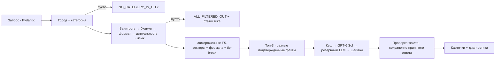

# событие.

### Подрядчики для мероприятий — по условиям, с понятным объяснением

**HackAlem AI · трек #79-lite · The Good The Bad and The Ugly**

Задайте город, дату, формат, категорию и бюджет. Сервис проверит каталог, покажет **до трёх подходящих кандидатов** и объяснит выбор конкретными фактами из анкет. Если совпадений нет, он покажет причину и предложит проверенное изменение условий.

| Каталог | Результат | Технологии | Запуск без ключей |
|:---:|:---:|:---:|:---:|
| **70** профилей · **17** категорий · **3** города | **1–3** карточки или объяснение пустого результата | Python 3.12+ · FastAPI · локальные E5-векторы | Шаблонные объяснения · без Node и GPU |

**Навигация:** [Быстрый запуск](#быстрый-запуск) · [Что умеет продукт](#что-умеет-продукт) · [Как устроен подбор](#как-устроен-подбор) · [Демо](#демо-для-жюри) · [Проверка и ограничения](#проверка-и-ограничения)

> [!IMPORTANT]
> Подбор и шаблонные объяснения работают локально без секретов. Адаптер OpenAI **GPT-6 Sol** и SMTP реализованы, но живой вызов модели и получение письма командой пока не подтверждены. Для Docker подготовлены файлы и проверка в CI; успешная сборка контейнера пока не подтверждена.

Разработка ведётся в **`demoVer-1`**. [HANDOFF.md](HANDOFF.md) содержит передачу команде, конфигурацию и порядок проверки; [AGENTS.md](AGENTS.md) — контекст для ИИ-участников. Отчёты ранних шагов в `docs/` сохранены как история, а текущую реализацию описывает этот README.

## Быстрый запуск

### Windows: один файл

1. Запустите **`start-demo.cmd`** из корня проекта.
2. Откройте **http://127.0.0.1:8000** — скрипт также попробует открыть страницу сам.
3. Остановите сервер сочетанием `Ctrl+C` в его окне.

Скрипт найдёт Python 3.12+ и подготовит окружение. Первый запуск может занять больше времени из-за загрузки зависимостей. Если приложение уже работает, скрипт проверит его готовность; чужой процесс на порту он не завершит. Для проверки без открытия браузера: `start-demo.cmd --check --no-browser`. [Подробности запуска](docs/launch.md).

<details>
<summary><strong>Ручной запуск на Python 3.12+</strong></summary>

Из корня репозитория создайте окружение и установите зависимости. В Windows используйте `.venv\Scripts\python.exe` вместо `.venv/bin/python`.

```bash
python3 -m venv .venv
.venv/bin/python -m pip install -r requirements-dev.txt
.venv/bin/python -m uvicorn contractor_matching.api:app --app-dir app --host 127.0.0.1 --port 8000
```

Проверка: `.venv/bin/python -m pytest -q` (Windows: `.venv\Scripts\python.exe -m pytest -q`).

</details>

<details>
<summary><strong>Docker Compose</strong></summary>

Нужен Docker с Compose ≥2.24. Из корня проекта:

```bash
docker compose up --build -d
```

Откройте **http://localhost:8000**; проверка готовности — **http://localhost:8000/health/ready**. Остановка: `docker compose down`. Кеш хранится в Docker volume: сохраните его, если проверяете повторяемость объяснений. Сборка впервые скачивает зависимости и базовый образ. После неё ключи API и локальные веса модели для запуска не нужны.

Dockerfile и сценарий контейнерной проверки добавлены в CI. Локальный Docker в среде разработки был недоступен; успешная сборка и запуск контейнера пока не подтверждены.

</details>

> [!TIP]
> `.env` необязателен: готовые E5-векторы и проверенные текстовые шаблоны работают без API-ключа, Node, GPU и установленного ONNX. Приложение читает `.env` в корне проекта; переменные процесса имеют приоритет. Секреты не входят в Git и Docker-образ.

## Что умеет продукт

1. **Задайте условия:** город, дата, формат, категория, бюджет; язык и длительность необязательны.
2. **Изучите карточки:** начальная цена «от», объяснение с конкретным фактом, дата по календарю, источник текста и пометки синтетических или восстановленных полей. Раскройте исходную цитату и ограничения профиля.
3. **Проверьте альтернативы:** сравните две даты, откройте статистику исключений и компоненты рейтинга или выберите предложенное изменение одного условия.
4. **Подготовьте обращение:** скачайте условия события; если канал команды настроен и профиль не синтетический, отправьте запрос на уточнение.

| Исход поиска | Что увидит пользователь |
|---|---|
| `SUCCESS` | 1–3 карточки; при неполной тройке — объяснение причины |
| `NO_CATEGORY_IN_CITY` | Сообщение, что в выбранном городе нет категории |
| `ALL_FILTERED_OUT` | Причины и числа исключённых профилей |

Когда вариантов меньше трёх, ассистент предлагает до трёх **проверенных альтернативных запросов**. Каждый меняет ровно одно условие, повторно проходит все фильтры и увеличивает число подходящих кандидатов. Город сохраняется; другая категория предлагается только при отсутствии исходной и названа явно. Изменение применяется только после выбора пользователя.

Обращение команде доступно после выбора карточки. Синтетический профиль позволяет только скачать пример; реальная заявка к нему запрещена в UI и API. Если канал команды не настроен, форма не собирает контакты и не отправляет обращение. Для остальных профилей заявка сохраняется в SQLite с защитой от повторов и приватной квитанцией. **Это запрос на уточнение, а не бронирование:** анонимизированный каталог не содержит подтверждённых контактов исполнителей, и команда должна установить соответствие вручную. [Сверка с ТЗ](docs/readiness.md).

Доступность означает лишь отсутствие даты в предоставленном `busy_dates`; реальность подрядчика, финальная цена и возможность заказа требуют подтверждения.

## Как устроен подбор



LLM получает уже выбранные карточки и разрешённые формулировки. Он не меняет состав, порядок или ограничения. Повторяемость решения не зависит от вероятностного текста и доступности сети.

### Фильтры и контракты

| Этап | Гарантия |
|---|---|
| Пул | Точный город и принадлежность категории; `Зарубежье` не подмешивается. Профили сортируются по ID. |
| Отсев | Первая причина учитывается один раз в порядке **занятость → бюджет → формат → длительность → язык**. |
| Длительность | Пустой `max_hours` проходит фильтр; это не обещание работы без ограничений. Площадки проходят те же правила. |
| Полнота | Фильтр не обрезает список; `stats.total() == pool_count - eligible_count` проверяется явно. |

Запрос принимает даты строго `YYYY-MM-DD` в диапазоне **2026-09-23–2026-12-31**, конечный положительный бюджет и положительную целую длительность. CSV читается через `DictReader`: строки `True/False` явно преобразуются в булевы значения, массивы разделяются `|`, пустая длительность становится `None`.

### Рейтинг и готовые E5-векторы

```text
score = 0.5*cosine + 0.3*(price_from_kzt/budget) + language_term - 0.05*synthetic
language_term = 0.2 при совпадении; 0.1 если язык не задан; 0 при несовпадении
sort_key = (-round(score, 4), price_from_kzt, id)
```

Выдаётся `min(3, eligible_count)`. Формула сохранена из задания: ценовой член поощряет более дорогой вариант внутри бюджета. После языкового фильтра языковой член одинаков для всех оставшихся профилей. Score не является вероятностью качества или оценкой репутации.

Используется готовая [multilingual-e5-small](https://huggingface.co/intfloat/multilingual-e5-small), 384 измерения, [ONNX-версия Xenova](https://huggingface.co/Xenova/multilingual-e5-small/tree/761b726dd34fb83930e26aab4e9ac3899aa1fa78), фиксированная ревизия `761b726dd34fb83930e26aab4e9ac3899aa1fa78`. Это локальный провайдер эмбеддингов без API-ключей. Модель не дообучалась.

В `data/embeddings.json` сохранены векторы 70 профилей и всех **408** комбинаций: 17 категорий × 6 форматов × 4 варианта языка, включая отсутствие. Дата, город и бюджет обрабатываются правилами/формулой. Произвольного текстового запроса нет.

Использованы префиксы `query:`/`passage:`, attention-mask mean pooling и L2-нормализация. Длинные описания разбиваются до 512 токенов; в текущем каталоге разбиение не понадобилось. SHA256 описаний и семантического текста, ревизия модели и хеш артефакта проверяются на старте. Устаревшие векторы блокируют запуск до явной пересборки; скрытого переключения модели нет. Веса не включены в репозиторий.

Пересборка только при изменении каталога/шаблона:

```bash
python -m pip install -r requirements-embeddings.txt
python scripts/build_embeddings.py --model-dir model-cache --download
python -m pytest
```

Потребуется ~136 МБ загрузки. После проверки зафиксируйте оба `embeddings*.json`. Для обычного запуска это не требуется. Манифест содержит версии сборки, ревизию и SHA256 файлов модели.

### Факты, кеш и LLM

`data/facts.json` содержит вручную отобранные утверждения, точные цитаты и SHA256 описаний всех 70 профилей. Факты проверяются на старте и назначаются после ранжирования. Для бедных описаний добавлены конкретные часы/цена и предупреждение, без выдумывания достижений.

LLM составляет объяснение в **ограниченной грамматике**: закреплённое утверждение из описания и самостоятельно скомпонованное предложение из истинных условий (цена, дата, формат, язык, часы). Готовые полные ответы модели не передаются. Валидатор принимает только заданный факт и разрешённые сочетания частей предложения; это проверка замкнутой грамматики, а не доказательство истинности произвольного текста. Чужие факты, добавленные услуги, числа, отрицания, перестановка карточек и клише отклоняются. Выход: 1–2 предложения, ≤45 слов.

Факты размечены по смысловому признаку и специфичности: предпочитаются конкретные отличия между финалистами, без изменения их рейтинга. Совпадение разных строк не считается само по себе достаточным различием. При слабом описании показывается предупреждение; сервис не выдумывает опыт и не утверждает, что у конкурента нет неупомянутой услуги. Карточка раскрывает дословную цитату и статус «из анкеты» / «синтетический».

По актуальному выбору команды используется [GPT-6 Sol](https://developers.openai.com/api/docs/models/gpt-6-sol) от OpenAI через [Chat Completions](https://developers.openai.com/api/reference/resources/chat/subresources/completions/methods/create). **Живой вызов пока не проверен:** нужен новый ключ в локальном `.env` и доступ команды к модели. Ключ, опубликованный в переписке, следует отозвать. `ASTRA_*` — сохранённый для совместимости исторический префикс основного провайдера, а не имя активной модели:

```dotenv
ASTRA_API_PROTOCOL=openai-chat-completions
ASTRA_CHAT_COMPLETIONS_URL=https://api.openai.com/v1/chat/completions
ASTRA_MODEL=gpt-6-sol
ASTRA_API_KEY_1=<новый ключ только в локальном .env>
```

Опционально `ASTRA_API_KEY_2/3`. Общий предел попыток основного LLM — **2.5 с**, второго провайдера — **1.5 с**, всего запроса — **8 с**. Резервный адаптер: `FALLBACK_LLM_API_PROTOCOL`, `FALLBACK_LLM_CHAT_COMPLETIONS_URL`, `FALLBACK_LLM_MODEL`, `FALLBACK_LLM_API_KEY`. Последний рубеж — конкретный детерминированный шаблон.

Для Sol на официальном endpoint передаются `reasoning_effort=none`, `temperature=0`, `max_completion_tokens=1000`; это короткая композиция проверенных фраз. Совместимость Astra сохранена отдельно с `low`, без `temperature`. Ограниченные таймауты могут приводить к шаблону даже при работающем API, поэтому в живой проверке необходимо проверить `explanation_source=openai`, а не только HTTP 200. В `.env.example` резервом указан [GPT-4.1 mini](https://developers.openai.com/api/docs/models/gpt-4.1-mini), но он включается только при отдельном заполнении ключа.

SQLite сохраняет принятый набор объяснений и их происхождение, включая шаблон. Ключ включает запрос, профили, факты, версии объяснителя и конфигурацию модели. Повтор получает сохранённые тексты; конкурирующие записи выбирают первый принятый ответ. API-ключи не входят в кеш, логи и фронтенд. Изменение конфигурации создаёт новый ключ кеша.

## Данные

| Набор | Профилей | Синтетических | Происхождение |
|---|---:|---:|---|
| `data/original.csv` | 66 | 13 | Исходный CSV без изменения байтов |
| `data/team_synthetic.csv` | 4 | 4 | 3 декоратора + 1 инструменталист в Астане |
| Всего | 70 | 17 | Отдельное поле `origin` |

SHA256 исходника: `6a724b6b7dfb5973343e68ba18dadb60fc807d87e3d78f03ee86fb26cb089f7d`. Командные профили вымышлены и явно помечены. Цены ориентированы на категории исходника, календари воспроизводимо созданы один раз скриптом `scripts/generate_synthetic.py`. Флористы и сувениры дополнительно не добавлялись.

Восстановленные города/цены и слабые описания показаны в UI. Для HK-77838 (язык) и HK-90009 (минимум аренды) есть предупреждения; расхождения не превращены в придуманные правила. Рейтинги и достижения атрибутируются описанию, а не независимой проверке.

## Демо для жюри

Все даты ниже относятся к **2026 году**. Начните с ведущих в Алматы, затем сравните 4 и 5 октября; для пустого результата покажите проверенное изменение бюджета и раскрытие цитаты. [Пошаговый сценарий](docs/demo-script.md).

| Пресет | Условия | Ожидаемый результат |
|---|---|---|
| **Ведущие · Алматы** | 04.10, корпоратив, 2 млн ₸, 6 ч, русский | Пул 10; заняты 5; подходят 5; топ-3 |
| **Сравнение дат** | Те же условия, 04.10 → 05.10 | Подходят 5 → 4; другая тройка из-за занятости |
| Декораторы · Астана | 05.10, свадьба, 3 млн ₸, 10 ч, русский | 3 командных синтетических профиля |
| Редкая категория | Алматы, Флорист, 04.10, свадьба, 300 тыс. ₸, 10 ч, русский | 2 карточки; `None` длительность проходит |
| Категории нет | Зарубежье, Ведущий | `NO_CATEGORY_IN_CITY`; пул 0 |
| Все вне бюджета | Те же флористы, 100 тыс. ₸ | `ALL_FILTERED_OUT`; бюджет: 2 |
| Все заняты | Те же флористы, 01.10, 300 тыс. ₸ | `ALL_FILTERED_OUT`; заняты: 2 |
| Банкетные залы | Алматы, 01.10, свадьба, 4 млн ₸, 8 ч, русский | Пул 7; подходят 4; заняты 1, бюджет 1, формат 1 |

Произвольные две даты могут дать одинаковую тройку, если набор подходящих кандидатов совпал. Для демо выбрана пара с подтверждённым изменением состава; сервис не переставляет карточки ради демонстрации.

## Проверка и ограничения

| Критерий | Подтверждённое состояние |
|---|---|
| Ответ ≤10 с | Сквозные локальные тесты и ограниченные таймауты; холодная сборка образа отдельно |
| До 3 конкретных невзаимозаменяемых объяснений | Все 70 профилей, лимит слов, различительные факты; реализовано |
| Одинаковый запрос → одинаковый порядок | 20 повторов, tie-break, перезапуск кеша; реализовано |
| Две даты → другая выдача и объяснение занятости | 04/05 октября + причины исключения; реализовано |
| Плотная, редкая и пустая категории | Проверенные пресеты и API-тесты; реализовано |
| Пустой результат словами | Разные исходы, первая причина и статистика; реализовано |
| Команда объясняет пайплайн | Диагностика, формула, Mermaid и цитаты; реализовано |
| Готовые эмбеддинги без дообучения | Закреплённая E5 + хеши; реализовано |
| LLM только для текста | Адаптер и строгая проверка; живой вызов требует локального ключа и проверки доступа к модели |
| Docker и воспроизводимость | Dockerfile, Compose, healthcheck и сценарий CI подготовлены; успешная контейнерная проверка не подтверждена |

Тесты покрывают причины отсева, инвариант суммы, города, пустой `max_hours`, булевы строки, неверные даты и типы, формулу, устаревшие эмбеддинги, факты, кеш, таймауты, враждебные ответы LLM и API. Платные внешние API в тестах не вызываются. Фактическую границу проверок описывает [docs/implementation-validation.md](docs/implementation-validation.md).

При Windows checkout с CRLF один исходный тест байтовой воспроизводимости `team_synthetic.csv` может не пройти: генератор пишет LF, а Git выдаёт CSV с CRLF. Этот случай не затрагивает работающий подбор; остальные тесты в текущем прогоне прошли.

## API и файлы

UI и API работают на одном origin. Основные маршруты:

| Маршрут | Назначение |
|---|---|
| `GET /api/meta` | Справочники, пресеты, режимы и состояние канала обращений |
| `POST /api/search` | Подбор и диагностическая статистика |
| `POST /api/inquiries` | Обращение к команде при настроенном канале и явном согласии |
| `GET /api/inquiries/{id}` | Приватная квитанция; токен передаётся в заголовке `Authorization: Bearer`, не в URL |
| `GET /health/ready` | Готовность каталога и сервиса |
| `GET /openapi.json` | Машинный контракт API |

Пример тела запроса к `POST /api/search`:

```json
{"city":"Алматы","date":"2026-10-04","event_format":"корпоратив","category":"Ведущий","budget":2000000,"duration":6,"language":"русский"}
```

```text
app/contractor_matching/  модели, фильтры, рейтинг, объяснения, API
app/static/              UI без сборки и CDN
data/                    CSV, факты, готовые векторы
scripts/                 подготовка данных и эмбеддингов
tests/                   ядро, API, отказы, детерминизм
docs/                    аудит, архитектура, демо
```

### Настройки доступа и хранения

MVP рассчитан на небольшой каталог и один worker; кеш хранится на диске. Для доступа по публичному домену задайте `APP_ALLOWED_HOSTS` списком **точных имён хостов через запятую** — без схемы, порта и `*`. По умолчанию разрешены только локальные адреса и тестовый клиент. `INQUIRY_DB_PATH` должен находиться **вне `app/static`**; иначе приложение не запустится. [Порядок настройки email и секретов](HANDOFF.md#4-подключить-email-заявок).

Семантическая полезность весов на реальных пользовательских выборах пока не оценивалась. Публичный многопользовательский запуск требует отдельной эксплуатационной подготовки.

## Границы продукта

Официальное ТЗ ограничено рекомендацией: бронирование, заявки и уведомления находятся вне обязательного объёма. Путь обращения добавлен по отдельному запросу команды, без оплаты и обещания брони. Аккаунты и конкретный движок БД в PDF не требуются: поиск работает без регистрации; SQLite хранит кеш и обращения.

Кабинеты исполнителей, живые календари, договоры и оплата требуют отдельного этапа и настоящего каталога с контактами. Для публичного запуска нужны HTTPS, защита от спама и лимиты для нескольких работников/прокси, приватное постоянное хранилище, резервные копии и согласованная командой политика хранения контактов. Локальное демо не подтверждает выполнение этих эксплуатационных требований.
