# Контур изменений

Команда **Token burner** · HackAlem AI

## Краткое описание

«Контур изменений» сравнивает комплекты организационных документов до и после реорганизации и выявляет изменения подразделений, переносы функций, дублирование и кандидатов на проверку конфликта интересов.
Каждый вывод связан с пунктами исходных документов, а цитаты проверяет программный верификатор.
В демонстрационных сэмплах `red8.pdf` и `red9.pdf` разобраны соответственно **439 и 446 пунктов**, по **25 страниц** в каждом документе.

Решение предназначено для сотрудника, который проверяет реорганизацию: оно показывает, что изменилось в структуре и распределении функций, и даёт ссылку на пункт документа для каждого вывода. Выводы носят рекомендательный характер, окончательное решение принимает ответственный сотрудник.

## Что реализовано

Кадры демонстрационного интерфейса на ширине 1280 px. Они сняты на раннем моке; состав находок в актуальном результате может отличаться.

**Функции:** фильтр «Переносы» и раскрытое сопоставление редакций со связанным выводом.


**Источник:** документ, номер пункта, страница и подсвеченная цитата.


**Структура:** подразделения и должности сгруппированы по статусам, у каждого есть ссылки на пункты.


[Питч — четыре слайда в HTML](docs/pitch/index.html): открыть в браузере, листать стрелками; «Печать / PDF» печатает всю деку. На втором слайде оставлено место для живого демо.

## Как работает решение

### Демо-сценарий на data/samples

Запустите API в `DEMO_MODE=1`, выберите [red8.pdf](data/samples/red8.pdf) в «До реорганизации» и [red9.pdf](data/samples/red9.pdf) в «После», нажмите «Анализировать». Экран проходит `ingest → extract → prematch → match → verify → report` и открывает сохранённый результат. Для показа сразу с результатов используйте `?demo=1`.

Начните со «Структуры», затем откройте «Функции» с фильтром «Только изменения». Ниже — ориентиры ручной сверки из [CLAUDE.md](CLAUDE.md) и [validation_set.py](tests/validation_set.py), а не фиксированное количество строк текущего отчёта.

| Что показать | Пункты и ожидаемая интерпретация |
| --- | --- |
| Два созданных департамента | ДИТААД и ДОА: red9 § 3.4.а и § 3.4.б. ДНМ и ДККМ сохранены. |
| Преобразованная роль | «Директор направления внутреннего аудита»: red8 § 3.5.а, § 5.3 → директора департаментов и направлений ДИТААД/ДОА, red9 § 5.3. Перенос функций не означает их потерю. |
| Три опорных случая потерь | Red8 § 5.6.2 — право формировать группы контроля качества; § 5.6.3 — предложения по объёму внешней оценки БВА; § 5.7.2 — доведение результатов консультаций до руководства. Формулировка: **«не найдена в загруженном комплекте после»**, с проверкой всего нового комплекта. |
| Два опорных случая дублей | Анализ результатов непрерывного аудита: red9 § 5.3.8 и § 5.4.5. Контроль устранения недостатков: § 5.1.4, § 5.3.7 и § 5.5.5. Сверить действие, объект и область ответственности у разных исполнителей. |
| Конфликт ДККМ устранён реорганизацией | В red8 исполнители аудита из § 3.8 сочетаются с контролем качества в § 5.5.2 и § 10.7.а; в red9 § 3.9 состав изменён. Это ориентир проверки устранённого конфликта, а не утверждение о новом конфликте в редакции «после». |
| Находка вне исходной шпаргалки | Red8 § 5.3.4.б: контроль сроков выполнения графика проверки проектной командой. Дополнительный кандидат, который надо отдельно сопоставить с red9, в том числе § 5.3.4.в и полномочиями других исполнителей. Его итоговый статус проверяется по доказательствам. |

Покажите перенос взаимодействия с субъектами СВК из red8 § 5.4.4 в red9 § 5.3.3: раскройте строку и сравните две колонки. Нажмите на чип источника, проверьте цитату, страницу и соседние пункты. Если есть отклонённые находки, откройте причину отказа. Завершите показ вкладкой «Заключение», оглавлением и кнопкой «Скачать» для сохранения PDF.

Состав находок зависит от версии сохранённого результата и нового анализа. В демо используются документы и результаты из репозитория; логика backend не содержит правил, привязанных к номерам пунктов этих сэмплов.

### Как работает верификатор

[verify.py](backend/agent/verify.py) не вызывает LLM и проверяет каждую цитату находки:

1. Документ загружен, указанный пункт существует, есть хотя бы одно доказательство.
2. Полное непустое совпадение цитаты с текстом пункта принимается сразу, в том числе для короткого пункта. Иначе в цитате должно быть минимум два слова после нормализации.
3. Для нечёткого совпадения нормализуются регистр, `ё`/`е`, пробелы, пунктуация и переносы слов в PDF. Проверяется сам пункт, пункт с подпунктами либо вводная часть родительского пункта вместе с подпунктом.
4. Требуются одновременно **`rapidfuzz.fuzz.partial_ratio ≥ 85`** по умолчанию и **не более двух «чужих» слов**: слов цитаты, отсутствующих в проверяемом тексте.
5. Перенос и изменение требуют доказательств из обеих редакций; дублирование — минимум из двух разных пунктов «после». Потеря должна ссылаться на редакцию «до»; для её цитат длиной от четырёх слов выполняется поиск по всему комплекту «после», и найденный аналог отклоняет потерю.
6. Неудача сохраняется как `verified=false` с `rejection_reason`; у принятых доказательств страница берётся из разобранного документа. Если анализ неполный, пайплайн дополнительно отклоняет находки о потерях и выставляет `analysis_complete=false` с предупреждениями.

Подтверждённые выводы и вводный абзац [Reporter](backend/agent/report.py) строятся только по проверенным находкам. Отклонённые доступны отдельно в интерфейсе; текущий формат `conclusion_md` также сохраняет их в последнем справочном разделе «Отклонено верификатором (в выводах не учитывается)».

#### Уверенность конфликтов

Модель предлагает кандидатов, а `grade_conflicts` в [match.py](backend/agent/match.py) проверяет три условия:

1. Сам субъект выполняет деятельность: у него есть собственная функция выполнения, отличная от функции контроля.
2. Сам субъект контролирует ту же деятельность: совпадают значимые признаки объекта или области ответственности, общие слова исключаются.
3. Состав или подчинение подкреплены проверенной цитатой из раздела структуры, указаны должности исполнителей или общие подчинённые, отличные от самого субъекта.

| Подтверждено условий | Что попадает в результат |
| --- | --- |
| 3 из 3 | `type=conflict`, `confidence=high` — высокая уверенность. |
| 2 из 3 | `type=conflict`, `confidence=medium` — средняя уверенность. |
| 1 из 3 | `type=overlap`, `confidence=low` — пересечение ответственности, а не подтверждённый кандидат в конфликт. |
| 0 из 3 | Кандидат отбрасывается. |

Если субъект не является подразделением или должностью оргструктуры, оценка ограничивается пересечением ответственности. Для одной редакции и субъекта остаётся наиболее обоснованный кандидат. `confidence` отражает полноту подтверждения, `severity` — важность; это разные поля. Даже при высокой уверенности формулировка остаётся **«кандидат на проверку сотрудником»**: совпадение цитат не доказывает правильность смысловой интерпретации.

## Технологии

- Python 3.12, FastAPI и uvicorn, pydantic v2.
- OpenAI Python SDK: Responses API со структурированными ответами, разобранными в pydantic-модели.
- PyMuPDF (резервно pdfplumber) для PDF, python-docx для DOCX, rapidfuzz для проверки цитат.
- Фронтенд: один `frontend/index.html` с локальной копией Vue 3, без npm и сборки.
- pytest для тестов; Docker и Docker Compose для запуска.

## Архитектура

```mermaid
flowchart LR
    files["PDF / DOCX<br/>Комплекты до и после"] --> ingest["ingest<br/>Текст и пункты"]
    ingest --> extract["extract<br/>Структура и функции"]
    extract --> prematch["prematch<br/>Детерминированное сопоставление"]
    prematch --> match["match<br/>Смысловая классификация остатка"]
    match --> verify["verify<br/>Проверка ссылок и цитат"]
    verify --> report["report<br/>Заключение"]
    report --> result["AnalysisResult<br/>JSON"]
    result --> ui["Vue 3<br/>Инструмент аудитора"]
```



Matcher состоит из двух слоёв. Детерминированный [prematch.py](backend/agent/prematch.py) нормализует исполнителей, сопоставляет цитаты и действия с объектами и закрывает неизменённые соответствия — на сэмплах это большинство функций. LLM получает для классификации только остаток: функции без пары и кандидатов на перенос или изменение; уже закрытые соответствия повторно классифицировать не нужно. При этом [match.py](backend/agent/match.py) передаёт модели весь комплект «после» как контекст поиска аналогов и отдельно проверяет структуру, кандидатов в дубли и конфликты.

| Шаг | Результат |
| --- | --- |
| `ingest` | Текст, пункты и подпункты с `doc_id`, `clause_id` и страницей. |
| `extract` | Подразделения, роли и атомарные функции; параллельная обработка групп пунктов с контекстом исполнителя. Ошибочные ссылки исправляются поиском цитаты по документу, неподтверждённые функции отбрасываются. |
| `prematch` | Сохранённые функции и кандидаты для смыслового сопоставления без LLM. |
| `match` | Изменения структуры и функций, переносы, предполагаемые потери, дубли и оценённые кодом конфликты. |
| `verify` | Проверенные доказательства, причины отклонения, пересчитанные счётчики. |
| `report` | Разделы заключения по шаблону и вводный абзац модели; при ошибке модели абзац заменяется шаблоном. |

Оркестрация — [pipeline.py](backend/agent/pipeline.py), модели данных — [schemas.py](backend/agent/schemas.py). Задание выполняется в фоновом потоке; состояние хранится в памяти и JSON под `data/jobs/`. После перезапуска незавершённое задание становится ошибочным, автоматически продолжить его нельзя. `trace` хранит длительность шагов и сведения об использовании моделей, а `stats` — исправления ссылок, отбрасывание функций, время и расчётную стоимость анализа.

Фронтенд — один [index.html](frontend/index.html) с CSS внутри и локальной production-сборкой Vue 3: без npm, сборки и CDN. Есть загрузка двух комплектов, прогресс, вкладки результатов, фильтры и сопоставление редакций. Находки связаны с таблицей через `function_ids`; drawer загружает источник и соседние пункты по API, сохраняя цитату из результата как fallback при недоступности источника. Заключение печатается в PDF средствами браузера.

### Устройство проекта

Карта `backend/`: входы и выходы модулей, включая служебные файлы и инструкции агентов.

| Файл | Что входит | Что выходит / назначение |
| --- | --- | --- |
| [main.py](backend/main.py) | Файлы `before[]` / `after[]`, HTTP-запросы задания, источника и демо. | FastAPI: `job_id`, состояние и результат задания, текст пункта с соседями; раздача фронтенда. |
| [config.py](backend/config.py) | Переменные окружения и `.env`. | Общие `Settings`: модели, адрес API, режим демо, пути и цены для расчёта стоимости. |
| [cli.py](backend/cli.py) | Пути «до», `--after`, путь `-o`, флаг `--no-cache`. | JSON результата на диске, прогресс и длительности в stderr; код 0 — полный анализ, 2 — частичный, 1 — ошибка входа или отсутствие ключа. |
| [ingest.py](backend/ingest.py) | PDF с текстовым слоем, DOCX или тестовый TXT, сторона и идентификатор документа. | `Document` с пунктами `Clause`, исходным текстом, страницами и предупреждениями разбора. |
| [agent/schemas.py](backend/agent/schemas.py) | Данные документов, извлечения, доказательств и результата. | Pydantic-модели и проверка их структуры; при запуске модуля — экспорт `contracts/result.schema.json`. |
| [agent/llm.py](backend/agent/llm.py) | Инструкции, контекст, схема ответа и настройки модели. | Типизированный `LLMCall` с расходом токенов и временем либо `LLMError`; расчёт стоимости вызова. |
| [agent/extract.py](backend/agent/extract.py) | Разобранные документы и контекст исполнителей. | `DocExtraction`: подразделения, роли, атомарные функции, исправленные ссылки и отброшенные функции; записи `trace`. |
| [agent/prematch.py](backend/agent/prematch.py) | Документы и извлечённые функции обеих редакций. | `Prematch`: нормализованные исполнители, сохранённые пары, кандидаты на перенос, изменение и дубли, остаток без пары; без LLM. |
| [agent/match.py](backend/agent/match.py) | Документы, извлечения и `Prematch`. | `MatchResult`: изменения подразделений, функции, находки, уверенность конфликтов, предупреждения и полнота; запись `trace`. |
| [agent/verify.py](backend/agent/verify.py) | Результат и индекс исходных документов. | Проверенные цитаты и страницы, `verified`, причины отклонения и пересчитанные счётчики; без LLM. |
| [agent/report.py](backend/agent/report.py) | Результат после верификации. | `conclusion_md` по шаблону с вводным абзацем и запись `trace`; отклонённые находки вынесены в справочный блок. |
| [agent/pipeline.py](backend/agent/pipeline.py) | Пути двух комплектов, обработчик прогресса, настройки клиента и кэша. | `AnalysisResult` после шести шагов, события прогресса, `trace`, предупреждения и статистика; кэш извлечения в `data/jobs/cache/`. |
| [prompts/extract.md](backend/prompts/extract.md) | Задача извлечения структуры и функций. | Русские инструкции, которые `extract.py` передаёт модели вместе с текстом документа. |
| [prompts/match.md](backend/prompts/match.md) | Правила сопоставления редакций и классификации находок. | Русские инструкции для смыслового слоя `match.py`. |
| [prompts/report.md](backend/prompts/report.md) | Требования к краткому резюме проверенных находок. | Русские инструкции для вводного абзаца `report.py`. |
| [__init__.py](backend/__init__.py) | — | Маркер Python-пакета `backend`; отдельной обработки данных нет. |
| [agent/__init__.py](backend/agent/__init__.py) | — | Маркер Python-пакета `backend.agent`; отдельной обработки данных нет. |

### API

Реализация — [backend/main.py](backend/main.py), схема результата — [contracts/result.schema.json](contracts/result.schema.json). Четыре основных эндпоинта:

| Метод и путь | Запрос и ответ |
| --- | --- |
| `POST /api/analyze` | Multipart с повторяющимися полями `before[]` и `after[]`; минимум один файл с каждой стороны. Возвращает `{"job_id":"…"}`. |
| `GET /api/jobs/{job_id}` | `status`: `queued`, `running`, `done` или `error`; `step`, `progress` от 0 до 1, `message`, `trace`, `demo`. При `done` содержит `result`, при `error` — понятный текст в `error`. |
| `GET /api/clause/{doc_id}/{clause_id}?job_id=…` | `doc_id`, `doc_name`, `clause_id`, полный `text`, `page` и `neighbors`: до двух пунктов перед источником и до двух после. У DOCX `page=null`. |
| `GET /api/demo` | Сохранённый `AnalysisResult` из `data/demo_result.json`, без запуска анализа. |

Примеры `curl` из корня репозитория:

```bash
# 1. Загрузить пару сэмплов; для нескольких файлов повторите нужное поле -F.
curl -fsS -X POST http://127.0.0.1:8000/api/analyze \
  -F 'before[]=@data/samples/red8.pdf' \
  -F 'after[]=@data/samples/red9.pdf'

# 2. Подставить job_id из ответа и опрашивать до done или error.
ANALYSIS_JOB_ID='job_id_из_ответа'
curl -fsS "http://127.0.0.1:8000/api/jobs/$ANALYSIS_JOB_ID"

# 3. После завершения получить пункт именно этого задания.
curl -fsS --get http://127.0.0.1:8000/api/clause/after-1/5.3.3 \
  --data-urlencode "job_id=$ANALYSIS_JOB_ID"

# 4. Получить сохранённый результат без загрузки файлов.
curl -fsS http://127.0.0.1:8000/api/demo
```

Фронтенд опрашивает задание каждые 1,5 с после ответа, без параллельных запросов. В `trace` приходят начало и завершение шагов. Даже при ошибке входных файлов `POST` может вернуть `job_id`: причину нужно читать в состоянии задания. Неизвестное задание, документ или пункт возвращают HTTP 404.

В запросе источника передавайте `job_id`, когда он известен: иначе сервер использует документы последнего показанного результата. Прямое демо сначала загружает `/api/demo` и открывает источники без `job_id`. Идентификаторы берутся из результата, например `before-1` и `after-1`; это не имена файлов.

## Установка и запуск

**Запуск и результат без ключа:** нужен запущенный Docker. Из корня репозитория выполните:

```bash
docker compose up --build
```

Откройте [готовый демо-результат — localhost:8000/?demo=1](http://localhost:8000/?demo=1): он загружается без API-ключа и вызовов модели. Чтобы также показать загрузку файлов и шесть шагов анализа в деморежиме, перед запуском задайте `DEMO_MODE=1` в `.env` (создайте его из [.env.example](.env.example)). [Запуск без Docker](#без-docker) описан ниже.

### Быстрый старт

Все команды выполняются из корня репозитория. Создайте локальный `.env` из [.env.example](.env.example), если его ещё нет:

```bash
test -f .env || cp .env.example .env
```

Для демонстрации без вызовов модели установите в `.env` **`DEMO_MODE=1`**; ключ API не нужен. Для анализа собственных документов установите `DEMO_MODE=0` и задайте доступ к модели. Не добавляйте `.env` в Git.

#### Docker

Нужны запущенный Docker и Docker Compose. Команда читает `.env`, собирает образ на Python 3.12 и запускает API вместе с интерфейсом:

```bash
docker compose up --build
```

Откройте [http://localhost:8000](http://localhost:8000). Прямой переход к сохранённому результату: [http://localhost:8000/?demo=1](http://localhost:8000/?demo=1). Каталог `data/jobs/` подключён в контейнер: загруженные файлы, задания и кэш извлечения сохраняются между запусками. Для остановки используйте `Ctrl+C`; удалить контейнер и сеть проекта можно командой `docker compose down`.

#### Без Docker

Нужен Python 3.12. Создайте окружение и установите зависимости:

```bash
python3.12 -m venv .venv
.venv/bin/python -m pip install -r requirements.txt
```

Запуск uvicorn напрямую, с тем же `.env`:

```bash
.venv/bin/uvicorn backend.main:app --port 8000
```

Для принудительного деморежима без редактирования существующего `.env`:

```bash
DEMO_MODE=1 .venv/bin/uvicorn backend.main:app --port 8000
```

Адрес интерфейса тот же. Автоперезагрузка не включена; остановка — `Ctrl+C`. Запускайте Docker и bare uvicorn по очереди, поскольку оба занимают порт 8000. Проверка доступности для любого способа:

```bash
curl -fsS http://127.0.0.1:8000/api/health
```

Ответ содержит `status: "ok"` и фактическое значение `demo_mode`.

### Переменные окружения

Настройки читаются в [backend/config.py](backend/config.py). Переменные процесса имеют приоритет над `.env` при прямом запуске; Docker Compose передаёт значения из `.env` контейнеру.

| Переменная из `.env.example` | Значение в примере | Назначение |
| --- | --- | --- |
| `OPENAI_API_KEY` | пусто | Ключ для реального анализа через API модели. В деморежиме не требуется. |
| `OPENAI_BASE_URL` | пусто | Альтернативный адрес сервера модели; пустое значение использует стандартный endpoint OpenAI. |
| `MODEL_EXTRACT` | `gpt-5-mini` | Модель извлечения подразделений, ролей и функций. |
| `MODEL_MATCH` | `gpt-5.5` | Модель смыслового сопоставления оставшихся функций. |
| `MODEL_REPORT` | `gpt-5-mini` | Модель вводного абзаца заключения. |
| `REASONING_EXTRACT` | `low` | Уровень рассуждения модели извлечения. |
| `REASONING_MATCH` | `medium` | Уровень рассуждения модели сопоставления. |
| `DEMO_MODE` | `0` | `1`: API проверяет читаемость загрузок, воспроизводит шесть шагов и возвращает сохранённый `data/demo_result.json`, без LLM. `0`: запускает анализ загруженных документов. |

`GET /api/demo` всегда возвращает сохранённый результат независимо от `DEMO_MODE`; параметр страницы `?demo=1` вызывает именно этот эндпоинт. Деморежим предназначен для показа сэмплов и не делает новых выводов о произвольных загруженных документах. Время и стоимость в сохранённом результате относятся к его исходному анализу.

Для **on-prem** задайте `OPENAI_BASE_URL` своего сервера, например `http://model-server:8000/v1`, и укажите доступные на нём модели в `MODEL_*`. Сервер должен поддерживать используемые приложением Responses API и структурированные ответы; одной совместимости с Chat Completions недостаточно. Если локальный сервер требует ключ, укажите его в `OPENAI_API_KEY`; при пустом ключе и заданном адресе клиент использует `EMPTY`. Совместимость конкретного сервера и модели необходимо проверить на пилоте.

Дополнительно код поддерживает `QUOTE_MIN_SCORE` (порог сходства цитаты, по умолчанию `85`) и `MODEL_PRICES` (JSON с ценами за миллион входных, кэшированных входных и выходных токенов). `cost_usd` — расчётная стоимость по этой таблице, а не сумма из биллинга; для неизвестной цены поле равно `null`.

## Как проверить решение

Выполняйте команды из корня репозитория после установки зависимостей из раздела «Быстрый старт». Для нового анализа сэмплов настройте доступ к модели в `.env` и запустите:

```bash
source .venv/bin/activate
python -m backend.cli data/samples/red8.pdf --after data/samples/red9.pdf -o result.json
python -m tests.validation_set result.json
```

CLI запускает настоящий пайплайн и расходует токены; `DEMO_MODE=1` не подменяет его результат. По умолчанию используется кэш извлечения, `--no-cache` отключает его чтение. Даже при частичном анализе CLI сохраняет JSON и возвращает код 2 — проверьте `analysis_complete` и `warnings` перед оценкой выводов.

Для просмотра готового результата без вызовов модели запустите веб-API в деморежиме:

```bash
source .venv/bin/activate
DEMO_MODE=1 python -m uvicorn backend.main:app --port 8000
```

Откройте [демо в браузере](http://localhost:8000/?demo=1). В другом терминале сохраните тот же результат и выполните сверку:

```bash
source .venv/bin/activate
curl -fsS http://127.0.0.1:8000/api/demo -o result.json
python -m tests.validation_set result.json
```

[tests/validation_set.py](tests/validation_set.py) печатает таблицу «найдено / пропущено / ложное / частично», дополнительные потери и конфликты. Проверяйте колонку «результат»: пропуски сами по себе не меняют код завершения этой команды. Это сверка с эталоном, а не новый анализ документов. JSON, созданный CLI, автоматически в интерфейс не загружается: для просмотра нового анализа загрузите сэмплы через веб-API с `DEMO_MODE=0`; `?demo=1` всегда показывает сохранённое демо.

Ниже — ожидаемые случаи из [Validation set в CLAUDE.md](CLAUDE.md#validation-set-what-red8---red9-actually-contains-check-against-this-never-hardcode), а не фиксированные счётчики текущего демо. Для подразделений указан статус `Unit`, для остальных строк — тип находки или статус функции. В колонках редакций приведены номера пунктов; «—» означает, что эталон не задаёт парный пункт.

| Тип / ожидаемое поведение | Подразделение или роль | До — red8 | После — red9 | Где увидеть в интерфейсе |
| --- | --- | --- | --- | --- |
| Создано (`created`) | ДИТААД | — | 3.4.а | «Структура» → «Созданы». |
| Создано (`created`) | ДОА | — | 3.4.б | «Структура» → «Созданы». |
| Сохранено (`preserved`) | ДНМ | 3.4.а, 3.7 | 3.4.в, 3.8 | «Структура» → «Сохранены». |
| Сохранено (`preserved`) | ДККМ | 3.4.б, 3.8 | 3.4.г, 3.9 | «Структура» → «Сохранены». |
| Роль преобразована (`transformed`), функции переданы | Директор направления ВА → директора департаментов и направлений ДИТААД/ДОА | 3.5.а, 5.3 | 5.3 | «Структура» → «Преобразованы»; «Функции» → «Переносы», раскрыть строку. |
| Изменён состав (`structure`): исключены исполнители аудита | ДККМ | 3.8 | 3.9 | «Функции» → карточка «Структура», цитаты находки; «Заключение». |
| Потеря (`loss`, high): право формировать группы контроля качества | Директор ДККМ | 5.6.2 | Не найдена в комплекте «после» | «Функции» → «Потери», раскрыть строку и источник. |
| Потеря (`loss`, high): предложения по объёму внешней оценки БВА | Директор ДККМ | 5.6.3 | Не найдена в комплекте «после» | «Функции» → «Потери»; «Заключение». |
| Потеря по эталону (`loss`, medium): доведение результатов консультаций | Директор ДНМ | 5.7.2 | По эталону не найдена; возможна классификация как изменение | «Функции» → «Потери» или «Изменение», цитаты и сопоставление редакций. |
| Изменение / перенос, не потеря: предложения в план работ | ДККМ → ДИТААД/ДОА, ДНМ; у ДККМ остаётся консолидация | 5.5.10 | 5.3.3, 5.4.2; консолидация — 5.5.7 | «Функции» → «Изменение» / «Переносы», раскрыть строку. |
| Изменение / перенос, не потеря: предложения по профессиональному уровню | ДККМ → ДИТААД/ДОА, ДНМ; у ДККМ — организация обучения | 5.5.8 | 5.3.9, 5.4.6; обучение — 5.5.6 | «Функции» → «Изменение» / «Переносы», раскрыть строку. |
| Изменение (`change`): отчётность без указания периодичности | ДККМ; периодичность остаётся у Главного аудитора | 5.5.5 | 5.5.3; периодичность — 5.1.6 | «Функции» → «Изменение», сравнить цитаты. |
| Перенос (`transfer`): карта гарантий / взаимодействие с субъектами СВК | ДНМ → ДИТААД/ДОА | 5.4.4 | 5.3.3 | «Функции» → «Переносы», колонки «Ред. до» / «Ред. после». |
| Перенос (`transfer`): делегирование надзора за проверкой | Директор направления ВА → Директор операционного аудита | 9.37 | 9.37 | «Функции» → «Переносы», сравнить получателя полномочий. |
| Дубль (`duplication`): анализ результатов непрерывного аудита | ДИТААД/ДОА и ДНМ | — | 5.3.8 и 5.4.5 | «Функции» → «Дубли», источники обеих функций в «после». |
| Дубль (`duplication`): контроль устранения недостатков | Главный аудитор, ДИТААД/ДОА, ДККМ | — | 5.1.4, 5.3.7, 5.5.5 | «Функции» → «Дубли», проверить область ответственности по цитатам. |
| Конфликт (`conflict`) устранён реорганизацией: выполнение аудита и контроль его качества | ДККМ | 3.8, 5.5.2, 10.7.а | 3.9 — изменён состав | «Функции» → «Конфликты», текст находки и бейдж уверенности; «Заключение». |
| Кандидат в конфликт: двойное подчинение | Директор проектов ДККМ и Менеджер по аудиту → Директор направления ВА и Директор ДККМ | 3.6, контекст 3.8 | — | «Функции» → «Конфликты», цитаты оргструктуры; при пониженной оценке — «Пересечение ответственности». |
| Раскрытие конфликта интересов (`conflict` / `change`, дополнительный случай) | Главный аудитор в ДЗО | — | 4.4 | «Функции» → «Конфликты» / «Изменение»; «Заключение», если находка сформирована. |
| Дефект документа (`structure`, low, дополнительный случай): пустой пункт «;» | ДККМ | 5.5.3 | — | «Функции» → карточка «Структура», источник находки; «Заключение». |

На вкладке «Функции» нажмите карточку типа находок и при необходимости выберите подразделение. Строка таблицы раскрывает сопоставление редакций, чип пункта открывает исходный текст и соседние пункты. По умолчанию видны только изменения; для связанных сохранённых функций включите «Показать все». Находка без `function_ids` остаётся в списке под карточкой, но не имеет связанной строки таблицы. Отклонённые находки проверяйте во вкладке «Отклонено верификатором» по `rejection_reason`.

**Выводы рекомендательные; пункт 5.7.2 red8 модель может классифицировать как изменение (`change`), а не потерю (`loss`).**

В текущем `tests.validation_set` для 5.7.2 ожидается `loss`, поэтому `change` будет отмечен как пропуск этого критерия; решение проверяется вручную по цитатам. Для двойного подчинения в 3.6 проверка ожидает `conflict` и отмечает понижение до `overlap` как расхождение с эталоном. Случаи 4.4 red9 и пустого пункта 5.5.3 red8 в проверке помечены как желательные.

### Тесты

После установки зависимостей:

```bash
.venv/bin/pytest -q
.venv/bin/pytest tests/test_synthetic.py -q
```

Обычный запуск исключает тесты с меткой `integration` через `pytest.ini` и не требует обращений к модели. Синтетические сценарии 1–6 используют небольшие TXT/DOCX и подставной LLM-клиент:

| № | Сценарий | Проверяемый результат |
| --- | --- | --- |
| 1 | Один документ с обеих сторон | Подразделения и функции сохранены, нет находок об изменениях. |
| 2 | Тот же текст, другая нумерация | Нет изменений и находок. |
| 3 | Функция перешла другому исполнителю | `transferred`, без ложной потери. |
| 4 | Пункт удалён | `lost` с доказательством из «до» и корректной формулировкой. |
| 5 | Пункт скопирован другому подразделению | `duplicated` со ссылками на разные пункты «после». |
| 6 | Одинаковые слова, разные области ответственности | Кандидат рассмотрен и отвергнут как дубль. |

Эти сценарии проверяют пайплайн от разбора документов до верификации и сборки результата, но не качество ответов реальной модели. Отдельные тесты покрывают парсинг PDF/DOCX, контракт, исправление ссылок, ложные цитаты, градацию конфликтов, Reporter и API.

Реальный интеграционный прогон на red8/red9 запускается отдельно, требует настроенного доступа к модели и расходует токены:

```bash
.venv/bin/pytest -m integration tests/test_validation_integration.py -q
```

Он проверяет эталонные случаи и сохраняет результат в `data/jobs/integration_result.json`. Этот тест напрямую вызывает пайплайн: `DEMO_MODE=1` не превращает его в имитацию.

## Данные и интеграции

- **Данные:** тестовый комплект организатора — [red8.pdf](data/samples/red8.pdf) (редакция «до») и [red9.pdf](data/samples/red9.pdf) (редакция «после») в `data/samples/`; рядом их извлечённый текст (`*.txt`). Сохранённый результат анализа этой пары — [data/demo_result.json](data/demo_result.json).
- **OpenAI API:** модели задаются в [.env.example](.env.example): `MODEL_EXTRACT=gpt-5-mini`, `MODEL_MATCH=gpt-5.5`, `MODEL_REPORT=gpt-5-mini`. Ключ `OPENAI_API_KEY` нужен только для нового анализа; демо работает без него.
- **Свой сервер модели:** любой OpenAI-совместимый endpoint через `OPENAI_BASE_URL` (подробнее — в разделе «Переменные окружения»).
- Внешних баз данных и сервисов нет: задания, загрузки и кэш извлечения хранятся в файлах под `data/jobs/`.

## Ограничения

- Поддерживаются **PDF с текстовым слоем** и DOCX; OCR для сканов отсутствует. У DOCX нет номера страницы.
- Excel (`.xls` / `.xlsx`), перечисленный в кейсе, на входе не поддерживается.
- Нечитаемый или повреждённый файл прерывает задание целиком, даже если остальные файлы читаются.
- Один запуск — одно сравнение комплекта «до» с комплектом «после»; в каждом может быть несколько файлов. При частичной обработке показываются предупреждения, а потери не подтверждаются.
- Выводы рекомендательные. Полнота извлечения и смысловая классификация зависят от модели и качества документов; окончательное решение принимает ответственный сотрудник.
- Нет авторизации, базы данных, внешней очереди и автоматического возобновления прерванного задания. Это прототип для контролируемого запуска.
- Сохранённое демо и локальная Vue работают без обращения к модели; реальный анализ требует доступного сервера модели. Деморежим не анализирует смысл произвольных новых загрузок.
- Проверка законодательства и сравнение с другими организациями не входят в текущий анализ.

- Разброс результатов между прогонами модели на red8 → red9 (какие находки стабильны, какие плавают) зафиксирован в [docs/notes.md](docs/notes.md).

### Roadmap

- Соответствие организационных документов законодательству со ссылками на применимые нормы.
- Бенчмаркинг структуры и распределения функций относительно сопоставимых организаций.
- Анализ должностных инструкций и их согласованности с положениями о подразделениях.
- Проверенный on-prem запуск через `OPENAI_BASE_URL`: совместимость моделей, качество на эталонной разметке и воспроизводимые измерения времени, полноты и ложных предупреждений.

## Ссылка на deployed-версию

Не развёрнуто: запуск локально по разделу «Установка и запуск».
