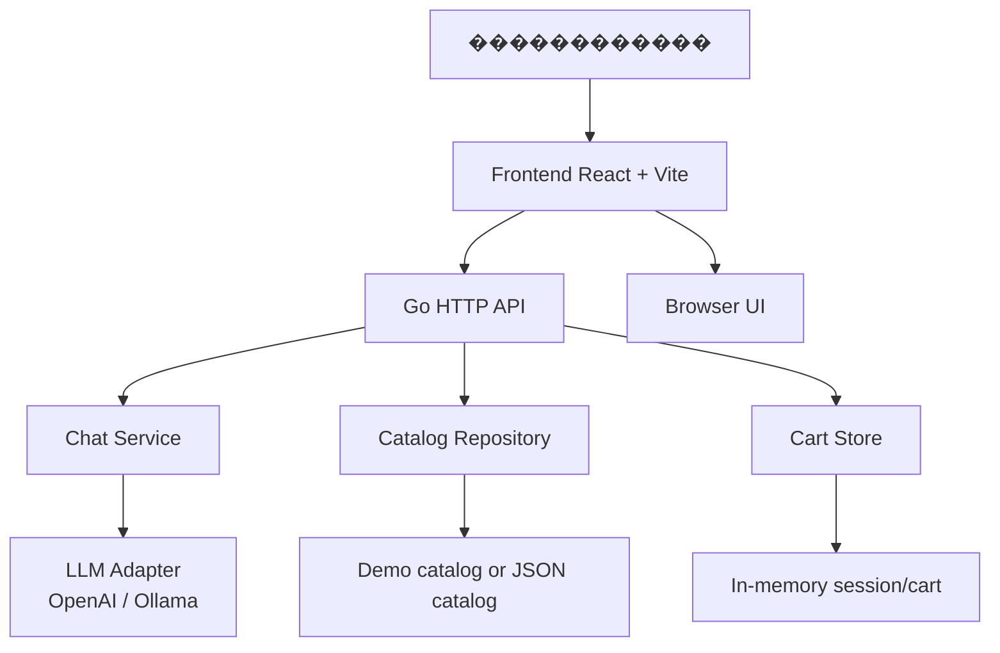

# CareTech � AI assistant for electrical catalog

CareTech � ��� ���-���������� ��� ������ � ������� ������������������ ������� �� �������� EKT � ����������� ��-����������. ������ �������� ������������ ������ ����� �����, ���������� ��������������, ��������� ������� � ��������� ���������� ������, �� ����� �� ����������.

## ������� ����������

- ����� ������� �� ��������, ������, SKU, �������� � ID
- �������� ���������� ���� � ������� �� �������
- ����� ������������� ������: ���, ����������, ��� �������, ������� � ��.
- ����� �������������� ������� ��� ���������� ������ �������
- ���-���������, ������� �������� ������� ������������ � ������������ ����� ��� ������
- ������������� ���������� � ������� �� �������� ������
- ������� �� session_id � ��������� ������� �������������
- ��������� ���������� Ollama � ������� OpenAI-compatible ��������
- ��������� ����-������, ���� JSON-������� �� ���������

## ��� ����������� � ��������

- Frontend �� React + Vite
- Backend �� Go
- ����������� API ��� ��������, ���� � �������
- ����������� in-memory ������� �������� ������� � ������
- ��������� ������� ����� pending-confirm workflow
- ������ ���������� � LLM ����� ���������� ���������

## ���� ����������

- Go 1.22
- React 19
- Vite 8
- JavaScript / JSX
- HTML / CSS
- Docker + Docker Compose
- PostgreSQL-ready integration (optional)
- OpenAI-compatible API / Ollama
- Git + GitHub

## ����-����� ��������� �������



## ��������� �����������

```text
careTech/
+- cmd/
�  L- server/
�     L- main.go
+- internal/
�  +- cart/
�  +- catalog/
�  +- chat/
�  +- db/
�  +- httpapi/
�  L- llm/
+- src/
�  +- App.jsx
�  +- App.css
�  +- main.jsx
�  L- ...
+- public/
+- data/
+- .env.example
+- .gitignore
+- docker-compose.yml
+- Dockerfile.backend
+- Dockerfile.frontend
+- go.mod
+- package.json
+- vite.config.js
+- README.md
L- index.html
```

## ��� ��������� ������ ��������

### 1. ������������

```bash
git clone https://github.com/BAITC-Hacks/hack-a7cf2003-caretech.git
cd careTech
```

### 2. ��������� ������������ ���������

```bash
npm install
```

### 3. ������ backend

������� �������� ���� `.env` �� ������ `.env.example` � ������� ����������:

```env
LLM_API_KEY=your_api_key_here
LLM_BASE_URL=https://api.openai.com/v1/chat/completions
LLM_MODEL=gpt-4o-mini
DATABASE_URL=
EKT_PRODUCTS_FILES=
```

��� Ollama �����������:

```env
LLM_API_KEY=ollama
LLM_BASE_URL=http://localhost:11434/v1/chat/completions
LLM_MODEL=qwen2.5:7b
```

������ Go backend:

```bash
go run ./cmd/server
```

Backend ����� �������� �� ������:

```text
http://localhost:8080/health
```

### 4. ������ frontend

```bash
npm run dev -- --host 0.0.0.0
```

Frontend ����� �������� �� ������:

```text
http://localhost:5173/
```

### 5. �������� API

Health-check:

```bash
curl http://localhost:8080/health
```

����� ������:

```bash
curl "http://localhost:8080/api/products?q=ABB"
```

��� ������:

```bash
curl -X POST http://localhost:8080/api/chat \
  -H "Content-Type: application/json" \
  -d '{"session_id":"demo-1","message":"���� ABB-S201-C16?"}'
```

## ������ ����� Docker

```bash
docker compose up --build
```

����� �����:

- frontend: http://localhost:5173
- backend: http://localhost:8080

## ����������

- � ���������� ����� ������� �������� ������ � ������� � Redis/PostgreSQL.
- ������ �������� ����� ���������� �� JSON-�������� EKT ����� ���������� `EKT_PRODUCTS_FILES`.
- �� ������� API-����� � �����������. ����������� ��������� `.env` � �������� ��� � `.gitignore`.

## ������� �������

- Backend: Go + HTTP API
- Frontend: React + Vite
- AI: OpenAI-compatible API / Ollama
- Product logic: catalog search and alternatives
- Cart logic: confirmed add-to-cart flow

## �����

CareTech / HackAlem style prototype for electric equipment catalog assistant.
