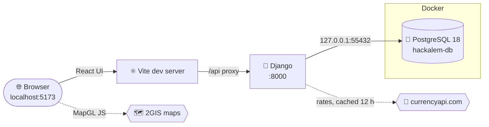

<div align="center">

```
   ██████╗ ██████╗ ███████╗██████╗ ███████╗
  ██╔═══██╗██╔══██╗██╔════╝██╔══██╗██╔════╝
  ██║   ██║██████╔╝█████╗  ██████╔╝███████╗
  ██║▄▄ ██║██╔══██╗██╔══╝  ██╔══██╗╚════██║
  ╚██████╔╝██████╔╝███████╗██║  ██║███████║
   ╚══▀▀═╝ ╚═════╝ ╚══════╝╚═╝  ╚═╝╚══════╝
```

### `// HACKALEM · TEAM QBERS · SYSTEM ONLINE`


<br/>

**Astana Budget Planner — split a city budget across five areas, on a live map of Astana.**

<sub>One command. Full stack. Same database on every machine.</sub>

</div>

---

## 🏛️ `00` — THE APP

A civil-planning budget tool for the city of Astana, in **white · lemonchiffon · dark turquoise**.

| Part | What it does |
|:--|:--|
| **Overall budget** (top) | Enter the budget as **money** (default currency **₸ tenge**, any currency via live exchange rates) or as **units** (default **10,000**). |
| **Split** | Divided **equally** across the five areas automatically — or switch to **Custom** and set each area yourself. Shows what's unallocated, or blocks saving if you go over. |
| **Currency switch** | Converts the whole budget at today's rate (e.g. ₸1,000,000,000 → $2,235,086.10) and shows the tenge equivalent. |
| **Five tabs** | 🚌 Transport · 🌳 Greenery · 🤝 Social services · 🛡️ Safety · 🏙️ City services — each with its own colour, the area's budget on the left and a **2GIS map of Astana** on the right. |
| **Autosave** | Every change is validated by a Django form and saved to PostgreSQL (header shows *Saved 14:17*). Reload the page and it's all still there. |
| **Preloaders** | Pastel bars with a live **%** — full-page on first load, inside each map while it loads, and while exchange rates, saves or coverage calculations are in flight. |
| **Language switch** (top right) | Translates the whole page into **Kazakh, Russian or Chinese** on the fly (Google Cloud Translation API, cached in Postgres so repeat text is instant). Original language is **English** — shown as a tooltip on the switcher, and every option marks English as `(original)`. |
| **AI budget allocator** | Next to the split controls — the OpenAI logo button reads every district's weakest `/100` indicators and re-splits your budget across the five areas to maximise the Final Score. Hover it for what it does before you click. |
| **`/100` score strip** (bottom of each tab) | The indicators that tab affects, each scored out of 100 per the district dataset's formula, with a before → after if your changes improved it. **[Full methodology deck →](https://claude.ai/artifact/7XJyGAk7Kgh82dAKhzNnRu)** — linked here, on the Contact page and in the footer. |

### 🚌 The Transport tab

| Feature | Details |
|:--|:--|
| **Map layers** | Every bus stop (🚏 sign — dots when zoomed out), railway 🚆 and LRT stations, Zenodo bus routes 10 · 12 · 46, and Astana's **six districts** coloured in. Toggles for each. |
| **District zoom** | Dropdown + ◀ ▶ buttons glide out and into a district, then show its **population** (qazatlas.kz), share, yearly change, area, density, stops, coverage and the dataset's T1/T2 scores. |
| **Current infrastructure** | Boxes + auto-filled inputs with today's counts: **1,002 bus stops**, **23 train stations** (5 railway + 18 LRT). Editable if you know better numbers. |
| **Add stops** | **Drag a bus-stop or train-station sign onto the map** to place a new one. Listed in the sidebar; click to fly there, ✕ to remove. |
| **Add buses / trains** | Per-route steppers using real GPS timings (buses per day, peak interval, trip time). Shows the new interval and whether it meets the dataset's **≤10 min** goal. |
| **Costs** | Pre-filled purchase/setup **and** maintenance costs for bus stops, stations, buses and trains. Maintenance in **currency or units**, **/month or /year**. Totals are checked against the transport budget. |
| **Walking distance** | Set the max distance to a bus stop (default **500 m**, from the dataset's T2) and to a station (1,000 m) plus goals. Shows the **% of residents in reach — before → after** your new stops, city-wide and per district, and stops per 10,000 residents. |

### 🌳 The Greenery tab

| Feature | Details |
|:--|:--|
| **Map (styled after [trees.sg](https://www.trees.sg))** | Parks & lawns, forest, every mapped tree as a dot, and home blocks shaded **red → green by green m² per resident nearby**. Toggles for each layer + the same animated district zoom. |
| **Green space today** | Park/lawn and forest area, mapped trees, and the **% of residents with ≥20 m² of green space within 500 m of home** (the district dataset's E1 target). |
| **Plant trees** | **Drag the tree sign onto the map** (choose how many trees per drop), or **mass-plant** N trees in a district — they're placed automatically in the blocks with the least green per resident. Each tree adds **4 m²**. |
| **Before → after** | Per district: green area, m² per resident, and share of residents meeting the goal near home — with a switch to include or exclude forest / the green belt. |
| **Tree costs** | Tree (sapling) cost + planting/setup cost per new tree, and a maintenance fee (pruning, cutting…) × the **number of trees needing it (default 1,000)**, per month or year, in currency or units. Checked against the greenery budget. |

<sub>Sources (also shown on the page): bus routes & timings — [Mansurova et al. 2025, Zenodo](https://doi.org/10.5281/zenodo.15769359) (CC BY 4.0); stops, stations, districts, buildings — © OpenStreetMap contributors (ODbL); population — [qazatlas.kz](https://qazatlas.kz/ru/city/astana) (1 July 2026); T1/T2 indicators — District_Dataset_EN.docx.</sub>

---

## ⚡ `01` — LAUNCH SEQUENCE

You don't need anything installed first — setup installs **Python, Node.js and Docker** for you, then starts our **PostgreSQL 18 database inside Docker** with the same tables, data, username and password as everyone else on the team. Already have some of these? Setup spots them, cheers you on 🎉, and skips ahead.

> [!NOTE]
> **No keys to hunt down.** Our `.env` (API keys, database login) is committed to this **private** repo, so it's already in your clone.

There are only **two steps**: run setup **once**, then use **`npm start`** every time after.

<table>
<tr>
<th width="50%">🍎 &nbsp;macOS &nbsp;·&nbsp; 🐧 Linux</th>
<th width="50%">🪟 &nbsp;Windows (Command Prompt)</th>
</tr>
<tr>
<td valign="top">

Open **Terminal**, then run:

```bash
git clone https://github.com/BAITC-Hacks/hack-b53220ee-qbers.git
cd hack-b53220ee-qbers
./setup.sh
```

</td>
<td valign="top">

Press <kbd>Win</kbd>, type **cmd**, press <kbd>Enter</kbd>, then run:

```bat
git clone https://github.com/BAITC-Hacks/hack-b53220ee-qbers.git
cd hack-b53220ee-qbers
setup.cmd
```

</td>
</tr>
<tr>
<td valign="top">

<sub>Installs Homebrew (or uses apt) → Python, Node, **Docker Desktop**.<br/>You may be asked for your computer password.</sub>

</td>
<td valign="top">

<sub>Uses winget → Python, Node, **Docker Desktop**.<br/>Click **Yes** on any Windows permission pop-ups.</sub>

</td>
</tr>
</table>

### 📟 What you'll see

```
▸ Python ≥ 3.12
  🎉 Already installed: Python 3.14.7
▸ Docker
  ⠼ Downloading Docker...   ██████████░░░░░░░░░░░░  46%  38s
  ✔  Starting Docker engine (12s)                  ███████████████░░░░░░░  68%
```

- **`...` preloader + percentage** on every download and install — the bar is the *overall* setup progress.
- **🎉 in rainbow colours** for anything already on your computer (Homebrew/winget, Python, Node, Docker, a local PostgreSQL, Django).
- **If a step fails**, setup stops right there and shows a red box with the last lines of output and a **How to fix** tip. Fix it and run setup again — finished steps are skipped. Everything is logged to `logs/setup.log`.

### 🐳 During setup you'll be asked

| Prompt | What to do |
|:--|:--|
| **Docker Desktop window opens** (first install only) | Accept the terms. Skip the sign-in screen if you like. Leave it running. On Windows it may ask to install WSL or restart — do it, then run setup again. |
| `Log in to Docker Hub? [y/N]` | Optional. Type **y** and enter your Docker Hub username + password (or access token) to avoid download limits — or press <kbd>Enter</kbd> to skip. Your password goes straight to Docker; the script never stores it. |
| Computer password (macOS/Linux) | Needed to install Homebrew / apt packages. |

### ⬆️ Versions

| Tool | What setup does |
|:--|:--|
| **PostgreSQL** | Always the **latest 18.x** image (re-checked every setup run). Older team databases (e.g. 16) are **upgraded automatically** with your data kept. A PostgreSQL you installed yourself is left untouched. |
| **Django + Python packages** | Upgraded to the **latest** release every run (Django 6.1.x today). |
| **Python** | Needs **3.12+**. Older → installs **3.14** alongside it. |
| **Node.js** | Needs **22.12+**. Older → updates to the latest. |
| **Docker** | Installs the latest Docker Desktop if missing; updates it if it's too old for this project. |

When setup finishes, your browser opens **[`http://localhost:5173`](http://localhost:5173)** on its own. 🚀

### ↻ Every time after that

Make sure **Docker Desktop is open** (the app starts it for you if it can), then from the project folder in any terminal — Terminal, cmd, or PowerShell:

```bash
npm start
```

<sub>Using pnpm? `pnpm start` works the same way.</sub>

Press <kbd>Ctrl</kbd> + <kbd>C</kbd> to stop the web servers. The database container keeps running quietly in Docker, so your data is still there next time.

### ⌘ Command cheat-sheet

| I want to… | npm | pnpm | macOS / Linux | Windows cmd |
|:--|:--|:--|:--|:--|
| **Install everything** (first time) | `npm run setup` * | `pnpm run setup` * | `./setup.sh` | `setup.cmd` |
| **Start the app** | `npm start` | `pnpm start` | `./run.sh` | `npm start` |
| **Stop the app** | <kbd>Ctrl</kbd>+<kbd>C</kbd> | <kbd>Ctrl</kbd>+<kbd>C</kbd> | <kbd>Ctrl</kbd>+<kbd>C</kbd> | <kbd>Ctrl</kbd>+<kbd>C</kbd> |
| **Start only the database** | `npm run db:up` | `pnpm run db:up` | ← same | ← same |
| **Reload map/population/green data** | `npm run data:load` | `pnpm run data:load` | ← same | ← same |
| **Rebuild it from the sources** (maintainers) | `npm run data:build` | `pnpm run data:build` | ← same | ← same |
| **Share my data with the team** | `npm run db:snapshot` | `pnpm run db:snapshot` | ← same | ← same |
| **Reload the team's data** (wipes mine) | `npm run db:reset` | `pnpm run db:reset` | ← same | ← same |
| **Open a SQL prompt** | `npm run db:shell` | `pnpm run db:shell` | ← same | ← same |
| **Fix "Virtualization support not detected"** | — | — | — | `fix-docker.cmd` |

<sub>\* Only if Node.js is already installed. On a brand-new computer, use `./setup.sh` or `setup.cmd`, which install Node for you. It's `pnpm run setup`, not `pnpm setup` — that one is a built-in pnpm command.</sub>

<details>
<summary><b>🪟 &nbsp;Windows notes</b></summary>

<br/>

- **Don't have Git?** Install it with `winget install Git.Git`, or download the ZIP from GitHub (green **Code** button → *Download ZIP*), unzip it, and double-click **`setup.cmd`**.
- **No `winget`?** It ships with Windows 10/11 as *App Installer* from the Microsoft Store. Update it, then run `setup.cmd` again.
- **"… not found" right after installing:** Windows only refreshes PATH in new windows. Close cmd, open a new one, `cd` back into the folder, and run `setup.cmd` again. It picks up where it left off.
- **Docker Desktop needs WSL 2.** If it asks to install WSL or restart, do it, reopen Docker Desktop, wait for *Engine running*, then run `setup.cmd` again.
- **Docker says "Virtualization support not detected"?** Installing WSL fixes it — double-click **`fix-docker.cmd`** (runs `wsl --install` for you), or see [the full fix below](#virtualization-support-not-detected-windows). Setup detects this and offers the fix automatically; `npm start` detects it and points you to `fix-docker.cmd`.
- **Prefer Git Bash?** `./setup.sh` works there too.

</details>

<details>
<summary><b>🐧 &nbsp;Linux notes</b></summary>

<br/>

Debian/Ubuntu (apt) is automated. Docker Engine is installed with Docker's official script and you're added to the `docker` group — until you log out and back in, the scripts use `sudo docker` automatically.

</details>

---

## 🛰️ `02` — WHAT SETUP DOES

```
┌─────────────────────────────────────────────────────────────────────────────┐
│  [1] CONFIG      reads .env (+ your .env.local) — DB login, ports, keys     │
│  [2] PKG MGR     Homebrew  ─or─  winget  ─or─  apt   (installs if missing)  │
│  [3] RUNTIME     Python 3.12+ · Node 22.12+ · Docker  (skipped if present)  │
│  [4] DOCKER      starts the engine, optional Docker Hub login               │
│  [5] DATABASE    pulls latest Postgres 18.x → port check → upgrade → up     │
│                  first run loads db/init/01-snapshot.sql (team data)        │
│  [6] BACKEND     .venv → pip install --upgrade (latest Django) → migrate    │
│  [7] FRONTEND    npm install  (React + Vite)                                │
│  [8] IGNITION    npm start → free ports picked → browser opens              │
└─────────────────────────────────────────────────────────────────────────────┘
```

It's **safe to re-run** — every step skips what's already installed.

---

## 🧬 `03` — ARCHITECTURE



| Layer | Tech | Job |
|:--|:--|:--|
| <samp>UI</samp> | **React 19 + Vite** | Budget controls, area tabs, 2GIS maps, preloaders |
| <samp>API</samp> | **Django** | `/api/plan/`, `/api/transport/…`, `/api/greenery/…` (scenarios validated by Django forms), `/api/currency/`, `/api/health/`, `/admin` |
| <samp>DATA</samp> | **PostgreSQL 18 in Docker** | Budget plan, transport & greenery scenarios, districts, stops, stations, routes, population & green grids, parks, trees, cached rates |
| <samp>MAPS</samp> | **2GIS MapGL** | Map of Astana on every tab |
| <samp>RATES</samp> | **currencyapi.com** | Live exchange rates (base KZT), proxied + cached by Django |
| <samp>CLOUD</samp> | **Google** | Sign-In with Google and Analytics (ready, not on this page yet) |
| <samp>CLOUD</samp> | **AWS** | Hosting / services (coming soon) |
| <samp>STYLE</samp> | **Font Awesome · Rubik · EB Garamond** | Icons and typography |

---

## 🐘 `04` — THE TEAM DATABASE

Everyone runs the **same** Postgres, defined once in [`docker-compose.yml`](docker-compose.yml) and configured from `.env`:

| Setting | Value (from `.env`) |
|:--|:--|
| Host | `127.0.0.1` |
| Version | PostgreSQL `18` (latest 18.x patch) |
| Port | `55432` <sub>(unusual on purpose; if it's still taken, you get the next free one — see below)</sub> |
| Database | `hackalem` |
| User / password | `hackalem` / `hackalem` |
| Container / volume | `hackalem-db` / `hackalem-pgdata-18` |

Connect with any SQL tool (TablePlus, DBeaver, pgAdmin, DataGrip) using those values, or run `npm run db:shell`.

**How the data stays in sync:**

1. The first time your container starts with an empty volume, it loads **`db/init/01-snapshot.sql`** — so you get exactly the tables and rows in the repo.
2. Changed data you want everyone to have? Run **`npm run db:snapshot`**, commit `db/init/01-snapshot.sql`, and push.
3. Teammates pull, then run **`npm run db:reset`** to replace their local data with the new snapshot.
4. Schema changes still go through Django: `python backend/manage.py makemigrations` → commit → teammates' `npm start` runs `migrate` automatically.
5. The **reference data** (districts, bus stops, stations, routes, population grid, green areas, trees) lives in the committed file `backend/core/fixtures/open_data.json.gz`. `npm start` and setup load it automatically **whenever those tables are empty** — so a database created before a dataset existed fills itself in. Force a reload with `npm run data:load`.
6. To rebuild the reference data from the sources (e.g. newer OpenStreetMap data), run `npm run data:build` — it downloads (cached in `data/raw/`), refreshes Postgres and rewrites the fixture. Commit the fixture.

### 🔌 When a port is already taken

Every port the app uses falls back automatically, so the site still runs:

| Port | If something else is using it… |
|:--|:--|
| **55432** database | Setup / `npm start` names what's using it (e.g. *Docker container some-db*), moves to the next free port, and saves it to **`.env.local`** so it stays the same for you. Django and your SQL tools use that port — the team `.env` isn't touched. |
| **8000** Django | Uses the next free port for this run. |
| **5173** web app | Uses the next free port (e.g. `5174`) and prints the URL. ⚠️ *Sign in with Google* only works on `5173`. |

`.env.local` is personal and gitignored. Delete it to go back to the team port.

### ⬆️ Upgrading PostgreSQL

`POSTGRES_VERSION` in `.env` picks the major version (currently **18**). When it changes, the next setup or `npm start`:

1. exports your old database with its **own** version (Postgres can't read another major version's files),
2. starts the new version on a fresh volume (`hackalem-pgdata-18`) and imports your data,
3. keeps the old volume and a backup file (`logs/backup-pg16.sql`) just in case.

Once you're happy, free the space with `docker volume rm hackalem-pgdata`.

> [!WARNING]
> `npm run db:reset` deletes your local database volume. Snapshot first if you have data you care about.

---

## 🗂️ `05` — FILE MAP

```
hackalem/
├── .env                   ⟶  ALL config: API keys, DB login, ports (committed — private repo)
├── .env.local             ⟶  your personal overrides, e.g. a moved port (gitignored, auto-created)
├── docker-compose.yml     ⟶  PostgreSQL container, reads .env
├── db/init/               ⟶  01-snapshot.sql — team data loaded on first start (incl. transport data)
├── data/raw/              ⟶  download cache for the transport import (gitignored)
├── package.json           ⟶  npm start · npm run setup · npm run db:*  (pnpm works too)
├── setup.sh               ⟶  one-time installer — macOS / Linux / Git Bash
├── setup.cmd · setup.ps1  ⟶  one-time installer — Windows Command Prompt
├── fix-docker.cmd         ⟶  Windows: fixes Docker's "Virtualization support not detected"
├── run.sh                 ⟶  shortcut for `npm start`
├── logs/                  ⟶  setup.log · django.log · upgrade backups (gitignored)
├── scripts/
│   ├── start.js           ·  Docker DB → migrate → Django → Vite → browser
│   ├── db.js              ·  up / pull / snapshot / reset / shell
│   ├── lib/               ·  .env reader · port finder · Docker + upgrade helpers
│   └── windows/           ·  docker-doctor.ps1 — virtualization checks + fixes
├── backend/               ⟶  Django project
│   ├── config/            ·  settings.py reads everything from .env
│   └── core/              ·  models, forms, API views
│       ├── transport.py   ·  transport scenario form, default costs, API payload
│       ├── greenery.py    ·  greenery scenario form, tree costs, API payload
│       ├── open_data.py   ·  builds districts, stops, routes, population, green space, trees
│       └── fixtures/      ·  open_data.json.gz — committed reference data (loaded automatically)
└── frontend/              ⟶  React (Vite)
    ├── index.html         ·  loads the Font Awesome kit from .env
    └── src/
        ├── App.jsx        ·  budget state, currency conversion, autosave, page preloader
        ├── lib/           ·  env.js (reads .env) · areas.js (the five areas) · money.js
        ├── hooks/         ·  useProgress — the % behind every preloader
        ├── lib/geo.js     ·  distances, point-in-district, walking-coverage maths
        ├── lib/green.js   ·  green m² per resident near home, tree placement
        └── components/    ·  BudgetControls · AreaTabs · DgisMap · ProgressBar · NumberField
            ├── transport/ ·  TransportTab · TransportMap · Coverage · Costs · Fleet · RegionCard
            └── greenery/  ·  GreeneryTab · GreeneryMap
```

---

## 🔐 `06` — ENVIRONMENT VARIABLES

All config lives in **one** root-level [`.env`](.env). Django, React, Docker Compose and the setup scripts all read it — change a value there and everything follows.
Only variables prefixed **`VITE_`** reach the browser.

| Variable | Used by | Purpose |
|:--|:--|:--|
| `POSTGRES_DB` · `POSTGRES_USER` · `POSTGRES_PASSWORD` | Docker + Django | Database name and login |
| `POSTGRES_HOST` · `POSTGRES_PORT` | Docker + Django | Where Postgres listens (`127.0.0.1:55432`) |
| `POSTGRES_VERSION` | Docker | Postgres major version (`18`); change it to upgrade |
| `DGIS_API_KEY` → `VITE_DGIS_API_KEY` | React | 2GIS maps of Astana |
| `CURRENCYAPI_KEY` | Django only | Exchange rates (free plan: 300 calls/month) |
| `CURRENCY_CACHE_HOURS` | Django | How long saved rates are reused (`12`) — keeps us well inside the quota |
| `GOOGLE_API_KEY` | Django only | Language switcher — Google Cloud Translation API (needs "Cloud Translation API" enabled in Google Cloud Console for this project; see troubleshooting) |
| `GOOGLE_OAUTH_CLIENT_ID` | React + Django | "Sign in with Google" |
| `GOOGLE_OAUTH_CLIENT_SECRET` | Django only | OAuth server-side flows |
| `GA_MEASUREMENT_ID` | React | Google Analytics 4 (`G-XXXXXXX`, optional) |
| `OPENAI_API_KEY` | Django only | AI budget allocator button (Chat Completions API) |
| `OPENAI_MODEL` | Django | Model used by the AI allocator (`gpt-5-mini`) |
| `DJANGO_SECRET_KEY` · `DJANGO_DEBUG` | Django | Framework settings |
| `AWS_*` | Django | AWS console details + future IAM access keys |
| `VITE_FONTAWESOME_KIT_URL` | React | Font Awesome icon kit |
| `VITE_FONT_SANS` / `VITE_FONT_SERIF` | React | Google Fonts — `Rubik` / `EB Garamond` |

Need a personal override without changing the team file? Put it in **`.env.local`** (gitignored) — the scripts create it for you when a port has to move. Priority: shell environment → `.env.local` → `.env`.

> [!CAUTION]
> **This repo must stay private.** `.env` contains live Google and AWS credentials. Never make the repo public, fork it publicly, or paste `.env` anywhere outside the team.

---

## 🧪 `07` — VERIFY IT WORKS

| Check | What proves it |
|:--|:--|
| **Database connected** | Header pill: <i>PostgreSQL 18.6 connected</i> (hover for host/port). Red *Database offline* means Docker isn't running. |
| **Saving works** | Change the budget → header shows *Saving…* then *Saved hh:mm*. Reload — your numbers are still there. |
| **Exchange rates** | Pick USD — the total converts and *Rates from currencyapi.com · date* appears. |
| **Maps** | Each tab shows its preloader %, then a 2GIS map of Astana. |

Peek at the saved data at **[`/admin`](http://localhost:5173/admin/)** (Budget plans, Exchange rates) after creating an admin user:

```bash
.venv/bin/python backend/manage.py createsuperuser
```

```bat
.venv\Scripts\python backend\manage.py createsuperuser
```

<sub>First line: macOS / Linux. Second line: Windows cmd.</sub>

---

## 🛠️ `08` — TROUBLESHOOTING

### "Virtualization support not detected" (Windows)

Docker Desktop shows this when Windows can't use your CPU's virtualization — Docker needs it to run Linux containers like our database.

> [!TIP]
> **The fix that works for most people: install WSL.** Open **Command Prompt as administrator** (<kbd>Win</kbd> → type `cmd` → *Run as administrator*), run the command below, then **restart Windows**:
>
> ```bat
> wsl --install
> ```
>
> After the restart, open Docker Desktop, wait for *Engine running*, and run `setup.cmd` again.

**You usually don't have to type that yourself.** On Windows, setup spots the problem three ways and offers to run `wsl --install` for you (one admin prompt, then a restart). `npm start` runs the same checks and tells you to run `fix-docker.cmd`:

- before starting Docker — virtualization / WSL checks fail,
- while waiting for Docker — its log shows *"Virtualization support not detected"* or a WSL error,
- after Docker fails to start — even when every check passes, it offers to (re)install WSL.

Or run the same fixer any time:

```bat
fix-docker.cmd
```

It checks six things and tells you exactly which one is wrong:

```
   [ok] CPU virtualization enabled in BIOS/UEFI   Intel(R) Core(TM) i7-1165G7
   [!!] Windows feature: Virtual Machine Platform
   [!!] Windows feature: Windows Subsystem for Linux
   [!!] Windows hypervisor running
   [!!] WSL 2 installed and working
   [!!] Docker Desktop log free of virtualization/WSL errors
```

| What's wrong | What happens |
|:--|:--|
| **WSL missing / Windows features off / hypervisor off** (most common) | ✅ **Fixed automatically.** Say **Y**, click **Yes** on the admin prompt, then restart. It runs **`wsl --install`** (installs WSL 2 and turns on *Virtual Machine Platform* + *Windows Subsystem for Linux*), sets the hypervisor to start at boot, and updates WSL. |
| **Everything looks on, but Docker still shows the error** | ✅ **Offers to reinstall WSL** with `wsl --install` — the same fix. |
| **Virtualization off in BIOS/UEFI** | 🔧 **You flip one switch** (Windows can't do it for you). The tool offers to **restart straight into the BIOS** for you. |
| **Windows is itself a virtual machine** | 🔧 The host must enable *nested virtualization* (instructions are printed). |

<details>
<summary><b>Manual steps: turn on virtualization in BIOS/UEFI</b></summary>

<br/>

1. **Open the BIOS/UEFI settings.** Either
   - *Settings → System → Recovery → Advanced startup → **Restart now** → Troubleshoot → Advanced options → **UEFI Firmware Settings** → Restart*, or
   - tap the key while the PC starts: **Dell** F2 · **HP** Esc then F10 · **Lenovo** F1/F2 · **ASUS / MSI** F2 or Del · **Acer** F2 · **Surface** hold Volume Up + Power.
2. **Find the setting** — usually under *Advanced*, *CPU Configuration*, or *Security*:
   - Intel: **Intel Virtualization Technology** / **VT-x** / **Intel VT**
   - AMD: **SVM Mode** / **AMD-V**
3. Set it to **Enabled** → **Save & Exit** (often F10).
4. Back in Windows, run **`fix-docker.cmd`** again to finish the Windows side, then **`setup.cmd`**.

> Work or school laptop with a BIOS password? That's what Docker means by *"contact your IT admin"* — they need to enable virtualization for you.

</details>

<details>
<summary><b>Manual steps: turn on the Windows side yourself</b></summary>

<br/>

Open **Command Prompt as administrator** (<kbd>Win</kbd> → type `cmd` → *Run as administrator*) and run:

```bat
wsl --install
```

That's normally enough — restart and you're done. If `wsl --install` fails (older Windows 10), turn the pieces on one by one instead:

```bat
dism /online /enable-feature /featurename:VirtualMachinePlatform /all /norestart
```

```bat
dism /online /enable-feature /featurename:Microsoft-Windows-Subsystem-Linux /all /norestart
```

```bat
bcdedit /set hypervisorlaunchtype auto
```

```bat
wsl --update
```

Restart Windows, open Docker Desktop → **Settings → General** → tick **Use the WSL 2 based engine** → *Apply & restart*. Wait for *Engine running*, then run `setup.cmd`.

</details>

<details>
<summary><b>Setup stopped with a red ✖</b></summary>

The red box shows the step that failed, its last lines of output and a **How to fix** tip. The full output is in `logs/setup.log` (`logs\setup.log` on Windows). Fix the issue and run setup again — it skips everything that already worked.
</details>

<details>
<summary><b>"Docker did not start" / PostgreSQL tile is red</b></summary>

Open **Docker Desktop** and wait until it shows *Engine running*, then `npm start` again. Still stuck? See what the database says:

```bash
docker compose logs db
```
</details>

<details>
<summary><b>"Port 55432 is already used by …"</b></summary>

That's handled for you — the message tells you what's using it and which port you got instead (saved in `.env.local`). Point your SQL tool at the new port. To force a specific port, set `POSTGRES_PORT=…` in `.env.local`.
</details>

<details>
<summary><b>Web app opened on 5174 (not 5173)</b></summary>

Something — often another copy of the app — is on 5173, so the next free port was used. Everything works except *Sign in with Google*. Stop the other copy with <kbd>Ctrl</kbd>+<kbd>C</kbd>, or find it:

```bash
lsof -i :5173 -i :8000
```

```bat
netstat -ano | findstr :5173
```

<sub>Django also moves off 8000 automatically when it's busy.</sub>
</details>

<details>
<summary><b>My data doesn't match the team's</b></summary>

The snapshot only loads into an **empty** volume. To throw away your local data and reload the snapshot from the repo:

```bash
npm run db:reset
```
</details>

<details>
<summary><b>"No transport data yet" / "No greenery data yet"</b></summary>

Your database was created before that dataset existed. Pull the latest code and restart `npm start` — it loads the missing data automatically. Or run it directly:

```bash
npm run data:load
```
</details>

<details>
<summary><b>Map area stays blank or shows an error</b></summary>

The maps come from **2GIS**. Check `VITE_DGIS_API_KEY` is in `.env`, you're online, and the key is active at [platform.2gis.com](https://platform.2gis.com/dashboard). After editing `.env`, restart `npm start`.
</details>

<details>
<summary><b>"Could not load exchange rates" / only tenge available</b></summary>

Money mode falls back to tenge. Check `CURRENCYAPI_KEY` in `.env` and your quota at [app.currencyapi.com](https://app.currencyapi.com/dashboard) (300 calls/month). Saved rates are reused for `CURRENCY_CACHE_HOURS`, so a short outage isn't noticed.
</details>

<details>
<summary><b>Google Maps: <code>ApiNotActivatedMapError</code> (only if you add Google Maps back)</b></summary>

The key in `.env` loads fine, but Google rejects it because the Maps APIs are **not enabled** on its Cloud project. In Google Cloud Console (the project that owns `GOOGLE_API_KEY`) → **APIs & Services → Library**, enable **Maps JavaScript API** (and Geocoding if needed), and make sure billing is on.
</details>

<details>
<summary><b>Language switcher shows "Translation unavailable"</b></summary>

The request reaches Django fine, but Google returns `403 API_KEY_SERVICE_BLOCKED`. Same cause as the Maps error above: in Google Cloud Console (the project that owns `GOOGLE_API_KEY`) → **APIs & Services → Library**, enable **Cloud Translation API**, and make sure billing is on. The page still works in English while this is off — nothing else breaks.
</details>

<details>
<summary><b>AI allocate button errors</b></summary>

Check `OPENAI_API_KEY` in `.env` is a live key with quota, and that `OPENAI_MODEL` (`gpt-5-mini`) is available to your account. The button shows OpenAI's error message directly rather than failing silently.
</details>

<details>
<summary><b>"Sign in with Google" button missing or errors</b></summary>

In Google Cloud Console → **Credentials** → your OAuth client, add `http://localhost:5173` and `http://localhost` to **Authorized JavaScript origins**.
</details>

<details>
<summary><b>Django won't start</b></summary>

Check the log:

```bash
tail -50 logs/django.log
```
</details>

---

<div align="center">

<sub>`▓▓▓▓▓▓▓▓▓▓▓▓▓▓▓▓▓▓▓▓▓▓▓▓▓▓▓▓▓▓▓▓▓▓▓▓▓▓▓▓▓▓▓▓▓▓▓▓▓▓▓▓▓▓▓▓▓▓▓▓`</sub>

**QBERS** · built at HackAlem · `EOF`

</div>
