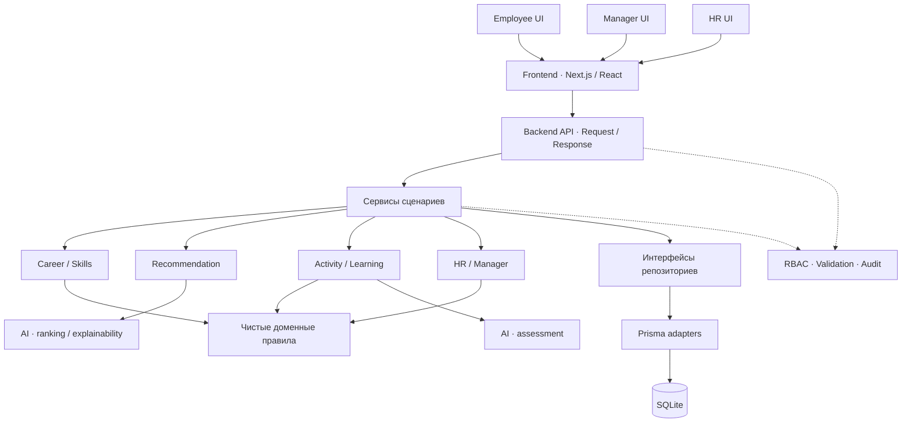
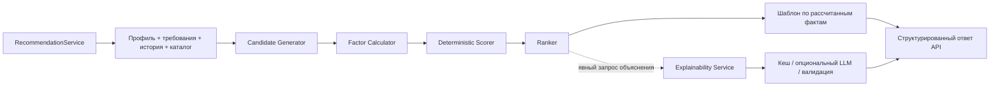
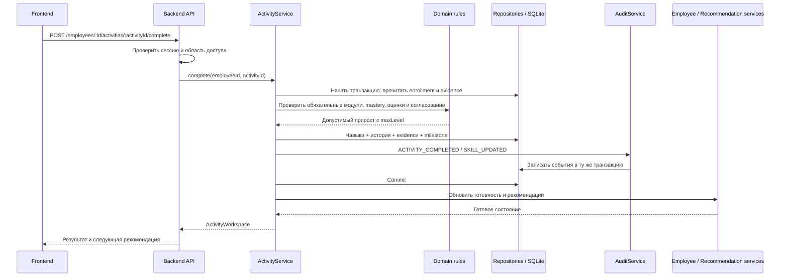

# Halyk TalentOS — карьерный навигатор Career Quest

**Персональный карьерный навигатор для сотрудников, руководителей и HR.** MVP для хакатона HackAlem AI, трек Halyk Bank.

Проект помогает сотруднику выбрать следующий шаг развития, понять причину рекомендации и увидеть ожидаемый результат. HR получает общую картину компетенций команды и инструмент для планирования обучения.

**Демо работает без AI-ключей и внешних интеграций.** Все сотрудники и истории в стартовом наборе данных вымышлены. Интерфейс приложения — на английском.

**Архитектура за минуту:** UI — `apps/frontend`; API и сценарии — `apps/backend`; правила — `packages/domain`; AI — `packages/ai`; контракты — `packages/shared`; хранение — `data`. Один модульный монолит, одна команда `npm run dev`, три роли. Обычный dashboard работает без LLM.

## Краткое описание: проблема и аудитория

В большом каталоге обучения сложно понять, какой курс или проект поможет перейти на следующую роль. Самый слабый навык не всегда самый важный для карьерной цели, а одинаковые рекомендации не учитывают опыт и интересы человека.

TalentOS сопоставляет текущие навыки, требования целевой роли, историю участия и эффект доступных активностей:

- **Сотруднику** показывает приоритетные действия и объясняет их пользу для выбранной карьерной цели.
- **HR и командам развития персонала** показывает дефицит навыков, участие в обучении и возможности внутреннего развития.

Пример: у сотрудника Public Speaking — 1/5, а System Design — 2/5. Для перехода в Senior Backend Engineer важнее System Design, поэтому система рекомендует соответствующий практикум и объясняет, почему публичные выступления сейчас не в приоритете.

## Что реализовано

| Область                 | Возможности MVP                                                                                 |
| ----------------------- | ----------------------------------------------------------------------------------------------- |
| Кабинет сотрудника      | Профиль, текущие навыки, готовность к целевой роли, рекомендации и история активностей          |
| Карьерные траектории    | Выбор целевой роли и пересчёт требований и рекомендаций                                         |
| Объяснимые рекомендации | Топ-3 активности, факторы оценки, ожидаемый прирост навыков и сравнение с альтернативой         |
| Работа с активностями   | Каталог с фильтрами и учебное пространство: материалы, практика, тесты, проверка навыка         |
| Пересчёт прогресса      | После подтверждения mastery и доказательств обновляются навыки, готовность и следующий шаг      |
| Внутренние миссии       | Каталог из двух проектов с сопоставлением требований и личных навыков                           |
| Кабинет HR              | Сводные показатели, дефицит компетенций, графики участия, карта сотрудников и просмотр профилей |
| Кадровые сценарии       | Расчёт условных групп для дообучения, внутренней мобильности и внешнего найма                   |
| Импорт данных           | Загрузка JSON/CSV, проверка структуры и связей, расчёт рекомендаций для новых профилей          |
| Доступ и интерфейс      | Две демонстрационные роли, серверная проверка доступа, адаптивная вёрстка                       |

## Как работает решение

1. **Входные данные.** Профиль сотрудника, уровни навыков от 0 до 5, текущая и целевая роли, требования к грейду, каталог активностей и история участия поступают из демоданных или импорта HR.
2. **Определение дефицита.** Система сравнивает навыки с требованиями выбранной цели и рассчитывает взвешенный процент готовности.
3. **Выбор следующего шага.** Алгоритм оценивает подходящие активности по значимости дефицита, релевантности цели, истории участия, ожидаемому приросту и бизнес-приоритету. Завершённые, отклонённые и не дающие полезного прироста активности исключаются.
4. **Результат.** Сотрудник получает до трёх рекомендаций с объяснением, деталями оценки и прогнозом «до → после».
5. **Обратная связь.** После прохождения учебной траектории, успешных оценок и проверки mastery система одной транзакцией сохраняет доказательства, применяет заданный прирост навыков и пересчитывает рекомендации. Повторная проверка не начисляет прирост повторно.
6. **Представление для HR.** Из тех же данных строятся сводные показатели и сценарии развития команды.

### Учебное пространство и подтверждение навыка

**Start activity** открывает `/employee/activities/[activityId]`: обзор, учебный план, практику, оценивание и доказательства. Материалы и ответы сохраняются между сессиями. Прогресс прохождения и mastery отображаются отдельно.

Для Advanced System Design Workshop подготовлены семь модулей: основы распределённых систем, масштабирование БД, проектирование коротких ссылок, AI-практика уведомлений, тест из 15 вопросов, архитектурный проект и итоговая проверка. Задания адаптируются к текущему уровню и карьерной цели. Все банковские кейсы и наборы данных синтетические.

| Основание                                        | Баллы mastery  |
| ------------------------------------------------ | -------------- |
| Изучение курса / статьи / видео                  | До 20 суммарно |
| Тест с результатом от 70%                        | До 20          |
| AI-задача / задание с кодом с результатом от 70% | До 30          |
| Успешная проверка проекта                        | До 20          |
| Подтверждение наставника, если предусмотрено     | 10             |

Повторные попытки и дополнительные материалы не позволяют накопить баллы сверх лимита категории. Для повышения уровня нужны минимум 70 баллов, все обязательные модули, успешные практические и итоговые оценки для развиваемых навыков, а также согласование HR у траекторий, где оно предусмотрено. Простое открытие материала не изменяет навык. Применяется заданный прирост активности с ограничением `maxLevel`.

Оценивание использует явную рубрику: масштабируемость, надёжность, архитектура данных и обработка отказов — по 20 баллов; наблюдаемость и безопасность — по 10. Для других дисциплин применяются соответствующие критерии. Без LLM работает демонстрационная проверка по признакам ответа; это эвристика, а не независимая экспертная оценка.

После результата **85% и выше** можно пропустить необязательную базовую практику; при **70–84%** обучение продолжается; при **менее 70%** добавляются материалы для повторения слабых тем. После подтверждения создаются записи SkillEvidence, обновляются готовность, рекомендации и карьерный цифровой двойник.

HR в **Development** видит учебные траектории, фактические показатели прохождения и оценок, этапы остановки и очередь согласований. **Create Learning Path** формирует черновик по навыку, уровням и аудитории. Публикация возможна только после проверки и явного подтверждения HR.

### Логика рекомендаций и роль AI

Рейтинг рассчитывается воспроизводимым алгоритмом:

```text
Оценка = 0,30 × значимость дефицита навыка
       + 0,20 × соответствие требованиям целевого грейда
       + 0,15 × оценка вероятности завершения
       + 0,10 × соответствие карьерной цели
       + 0,10 × ожидаемый прирост готовности
       + 0,10 × бизнес-приоритет
       + 0,05 × разнообразие активностей
       − штраф за пропуски и отказы
```

Оценка вероятности завершения — эвристика по истории похожих активностей, стажу и текущей роли. Факторы и итоговая оценка ограничены диапазоном 0–1.

Готовность — взвешенная доля выполнения требований целевой роли:

```text
Готовность = round(100 × Σ(вес × min(текущий уровень / требуемый, 1)) / Σ(вес))
```

**LLM используется опционально для формулировки объяснения и оценки письменных работ по заданной рубрике.** Рейтинг, применение прироста навыков и готовность рассчитываются кодом. При подключённом LLM оценки письменных работ формирует модель; сервер проверяет структуру, границы каждой оценки и сумму баллов по рубрике. Без ключа, при ошибке провайдера или тайм-ауте приложение показывает объяснение по шаблону с теми же исходными фактами.

## Технологии

| Компонент               | Технологии и назначение                                                                 |
| ----------------------- | --------------------------------------------------------------------------------------- |
| Языки                   | TypeScript, JavaScript, CSS                                                             |
| Веб-приложение и сервер | Next.js 16, App Router, React 19; серверные страницы и HTTP API                         |
| Интерфейс               | Tailwind CSS 4, Radix UI и компоненты в стиле shadcn/ui                                 |
| Визуализация            | Recharts — графики; Lucide — иконки; Framer Motion — анимации                           |
| Хранение                | SQLite, Prisma ORM 6, миграции и стартовое заполнение БД                                |
| Проверка и импорт       | Zod — схемы и валидация; PapaParse — CSV                                                |
| AI                      | Собственный алгоритм ранжирования; опциональный OpenAI-совместимый Chat Completions API |
| Модель по умолчанию     | `gpt-4.1-mini`; модель и адрес провайдера настраиваются через окружение                 |
| Проверки и CI           | Vitest, TypeScript, ESLint, HTTP smoke-тесты, Prettier, GitHub Actions                  |

Подключение к реальным системам Halyk Bank не требуется и в MVP не реализовано. Для базового демо после установки зависимостей внешние API не нужны.

## Структура репозитория (Repository Structure)

```text
apps/
  frontend/                 Next.js: страницы, компоненты, API-клиент
    app/                    Тонкие страницы; единственный адаптер HTTP API
    components/             Общие элементы, кабинеты HR и Manager
    features/               Career, Activities, Skills, Analytics
    lib/                    API-клиент, сессия для страниц, форматирование
  backend/src/
    api/                    Контроллеры employee, manager, HR
    services/               Сценарии, оркестрация, транзакции
    repositories/           Интерфейсы и реализации Prisma
    middleware/             Сессия, RBAC, Origin, контекст действующего лица
    errors/                 Типизированные ошибки и единый формат ответа
packages/
  domain/                   Чистые правила career, skills, activities, workforce
  ai/                       Recommendation, explainability, assessment, learning
  shared/                   Общие DTO, Zod-схемы и константы
data/
  fixtures/                 Синтетические исходные данные
  prisma/                   Схема, миграции, seed и локальный dev.db
tests/
  unit/                     Правила, сервисы, AI, разрешения и границы слоёв
  integration/              Репозитории, транзакции и обучение в SQLite
  api/                      HTTP-контракты, роли и smoke-проверка приложения
docs/                       Оценка архитектуры и API-контракты
```

Файлы для быстрого знакомства: [оценка исходной архитектуры](docs/architecture-assessment.md), [API-контракты](docs/api.md), [интерфейсы репозиториев](apps/backend/src/repositories/contracts.ts), [правила доступа](apps/backend/src/middleware/authorization.ts).

## Архитектура системы (System Architecture)

**Модульный монолит:** один процесс Next.js, одна SQLite-БД и одна команда запуска. Каталоги `apps` задают границы ответственности, а не отдельные развёртывания. Это упрощает запуск MVP и сохраняет возможность позже вынести рекомендации, оценивание или workforce-аналитику в отдельный сервис.



Направление зависимостей: UI → API-клиент; контроллеры → сервисы; сервисы → domain / AI / репозитории; Prisma-адаптеры → БД. Shared не зависит от других слоёв. Domain не импортирует React, Next.js, HTTP, Prisma или AI. AI не импортирует UI, backend или БД.

ESLint и `tests/unit/architecture.test.ts` проверяют границы импортов, включая относительные пути. Алиасы: `@frontend/*`, `@backend/*`, `@domain/*`, `@ai/*`, `@shared/*`, `@data/*`.

## Архитектура интерфейса (Frontend Architecture)

Страницы собирают экран из feature-компонентов и получают готовые DTO через API. В браузере остаются навигация, формы, поиск, фильтры и форматирование. Готовность, дефицит навыков, рейтинг, прирост, mastery и кадровые сводки вычисляются сервером.

Клиентские запросы проходят через `lib/api-client.ts`; серверные страницы — через `lib/server-api.ts`, который передаёт cookie на локальный API того же процесса. Он использует доверенный порт окружения, а не входящий Host как адрес внешнего запроса. API возвращает возможности интерфейса (`access.canEdit`); окончательное решение о доступе всегда принимает backend.

Единственное исключение направления импортов — `app/api/[...path]/route.ts`: небольшой адаптер Next.js, экспортирующий backend-обработчик. Бизнес-логики в нём нет.

## Архитектура backend (Backend Architecture)

Контроллеры разбирают запрос, вызывают централизованную авторизацию и сервис, затем возвращают JSON. Сервисы управляют сценариями; правила и расчёты вынесены в доменные модули.

| Модуль                              | Ответственность                                                      |
| ----------------------------------- | -------------------------------------------------------------------- |
| EmployeeService                     | Снимок профиля, готовые данные для dashboard и карьерного симулятора |
| CareerService / SkillService        | Карьерная цель, требования, разрывы и доказательства навыков         |
| RecommendationService               | Подготовка кандидатов, расчёт рейтинга и аудит результата            |
| ActivityService / Learning services | Старт, прохождение, проверка доказательств, подтверждение навыка     |
| ManagerService                      | Команда руководителя, контекст развития, проверка работ              |
| HRService                           | Агрегация workforce, дефициты, кадровые сценарии                     |
| AuditService                        | Событие, действующее лицо и явные метаданные                         |
| Репозитории                         | Предметные операции хранения и единица транзакции                    |

`EmployeeRepository`, `SkillRepository`, `ActivityRepository`, `HistoryRepository`, `EvidenceRepository` и остальные интерфейсы не раскрывают Prisma-запросы. Сервисы получают обычные TypeScript-объекты. В тестах есть адаптер сотрудника в памяти; текущий runtime использует Prisma. Переход на PostgreSQL потребует настройки схемы и миграций, но не переписывания формул или UI.

Мутации и соответствующие audit-события сохраняются в общей транзакции. Ошибки проходят через `AppError`, `ValidationError`, `NotFoundError`, `ForbiddenError` и `BusinessRuleError`. Ответ предсказуем:

```json
{ "error": { "code": "EMPLOYEE_NOT_FOUND", "message": "Employee not found." } }
```

Zod-схемы запросов, импортируемых данных и ответов LLM находятся в `packages/shared/schemas`. Доменные ограничения опубликованной траектории проверяются отдельно в domain.

## Архитектура AI (AI Architecture)

`packages/ai` получает структурированные данные и возвращает результат. Сохранением кеша, оценок и доказательств управляют backend-сервисы.

- **recommendation:** кандидаты → факторы → scorer → ranker; все вычисления детерминированы.
- **explainability:** безопасный контекст → шаблон либо опциональный LLM → валидация ответа. Кеш на 24 часа находится за интерфейсом репозитория.
- **assessment:** рубрики, проверка тестов, оценка письменной работы; проверяются поля, пределы и сумма оценок.
- **learning:** генерация учебного контента и адаптивных заданий.
- **copilot:** обозначенная точка будущего расширения; отдельный чат в текущем MVP не реализован.

**Обычный dashboard не вызывает LLM.** Модель не записывает данные, не назначает уровень навыка, грейд, готовность, рейтинг или право на повышение. При оценке письменной работы модель может предложить баллы по рубрике; backend валидирует результат, а domain проверяет все условия подтверждения навыка. Объективность такой оценки не гарантируется.

## Поток данных (Data Flow)

Сотрудник открывает dashboard → frontend запрашивает `GET /api/employees/EMP001/dashboard` → backend проверяет сессию и доступ → EmployeeService загружает профиль и каталог через репозитории → career/skills domain и RecommendationService готовят расчёты → API возвращает Snapshot → React отображает данные.

Запрос навыков использует SkillService; изменение цели — CareerService. API кадровой аналитики вызывает HRService, который сначала получает сотрудников разрешённой области, затем передаёт их чистому агрегатору. UI получает готовые метрики. Для Manager область задаётся сохранёнными связями команд, а не параметром браузера.

## Поток рекомендаций (Recommendation Flow)



Кандидаты исключают завершённые активности, неподходящий стаж и отсутствие достижимого прироста. Формула и веса приведены выше. Ответ содержит `employeeId`, список рекомендаций, активность, `score`, факторы, ожидаемое изменение и объяснение. Объяснение не меняет рассчитанный рейтинг.

### Подтверждение активности



При ошибке проверок изменения не сохраняются. Повторный запрос завершённой траектории возвращает текущее состояние без повторного начисления. Готовность в milestone рассчитывается по доменной формуле; свежие рекомендации после commit отражают сохранённые навыки.

## Безопасность и роли (Security / RBAC)

| Роль     | Область и действия                                                                                          |
| -------- | ----------------------------------------------------------------------------------------------------------- |
| EMPLOYEE | Собственный профиль, цель, учебные действия, рекомендации и доказательства                                  |
| MANAGER  | Только сотрудники назначенных команд: просмотр развития и согласование работ                                |
| HR       | Вся демонстрационная организация: аналитика, чтение профилей, импорт, учебный контент, согласование и аудит |

Разрешения централизованы в `middleware/authorization.ts`. Manager связан с подразделениями через `ManagerTeam`; seed назначает DEMO-MANAGER подразделение Aidar. Для HR разрешённая область MVP — одна демонстрационная организация. HR и Manager не выполняют учебные действия от имени сотрудника.

Сессия подписана HMAC и хранится в HttpOnly-cookie; срок и подпись проверяются сервером. Изменяющие запросы требуют допустимый Origin, JSON проверяется строгими схемами. Клиент не может передать другой employeeId или собственную оценку в учебном ответе. Ключи ответов тестов не выдаются в API. Демовход позволяет каждому посетителю выбрать любую роль: это проверка разграничения сценариев, не корпоративная аутентификация.

## Аудит (Auditability)

`AuditEvent` хранит `actorId`, `actorRole`, `action`, `entityType`, `entityId`, `timestamp` и `metadata`. Действующее лицо берётся из серверной сессии и передаётся через контекст запроса.

События: ACTIVITY_STARTED, ACTIVITY_COMPLETED, SKILL_UPDATED, RECOMMENDATION_GENERATED, MANAGER_VALIDATION, DATA_IMPORTED; дополнительно — изменение карьерной цели и публикация траектории. При повторном открытии или подтверждении выполненного обучения события начисления не дублируются. Новое вычисление рекомендаций, включая dashboard, создаёт событие генерации.

HR может прочитать последние события через `GET /api/hr/audit`. Метаданные содержат выбранные идентификаторы и результаты, без токенов, исходных запросов и письменных ответов. Журнал дополняется приложением; защита от администратора БД, внешнее архивирование и политика хранения пока не реализованы.

## Установка и запуск (How to Run)

### Требования

- **Node.js 24** и npm.
- Git и доступ к этому репозиторию.
- Для обычного демо API-ключ не нужен.

### 1. Получить проект

```bash
git clone https://github.com/BAITC-Hacks/hack-c273b2c0-adrenol1ne.git
cd hack-c273b2c0-adrenol1ne
```

Если проект уже скачан, откройте терминал в его корневом каталоге и переходите к следующему шагу.

### 2. Установить зависимости и подготовить БД

```bash
npm ci
npm run db:setup
```

`db:setup` создаёт `.env` из `.env.example`, генерирует секрет сессии, создаёт локальный файл SQLite, применяет миграции и заполняет пустую БД демоданными. Повторный запуск сохраняет существующих сотрудников и их прогресс.

### 3. Запустить приложение

```bash
npm run dev
```

Откройте [http://127.0.0.1:3000](http://127.0.0.1:3000). Вход выполняется кнопками **Employee demo**, **Manager demo** и **HR demo**, без логина и пароля. Между ролями можно переключаться в боковом меню.

В Windows PowerShell, если запуск `npm.ps1` заблокирован политикой выполнения, используйте `npm.cmd` вместо `npm`.

### Запуск production-сборки локально

Сначала остановите сервер разработки через `Ctrl+C`, затем выполните:

```bash
npm run build
npm start
```

Остановка особенно важна в Windows: работающий сервер может удерживать файл движка Prisma и мешать сборке.

Для другого порта: `npm run dev -- --port 3001` или `npm start -- --port 3001`. Скрипт запуска передаёт тот же порт серверным API-запросам. Для контейнера с reverse proxy нужен отдельно настроенный публичный listener; локальный запуск привязан к 127.0.0.1.

### Настройки окружения

| Переменная в `.env`  | Назначение                                                                    |
| -------------------- | ----------------------------------------------------------------------------- |
| `DATABASE_URL`       | По умолчанию `file:./dev.db`; файл находится в `data/prisma/dev.db`           |
| `SESSION_SECRET`     | Секрет подписи сессий, минимум 32 символа; создаётся автоматически            |
| `DEMO_LOGIN_ENABLED` | `true` включает демонстрационный вход в три роли                              |
| `LLM_API_KEY`        | Необязательный ключ провайдера; пустое значение включает шаблонные объяснения |
| `LLM_BASE_URL`       | По умолчанию `https://api.openai.com/v1`                                      |
| `LLM_MODEL`          | По умолчанию `gpt-4.1-mini`                                                   |

Для подключения модели заполните `LLM_API_KEY`, при необходимости измените провайдера и модель, затем перезапустите сервер. Настоящие ключи и `.env` не должны попадать в Git.

## Как проверить решение: сценарий для жюри

Обзор интерфейса занимает 5–10 минут; полноценное выполнение практических заданий требует дополнительного времени. Числа ниже относятся к исходной демобазе до изменения карьерной цели или завершения активностей.

### Сотрудник: обучение, практика и проверяемый прогресс

1. Нажмите **Employee demo**. В исходной базе у **Aidar Sarsenov** готовность к Senior Backend Engineer — **68%**, System Design — **2/5**.
2. В **Dashboard → Why this activity?** изучите объяснение Advanced System Design Workshop и сравнение с Public Speaking. Затем нажмите **Start activity** или **Open learning workspace**.
3. В **Learning Path** откройте Distributed Systems Fundamentals, начните модуль, изучите материал и подтвердите его прохождение. Повторите для Database Scaling. Убедитесь: прогресс растёт, но навык пока остаётся прежним.
4. В **Practice** выполните письменное задание. Для проверки отрицательного сценария отправьте слабое решение: должны появиться обратная связь и материалы для повторения, без повышения навыка. Пройдите повторение и отправьте исправленную работу.
5. Пройдите тест из 15 вопросов, архитектурный проект и итоговую оценку. Успешный ответ должен раскрывать требования задания и критерии рубрики: масштабирование, данные, отказоустойчивость, обработку ошибок, мониторинг и безопасность.
6. После выполнения обязательных требований используйте кнопку подтверждения навыка. Для Advanced System Design Workshop ожидаемый результат — **System Design 2 → 3** и готовность **68% → 76%**. На экране результата появится следующая рассчитанная рекомендация.
7. Обновите страницу и откройте **My skills → Evidence**: прогресс и подтверждающие записи должны сохраниться. Повторная проверка завершённой траектории не начисляет прирост снова.

Проценты рассчитаны из весов требований: Python — 14%, Databases — 14%, System Design — 32%, Leadership — 24%, Cloud — 16%. Рост System Design с 2/4 до 3/4 даёт **+8 процентных пунктов**. Это демонстрация расчёта, а не обещание повышения.

### Руководитель: своя команда

1. Вернитесь на главную и нажмите **Manager demo**. Откройте список команды и профиль Aidar: доступны навыки, карьерный контекст и рекомендации; учебные действия от его имени недоступны.
2. Проверьте очередь согласований. Она содержит только работы своей команды, готовые к проверке. Если таких работ ещё нет, очередь пуста.
3. Проверка доступа к сотруднику другого подразделения возвращает 403; этот сценарий также покрыт API-тестом.

### HR: аналитика, сценарий и новый профиль

1. Нажмите **Switch to HR demo** в боковом меню. Проверьте **Overview**, **Skill intelligence** и **Employees**.
2. В **Workforce scenarios** выберите Applied AI, потребность в **50 дополнительных сотрудниках**, горизонт **9 месяцев**, затем **Run scenario**. Система покажет группы дообучения, внутренней мобильности и остаточную потребность во внешнем найме. Уже готовые сотрудники отображаются отдельно.
3. В **Import data** скачайте **Download a sample profile** и загрузите полученный `employees.json`. Откройте добавленный профиль **Samira Alimova** из результата импорта. Для него должна появиться рассчитанная рекомендация по System Design.
4. Дополнительно загрузите `apps/frontend/public/samples/dataset.json`. Этот пример добавляет новую компетенцию, активность, требования к роли AI Engineer и сотрудника **Askar Seitov**. В его профиле должна появиться рекомендация **Model Evaluation Lab**.

Прогресс сохраняется между запусками. Для точного повтора начального сценария используйте новую копию проекта с пустой БД; повторный `db:setup` не сбрасывает результаты проверки.

В **Development** дополнительно проверьте карточку траектории и **Create Learning Path**: задайте навык и уровни, создайте черновик, изучите модули и опубликуйте после подтверждения. У траекторий с обязательным наставником завершение блокируется до одобрения в этом разделе.

## Как запускать проверки (How to Test)

```bash
npm run lint
npm run check
npm run build
```

`check` запускает проверку TypeScript и тесты. В проекте 128 автоматических тестов: ранжирование, готовность, импорт и откат, сессии, mastery, тесты и пороги оценки, адаптация и повторение, защита от преждевременного или повторного прироста, SkillEvidence, согласование HR и резервные AI-объяснения.

При запущенном приложении в другом терминале выполните:

```bash
npm run test:http
```

Тесты разделены на `tests/unit`, `tests/integration` и `tests/api`. Изолированные SQLite-базы создаются во временном каталоге; основная база не сбрасывается. Покрыты CareerService, SkillService, ActivityService, scorer, HR-агрегация, RBAC, атомарность аудита и границы импортов.

HTTP-проверки охватывают доступ к страницам и API, три роли, ограничения команды и защиту изменяющих запросов. Они читают текущую базу, создают сессии и audit-события, но не завершают учебные активности. Для другого порта задайте `APP_URL`, например `$env:APP_URL="http://127.0.0.1:3001"` в PowerShell. GitHub Actions устанавливает зависимости, подготавливает БД, запускает ESLint, проверяет типы, выполняет тесты и собирает приложение.

## Данные и интеграции

**Стартовый набор:** 48 синтетических сотрудников, 24 навыка, 20 активностей, 2 внутренние миссии и шесть месяцев истории. Источник — `data/fixtures/seed-data.ts`; реальные персональные данные банка не используются.

**Импорт:** через кабинет HR можно передать до пяти JSON/CSV-файлов, до 2 МБ каждый и до 8 МБ суммарно.

| Файл                   | Содержимое                                                                         |
| ---------------------- | ---------------------------------------------------------------------------------- |
| `employees.json`       | Профили, роли, цели и текущие уровни навыков                                       |
| `skills.json`          | Справочник компетенций                                                             |
| `events.json`          | Активности и заданный прирост навыков                                              |
| `requirements.json`    | Требования и веса навыков для целевой роли и грейда                                |
| `activity_history.csv` | История участия и статусы активностей                                              |
| Объединённый JSON      | Массивы `employees`, `skills`, `events`, `history`, `requirements` в одном объекте |

Готовые примеры находятся в `apps/frontend/public/samples/` и доступны для скачивания в **Import data**. Можно также загрузить отдельный JSON-объект сотрудника.

Правила импорта:

- Уровни навыков — целые числа 0–5; отсутствующий навык считается равным нулю.
- Связанные сотрудники, навыки и активности должны существовать в БД или поступить в том же импорте.
- Поле `employeeId` в истории ссылается на внутренний `id` сотрудника, а не на его внешний `employeeId`.
- Даты — ISO 8601 с часовым поясом; для `COMPLETED` требуется дата завершения.
- Данные проверяются и сохраняются одной транзакцией. Записи с существующими ID обновляются; массив навыков заменяет текущий снимок навыков сотрудника.
- Исторические завершения при импорте не начисляют прирост повторно: источником текущих уровней служит импортированный профиль.
- Если требований для новой карьерной цели нет, рекомендации не формируются до добавления требований.

**Внешняя интеграция:** опциональный OpenAI-совместимый API получает роль, цель, данные о навыках, сведения об активности и агрегаты истории. Имена, ID сотрудников и исходные записи истории не отправляются при объяснении рекомендаций. При оценивании в настроенный API передаются задание, рубрика и текст учебного ответа; в демо используйте только синтетические данные. Ответ проверяется по JSON-схеме и допустимым числам; при ошибке или превышении пяти секунд используется шаблон.

## Ограничения текущей версии

- **Демонстрационная авторизация.** Есть разделение ролей на сервере, но любой участник демо может переключиться в HR. Корпоративные SSO и управление правами не подключены.
- **Условная оценка компетенций.** Веса, прирост от обучения, вероятность завершения и уверенность заданы демонстрационными правилами и не откалиброваны на реальных данных. Уровень меняется только после заданных оценок и проверки mastery; для части траекторий есть имитация подтверждения HR. Реальная аттестация и интеграция с LMS не подключены.
- **Упрощённое кадровое планирование.** Группы определяются уровнем навыка и сроком 3/6/9 месяцев. Не учитываются бюджет, загрузка, желание сотрудников и фактическая эффективность обучения.
- **SQLite и один экземпляр приложения.** Для масштабирования нужны серверная БД, отдельная настройка развёртывания и постоянное хранилище. Статическая публикация без Node.js-сервера не поддерживается.
- **Ограниченный контур интеграций.** Нет подключения к HRIS, LMS и системам банка, полноценного процесса назначения на миссии и уведомлений. Согласование наставником демонстрационное; внешний LMS можно описать через URL, имя провайдера и ID курса, но синхронизация с ним не реализована.
- **Ограничения LLM.** Работа с живым провайдером требует ключа и отдельно настроенного доступа. Проверка JSON, границ и суммы баллов не гарантирует объективность оценки или правильность всех формулировок; расчёты и карточки исходных данных остаются основой объяснения.
- **Готовность к эксплуатации.** Реализован базовый аудит бизнес-действий. Внешний защищённый журнал, производственный мониторинг, политика хранения персональных данных и русская локализация интерфейса пока не реализованы. Чат-copilot и специальный редактор планов one-on-one не добавлены; руководитель использует существующий контекст развития сотрудника.

## Опубликованная версия

Публичная версия приложения на момент подготовки README не опубликована.

Доступен локальный запуск по инструкции выше: [http://127.0.0.1:3000](http://127.0.0.1:3000). Это адрес приложения на вашем компьютере, а не публичная ссылка.

Исходный код: [BAITC-Hacks/hack-c273b2c0-adrenol1ne](https://github.com/BAITC-Hacks/hack-c273b2c0-adrenol1ne).
