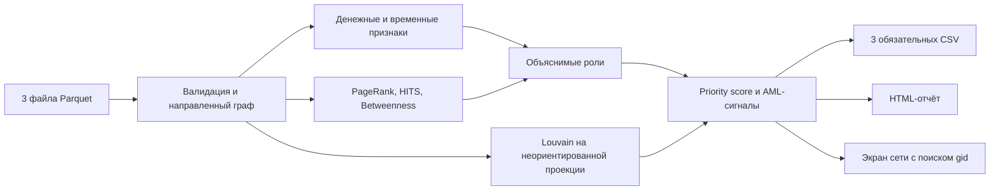

# Граф денег — AML-анализ внутрибанковских переводов

Инструмент анализирует 4-hop граф переводов, выделяет роли участников, денежные сообщества и формирует очередь узлов для проверки AML-аналитиком. Решение построено на объяснимых правилах и графовых метриках: для каждого `gid` выгружается роль, приоритет и короткое человеческое объяснение с числами.

## Быстрый запуск

Требуется Python 3.10+.

```bash
python3 -m pip install -r requirements.txt
python3 solution.py --data data --out out
```

После запуска откройте [out/report.html](out/report.html) в браузере: это основной отчёт с распределением ролей и паттернов, Top-20, операциями выбранных узлов и сводкой кластеров. Из отчёта можно открыть [out/network.html](out/network.html) — экран всей сети с поиском любого `gid`, подсветкой его входящих и исходящих связей, роли и кластера. Карта крупнейшего кластера доступна отдельно в [out/largest_cluster.html](out/largest_cluster.html).

Также создаются три CSV: `nodes_roles.csv`, `clusters.csv`, `top_nodes.csv`. Все шесть файлов доступны локально после запуска.

## Как пользоваться результатом

1. Откройте `out/report.html` и выберите узел из Top-20. Позиция означает приоритет ручной проверки, а не вероятность AML-нарушения.
2. Прочитайте evidence и раскройте таблицу операций этого `gid`. Сопоставьте даты, отправителей, получателей и суммы; порядок операций внутри дня неизвестен.
3. Перейдите в `out/network.html`, введите полный `gid` и нажмите «Показать связи». Выбранный узел, его непосредственные контрагенты и направленные рёбра будут подсвечены. Цвет узла показывает роль, рамка панели — кластер.
4. Найдите `gid` в `nodes_roles.csv`: проверьте обороты, роль, глубину и `truncated_by_depth`. По `cluster_id` найдите сводку кластера в `clusters.csv`; полный список его участников получите фильтрацией `nodes_roles.csv` по этому полю.
5. Проверьте гипотезу по первичным данным, назначениям платежей и KYC. Назначения платежей и KYC в текущую модель не загружаются; их проверка выполняется отдельно.

Ограничения наблюдения обязательны для интерпретации: входящие операции seed представлены неполно, а на глубине 4 продолжение переводов может отсутствовать в выгрузке.

## Данные

В папке `data/` находятся три Parquet-файла:

| Файл | Содержание |
| --- | --- |
| `nodes.parquet` | 2 248 узлов: `gid`, глубина обхода `depth`, признак seed `is_seed` |
| `edges.parquet` | 3 119 уникальных направленных рёбер с суммой `sum_kzt` и числом переводов `n_tx` |
| `transactions.parquet` | 4 840 отдельных переводов с датой и суммой |

Период наблюдения — июль 2026 года. Минимальная сумма перевода — 5 000 KZT.

## Результаты текущей выгрузки

Ниже — фактические значения из имеющихся `out/nodes_roles.csv`, `out/clusters.csv` и `out/top_nodes.csv` для июля 2026 года. Это описание сохранённого результата, а не оценка качества обнаружения нарушений. После смены входных данных сводку нужно обновить.

Всего **2 248 узлов, 91 кластер и 20 узлов в очереди Top-20**. Крупнейший кластер — `cluster_id=0`: 277 узлов, 1 seed, внутренний оборот 31 856 346.24 KZT.

| Роль | Число узлов |
| --- | ---: |
| `terminal` | 1 085 |
| `peripheral` | 929 |
| `transit` | 152 |
| `distributor` | 36 |
| `consolidator` | 35 |
| `coordinator` | 11 |

### Пример: первый узел в очереди

`gid=100000000661912100`, роль `transit`, `priority_score=0.816202`, `role_score=0.879780`, `cluster_id=0`. Дословное поле `why` из первой строки `out/top_nodes.csv`:

> Транзит: вход 393 036 KZT, выход 430 700 KZT; отношение 110% к наблюдаемому входу. AML: fan-in, IN/OUT близко, структ. цикл. Triage 0.82: PR 0.001803, кластер 277 уз.

У узла 5 входящих и 2 исходящих контрагента; входящий оборот 393 036 KZT, исходящий — 430 700 KZT. Их отношение 1.095828 попадает в диапазон transit; более приоритетные правила роли не выбраны. `depth=1`, `is_seed=False`, `truncated_by_depth=False`.

В evidence «IN/OUT близко» обозначает rapid transit, «структ. цикл» — circular flow. Эти метки требуют проверки дат и структуры связей; они не доказывают передачу или возврат тех же средств. Значение 0.816202 задаёт место в очереди, а не 81.6% вероятности нарушения. Для проверки откройте операции этого `gid` в отчёте и сопоставьте их с первичными документами.

## Архитектура

```text
Parquet
  → валидация схемы и загрузка
  → направленный взвешенный граф
  → базовые признаки и роли по правилам
  → Louvain-кластеры
  → временные и структурные признаки, метки паттернов
  → структурная добавка к role_score и расчёт priority_score
  → три CSV, report.html, network.html и largest_cluster.html
```



Денежные метрики считаются на исходном направленном графе. Неориентированная проекция используется только для поиска сообществ.

## Алгоритм

### Базовые признаки

Для каждого узла считаются:

- `in_deg`, `out_deg` — число уникальных входящих и исходящих контрагентов;
- `in_kzt`, `out_kzt` — входящий и исходящий оборот внутри наблюдаемого графа;
- `in_tx`, `out_tx` — число входящих и исходящих переводов;
- `pass_through = out_kzt / in_kzt` — отношение наблюдаемого исходящего оборота к наблюдаемому входящему; показатель не доказывает движение тех же денег;
- `depth`, `is_seed`, `truncated_by_depth` — последний признак равен `True` при `depth=4` и отсутствии исходящих рёбер.

При `in_kzt=0` отношение `pass_through` не определено. В CSV код записывает для него технический `0`; это не свидетельство удержания средств. Отличайте этот случай по полю `in_kzt`.

### Роли

Роли определяются порогами текущей выборки. `Q95(x)` означает 95-й перцентиль признака `x` по всем узлам; `Q90_out(x)` и `Q75_out(x)` — 90-й и 75-й перцентили среди узлов с `out_deg > 0`. Сравнения включают равенство порогу, поэтому число прошедших узлов не обязано совпадать с заданной долей выборки.

Узлам с `truncated_by_depth=True` назначается `peripheral`. Для остальных действуют следующие правила; все условия строки должны выполняться одновременно, кроме явно указанного «или».

| Роль | Условия |
| --- | --- |
| `distributor` | `out_deg ≥ Q90_out(out_deg)`, `out_tx ≥ Q90_out(out_tx)`, `out_kzt ≥ Q90_out(out_kzt)` |
| `coordinator` | `is_seed=True`, `out_deg ≥ Q75_out(out_deg)`, `out_tx ≥ Q75_out(out_tx)` |
| `consolidator` | `in_deg ≥ Q95(in_deg)`, `in_tx ≥ Q95(in_tx)` и (`out_deg ≤ 1` или `pass_through ≤ 0.50`) |
| `transit` | `in_deg > 0`, `out_deg > 0`, `0.60 ≤ pass_through ≤ 1.50` |
| `terminal` | `in_deg > 0`, `out_deg=0`; узел не обрезан по глубине |
| `peripheral` | Ни одно из правил выше не выбрано либо наблюдение обрезано по глубине |

При пересечении условий выбирается первая подходящая роль в порядке **distributor → coordinator → consolidator → transit → terminal**. Например, узел с сопоставимыми оборотами получит distributor, если выполнит все три порога этой роли. Роли описывают наблюдаемую структуру: consolidator не доказывает удержание средств, а transit не требует временной близости операций.

`role_score` — сила выполнения правила роли с небольшой структурной добавкой, а не вероятность роли или AML-нарушения.

### PageRank, HITS и Betweenness

Все структурные метрики считаются на направленном графе и взвешиваются суммой перевода `sum_kzt`.

- **PageRank** показывает структурное влияние узла в наблюдаемой сети. Значение сохраняется в поле `pagerank`.
- **HITS hub** поддерживает интерпретацию `distributor`: сильный отправитель средств значимым получателям.
- **HITS authority** поддерживает интерпретацию `consolidator`: значимый получатель средств от сильных отправителей.
- **Directed betweenness** поддерживает интерпретацию `transit`: посредник на денежных путях. Для поиска кратчайших путей используется расстояние `1 / sum_kzt`, поэтому крупный денежный поток рассматривается как более сильная связь.

HITS и betweenness не меняют присвоенный label роли. Они добавляют до `0.05` к `role_score` соответствующей роли и используются как небольшой структурный сигнал в приоритете.

### Кластеры

Сообщества ищутся Louvain-алгоритмом на неориентированной проекции графа. Если между двумя узлами есть переводы в обе стороны, их веса суммируются.

Для каждого кластера рассчитываются:

- размер и число seed-узлов;
- внутренний направленный денежный оборот;
- до десяти узлов с наибольшим приоритетом;
- объяснимая гипотеза: контур распределения, сбора, транзита, конечных получателей, смешанный или изолированный контур.

Для Louvain задан `seed=42`. Воспроизводимость следует проверять на одинаковых входных данных и версиях зависимостей; `requirements.txt` задаёт нижние границы версий, а не фиксирует окружение.

### Временные признаки

Из `transactions.parquet` рассчитываются:

- `active_days` — число дней активности;
- `tx_count_total` — число переводов с участием узла;
- `avg_tx_amount` — средняя сумма перевода;
- `frequency_score` — нормированная плотность переводов на активный день;
- `transit_timing_score` — временная близость входящей операции и исходящей на ту же или более позднюю дату: `max(0, 1 − минимальный интервал в днях / 7)`. Это не доказательство движения тех же денег.

Для seed-узлов `transit_timing_score` отключён: их входящие средства представлены неполно.

### AML-паттерны

Метки паттернов дополняют evidence и сводку отчёта, но не меняют роль или `priority_score`. Отдельной колонки patterns в CSV нет. Правила применяются независимо: у узла может быть несколько меток.

- **Fan-in** — `in_deg ≥ max(3, Q95(in_deg))` и `in_tx ≥ Q95(in_tx)` по всем узлам. Это концентрация входящих связей и переводов; само по себе правило не доказывает дробление.
- **Fan-out** — `out_deg ≥ Q90_out(out_deg)` и `out_tx ≥ Q90_out(out_tx)`. Это широкий набор исходящих связей с большим числом переводов; в отличие от роли distributor, порога по обороту здесь нет.
- **Split payments** — по каждому отправителю из `transactions.parquet` агрегируются число, сумма и средняя сумма исходящих переводов. Метка ставится при числе переводов не ниже 90-го перцентиля, общей сумме не ниже 75-го и средней сумме не выше медианы; все пороги считаются среди отправителей. Правило выделяет множество относительно небольших платежей, но не проверяет намеренное дробление или обход контрольного порога.
- **Money island** — принадлежность слабосвязному компоненту из 2–5 узлов. При определении связности направление рёбер игнорируется. Изоляция относится только к наблюдаемому графу.
- **Rapid transit** — для не-seed узла с положительными оборотами: `pass_through` от 0.60 до 1.50 и минимальный интервал между входящей операцией и исходящей на ту же или более позднюю дату не более двух дней. Это временная близость без сопоставления сумм отдельных операций и без доказательства передачи тех же средств. Порядок операций внутри дня неизвестен.
- **Circular flow** — участие в структурном направленном цикле длиной до 4. Рассматриваются первые 500 найденных циклов; хронология переводов не проверяется, возврат средств не доказан, поиск не исчерпывающий.

### Priority score

`priority_score` — объяснимый triage-рейтинг очереди ручной проверки в диапазоне 0–1. Это не вероятность риска или нарушения и не автоматическое AML-решение.

Веса — эвристические настройки текущего решения, заданные в коде, а не обученные или откалиброванные вероятности. В проекте не приведена оценка качества очереди на размеченных AML-кейсах или проверка чувствительности к весам. Числа ниже описывают расчёт, но не подтверждают оптимальность ранжирования. Баллы зависят от распределений текущей выборки и не рассчитаны для прямого сравнения между периодами.

Основная часть (умножается на 0.95):

```text
28% денежный оборот
19% фиксированный вес присвоенной роли (не role_score)
14% баланс входящего и исходящего потока
14% PageRank
 9% близость к seed по depth
 9% значимость кластера
 7% временная активность
```

Вес роли в этой формуле фиксирован: consolidator — 0.90, distributor — 0.85, coordinator — 0.80, transit — 0.75, terminal — 0.45, peripheral — 0.20. Это отдельная величина, не `role_score`.

Баланс оборотов равен `min(in_kzt, out_kzt) / max(in_kzt, out_kzt)` при положительных оборотах у не-seed узлов, иначе 0. Значимость кластера складывается из 70% нормированного внутреннего оборота и 30% нормированного размера; временная активность — из 60% `frequency_score` и 40% `transit_timing_score`. Каждый фактор вносит свой вклад независимо; метки паттернов в формулу не входят.

Оставшаяся часть (умножается на 0.05) — структурный сигнал:

```text
34% HITS hub + 33% HITS authority + 33% betweenness
```

Денежные суммы и размеры кластеров нормируются логарифмически с ограничением на 99-м перцентиле, чтобы единичный выброс не определял весь рейтинг.

## Выходные файлы

### `out/nodes_roles.csv`

Ровно 2 248 строк — по одной для каждого `gid`.

Ключевые поля:

- `role`, `role_score`;
- `cluster_id`;
- `priority_score`;
- `evidence` — объяснение роли и приоритета; набор чисел зависит от роли и полной или компактной формы текста, поэтому не все признаки присутствуют в каждой строке;
- базовые денежные метрики, `pagerank`, `depth`, `is_seed`, `truncated_by_depth`.

### `out/clusters.csv`

Одна строка на кластер: `cluster_id`, число узлов и seed, внутренний оборот, ключевые `gid` и гипотеза назначения.

### `out/top_nodes.csv`

20 узлов для данной выборки (или все узлы, если их меньше 20), отсортированных по убыванию `priority_score`. Поле `why` содержит то же объяснение, что и `evidence` для соответствующего узла.

### Интерфейс просмотра

- `out/report.html` — сводная статистика, роли, AML-сигналы, Top-20, операции Top-20 и кластеры;
- `out/network.html` — все 2 248 узлов и направленные рёбра, поиск любого `gid`, подсветка его непосредственных связей, роли и кластера;
- `out/largest_cluster.html` — подробная карта крупнейшего кластера.

Все страницы открываются локально. `network.html` использует только встроенный JavaScript и не обращается к интернету или внешним сервисам.

## Ограничения и корректная интерпретация

- Граф ограничен четырьмя коленами. Узел на `depth=4` без исходящих переводов **нельзя** считать подтверждённым terminal: последующие операции не наблюдаются. Для таких узлов evidence содержит явное предупреждение.
- Граф строится только по исходящим переводам seed-клиентов. Входящие средства seed неполны, поэтому их `pass_through` нельзя трактовать как аномалию.
- Один месяц наблюдения не доказывает устойчивый паттерн поведения.
- Rapid transit означает временную близость входящих и исходящих операций — это сигнал для проверки, а не доказательство передачи тех же средств.
- Circular flow означает структурный цикл в наблюдаемом графе, а не доказанный возврат средств.
- Высокий `priority_score` задаёт triage-очерёдность ручной проверки, а не вероятность риска, факт нарушения или мошенничества.
- Кластеризация отражает структуру наблюдаемой выборки; гипотеза кластера требует проверки аналитиком.

## Масштабирование до ~1 млн узлов

Текущая реализация рассчитана на предоставленный граф из 2 248 узлов. При росте до порядка миллиона узлов формат результатов и правила ролей можно сохранить, но вычислительный слой потребуется заменить:

- хранить рёбра в компактном разреженном формате или графовой БД и считать агрегаты потоково, не создавая полный `networkx.DiGraph` в памяти;
- PageRank считать разреженными матричными итерациями или распределённым движком;
- exact betweenness заменить приближённой оценкой по выборке опорных узлов;
- HITS и Louvain запускать в масштабируемом графовом движке с контролем числа итераций и фиксированным seed;
- циклы искать только в ограниченных подозрительных подграфах, а не во всей сети;
- вместо отображения миллиона узлов сразу загружать по запросу окрестность выбранного `gid` и агрегированные кластеры;
- Parquet читать порциями, а итоговые таблицы записывать инкрементально.

Пороговые значения, нормализацию и веса потребуется повторно проверить на распределениях нового объёма. Score между разными периодами нельзя сравнивать без общей калибровки.

## Проверка результата

После запуска проверьте целостность выгрузки. Этот список — ручная проверка, не встроенный автоматический валидатор:

- все 2 248 `gid` присутствуют в `nodes_roles.csv`;
- обязательные поля не пустые;
- `role_score` и `priority_score` лежат в диапазоне 0–1;
- отдельно проверить длину evidence: код выбирает компактную форму при превышении 200 символов, но не гарантирует этот предел во всех ветках;
- `top_nodes.csv` отсортирован по priority;
- каждый кластер согласован с `cluster_id` узлов.
