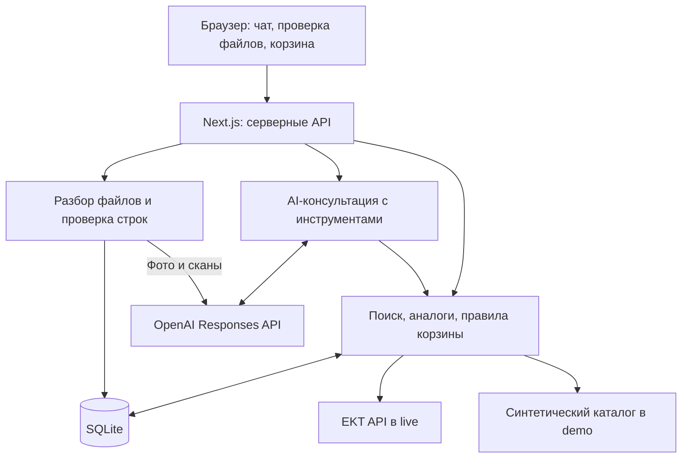

# EKT Assistant

**Помощник по подбору электротоваров и подготовке корзины на основе каталога EKT.**

## О проекте

Покупателю электротоваров нужно найти нужный артикул, проверить характеристики и наличие, подобрать замену отсутствующей позиции и перенести список покупок в корзину. EKT Assistant объединяет эти действия в одном интерфейсе: покупатель вводит запрос или загружает спецификацию, проверяет предложенные позиции и подтверждает добавление.

Проект предназначен для покупателей и специалистов, собирающих электротовары по списку. Это прототип для хакатона с двумя режимами: **demo** на синтетических данных и **live** с чтением каталога через EKT API.

> Корзина хранится на сервере прототипа. Интеграция с корзиной ekt.kz, резервирование, оформление заказа и проведение оплаты не реализованы.


[Мобильный экран](docs/screenshot-live-mobile.png) · [Сценарии демонстрации](docs/demo.md) · [Отчёт интеграции](docs/reports/integration.md)

## Что реализовано

| Возможность | Что получает пользователь |
| --- | --- |
| Поиск товара | Поиск по артикулу, названию и словам из описания в локальном индексе каталога. |
| Карточка и наличие | Характеристики, цена, остаток, источник и время проверки. В live подробные данные перечитываются из EKT API. |
| Подбор аналогов | Для товара без остатка — доступные кандидаты с совпадениями, различиями и оговорками о совместимости. Неизвестные или противоречивые параметры не считаются подтверждёнными совпадениями. |
| Условия покупки | Ответы об оплате, доставке и самовывозе со ссылкой на официальный источник. Если правило минимальной партии не подтверждено, приложение сообщает об этом. |
| Загрузка спецификации | Извлечение строк из XLSX, XLS, DOCX, PDF и JPEG; ручная правка артикула, количества и единицы измерения. Распознавание фото и сканов требует OpenAI API. |
| Проверка строк | Пользователь отдельно отмечает проверенные позиции. В предложение входят только подходящие строки; причины исключения остальных видны в интерфейсе. |
| Предложение и согласие | Предварительный состав и сумма. Добавление происходит после отдельного подтверждения с повторной проверкой цены и остатка. Повторное подтверждение не удваивает количество. |
| Собственная корзина | Страница `/cart`, изменение количества, удаление позиций и сохранение после обновления страницы. |
| История и сессия | Чат и корзина привязаны к cookie-сессии; вход в аккаунт не требуется. |
| Ссылки на сертификаты | Отображаются связанные ссылки, если они присутствуют в данных товара. Реальный применимый сертификат в проверенной выборке не подтверждён. |

## Как работает решение

1. **Ввод:** покупатель пишет артикул или запрос в чат либо загружает файл со списком позиций.
2. **Поиск и разбор:** сервер ищет товары в индексе; из документа извлекает черновик строк. Фото и сканы обрабатываются через OpenAI при настроенном API.
3. **Проверка товара:** в live сервер получает актуальную карточку EKT. Для отсутствующего товара ищет кандидатов с подходящими критичными характеристиками и положительным остатком.
4. **Проверка пользователем:** покупатель выбирает товар и количество. Для файла он исправляет и отдельно отмечает каждую строку, которую хочет включить.
5. **Предложение:** приложение показывает состав и сумму; корзина на этом шаге ещё не меняется.
6. **Подтверждение:** кнопка «Подтвердить добавление» или однозначное согласие в чате запускает серверную проверку и запись в корзину. Пользователь получает ссылку на `/cart`.

Предложение действует 10 минут. Сервер проверяет его версию и принадлежность сессии. Модель может подготовить предложение, но инструмента подтверждения или прямого изменения корзины у неё нет.

## Технологии

Версии и зависимости зафиксированы в [package.json](package.json) и [package-lock.json](package-lock.json).

| Компонент | Технологии |
| --- | --- |
| Язык и интерфейс | TypeScript 5.9, React 19, CSS. |
| Приложение и сервер | Next.js 16, App Router и Route Handlers в Node.js runtime. |
| Хранение | SQLite через `better-sqlite3`: каталог, сессии, история, предложения, корзины и черновики файлов. |
| AI | OpenAI SDK 6, Responses API, вызовы серверных инструментов; структурированный JSON для OCR. Модель задаётся через `OPENAI_MODEL`. |
| Валидация | Zod 4 для входных данных и ответов AI. |
| Разбор документов | SheetJS `xlsx` 0.20.3, `mammoth` для DOCX, `pdf-parse` для PDF. |
| Интеграция с каталогом | EKT REST API, HTTP Basic Auth. |
| Проверки | Vitest 4, ESLint 9, TypeScript, браузерные сценарии через `playwright-core` и Microsoft Edge. |
| Контейнеризация | Dockerfile на Node.js 22 и Docker Compose с томом для SQLite. |

В сохранённых проверках от **23.09.2026** использовалась модель **`gpt-6-sol`**: подтверждены вызов инструмента и OCR на синтетических файлах. Автоматического выбора модели нет; доступность указанного имени зависит от API-аккаунта. Подробности — в [отчёте интеграции](docs/reports/integration.md) и [отчёте OCR](docs/reports/ocr.md).

## Архитектура



| Расположение | Назначение |
| --- | --- |
| [src/app/](src/app/) | Страницы приложения и серверные маршруты чата, каталога, файлов и корзины. |
| [src/components/](src/components/) | Интерфейс чата, карточки товаров, проверка строк спецификации и корзина. |
| [src/lib/ekt.ts](src/lib/ekt.ts), [catalog.ts](src/lib/catalog.ts) | Доступ к EKT, нормализация карточек, локальный индекс и получение свежих деталей. |
| [src/lib/analogs.ts](src/lib/analogs.ts), [inventory.ts](src/lib/inventory.ts) | Сравнение характеристик и проверка доступного количества. |
| [src/lib/chat.ts](src/lib/chat.ts), [openai.ts](src/lib/openai.ts) | Сценарии консультации и инструменты AI. Ответы о товарах формируются из серверных данных. |
| [src/lib/uploads.ts](src/lib/uploads.ts) | Парсеры документов, OCR и сопоставление строк с каталогом. |
| [src/lib/cart.ts](src/lib/cart.ts), [db.ts](src/lib/db.ts), [session.ts](src/lib/session.ts) | `PrototypeCartAdapter`, транзакции SQLite и изоляция сессий. |
| [src/lib/policy.ts](src/lib/policy.ts), [certificates.ts](src/lib/certificates.ts) | Справка об условиях покупки и извлечение ссылок на сертификаты. |
| [scripts/](scripts/), [tests/](tests/), [docs/](docs/) | Синхронизация, автоматические проверки, тестовые файлы, сценарии и отчёты. |

Индекс помогает найти кандидатов, а данные карточки и предложения в live перечитываются через detail API. Ключи внешних сервисов используются на сервере. Корзина меняется через серверные проверки и транзакции SQLite.

## Установка и запуск

### 1. Подготовить окружение

Нужны Git, npm и Node.js **22.x от 22.12** либо **20.x от 20.19**. Локальные проверки проекта выполнены на Node.js 20.20.0. Для установки зависимостей нужен доступ к сети.

```bash
git clone https://github.com/BAITC-Hacks/hack-d3504b88-bakdaulet-lab.git
cd hack-d3504b88-bakdaulet-lab
npm ci
```

Если репозиторий уже склонирован, перейдите в его папку и выполните `npm ci`.

### 2. Создать локальную конфигурацию

Создайте `.env` из [.env.example](.env.example), если файла ещё нет.

**Windows PowerShell:**

```powershell
if (-not (Test-Path .env)) { Copy-Item .env.example .env }
```

**Linux / macOS:**

```bash
test -f .env || cp .env.example .env
```

Существующий `.env` сохраните. Для демонстрационного запуска задайте в нём:

```dotenv
DATA_MODE=demo
CART_MODE=prototype
DATABASE_PATH=./data/demo.sqlite
```

Ключи EKT и OpenAI для основного demo-сценария не нужны. Без OpenAI доступны поиск, условия покупки, корзина и разбор Excel, DOCX и текстового PDF. Фото и сканы требуют настроенного OpenAI API даже в demo.

> **Смена режима на той же БД очищает каталог, сессии, историю, предложения и корзины.** Для demo и live используйте разные `DATABASE_PATH`, например `./data/demo.sqlite` и `./data/live.sqlite`. Перед изменением режима остановите сервер. При повторном запуске уже настроенного проекта сохраняйте его существующий путь к БД.

Основные параметры:

| Переменная | Назначение / значение в примере |
| --- | --- |
| `DATA_MODE` | `demo` — синтетические товары; `live` — EKT API. |
| `DATABASE_PATH` | Путь к SQLite; в `.env.example` — `./data/app.sqlite`. База создаётся автоматически. |
| `CART_MODE` | `prototype`; реализована собственная корзина. |
| `EKT_API_BASE_URL` | `https://ekt.kz/api`. |
| `EKT_API_USERNAME`, `EKT_API_PASSWORD` | Учётные данные EKT для live. |
| `OPENAI_API_KEY`, `OPENAI_MODEL` | Ключ и модель для AI-консультации и OCR; по умолчанию пустые. |
| `CATALOG_MAX_PAGES` | Максимум страниц при синхронизации; по умолчанию `25`. |
| `CATALOG_DETAIL_PAGES` | Сколько начальных страниц дополнить деталями при синхронизации; по умолчанию `2`. |
| `UPLOAD_MAX_MB` | Максимальный размер файла; по умолчанию `10`, допустимый диапазон 1–20 МБ. |

`.env` и локальные SQLite в `data/` исключены из Git. Заполняйте секреты только локально.

### 3. Запустить demo

```bash
npm run catalog:sync
npm run dev
```

Откройте [http://localhost:3000](http://localhost:3000). Статус доступен по [http://localhost:3000/api/health](http://localhost:3000/api/health): режим `demo`, четыре товара, готовность каталога.

Для другого порта: `npm run dev -- -p 3001`.

### 4. Подключить реальные данные — при наличии доступа

Остановите сервер. В локальном `.env` задайте `DATA_MODE=live`, отдельный `DATABASE_PATH=./data/live.sqlite` и заполните `EKT_API_USERNAME` / `EKT_API_PASSWORD`. Для AI и OCR также заполните `OPENAI_API_KEY` и `OPENAI_MODEL`; проверенное в отчётах значение — `gpt-6-sol`.

```bash
npm run catalog:sync
npm run dev
```

Для проверки обеих интеграций и поиска актуальной пары «нет в наличии → доступный аналог» выполните в другом терминале:

```bash
npm run live:check
npm run analogs:discover
```

`live:check` требует одновременно EKT и OpenAI: получает каталог и карточку, затем выполняет реальный цикл вызова инструмента модели. Запросы OpenAI могут расходовать средства API-аккаунта. `analogs:discover` использует EKT и частичный индекс; отсутствие найденной пары не означает отсутствия аналогов во всём магазине.

### 5. Запустить production-сборку локально

Остановите dev-сервер и выполните с выбранным `.env`:

```bash
npm run build
npm run start
```

Приложение будет доступно на [http://localhost:3000](http://localhost:3000). Не запускайте сборку и dev-сервер одновременно в одной папке: они используют общий каталог `.next`.

### Docker Compose

Подготовлены [Dockerfile](Dockerfile) и [docker-compose.yml](docker-compose.yml). После настройки `.env`, при работающем Docker Engine:

```bash
docker compose -p ekt-demo config --quiet
docker compose -p ekt-demo up --build
```

Перед стартом сервера выполняется синхронизация каталога. Порт по умолчанию — `3000`; переменная `APP_PORT` позволяет изменить внешний порт. SQLite хранится в томе `ekt-demo_ekt_data` по пути `/app/storage/app.sqlite`; Compose переопределяет `DATABASE_PATH` из `.env`.

Для live используйте отдельное имя проекта, например `-p ekt-live`, чтобы получить отдельный том. Для остановки с сохранением данных: `docker compose -p ekt-demo down`.

**Статическая конфигурация проверена.** Сборка образа, запуск контейнера, его healthcheck и сохранность корзины после рестарта не проверены: в окружении проверки не было доступного Docker Engine. Подробности — в [отчёте Docker](docs/reports/docker.md).

## Как проверить решение

### Сценарий для жюри без API-ключей

Запустите приложение в `DATA_MODE=demo`. Откройте новое приватное окно браузера, чтобы начать с пустой корзины.

1. Введите в чат **`DEMO-AV16-OLD`**. Ожидается карточка товара с нулевым остатком и кандидат на замену **`DEMO-AV16`**.
2. Изучите характеристики и оговорки подбора. Спросите **«Условия доставки в Алматы»** — ответ должен содержать источник EKT.
3. У аналога нажмите **«Предложить 1 шт.»**. Проверьте состав предложения.
4. Откройте [корзину](http://localhost:3000/cart) в другой вкладке того же окна: до согласия она должна быть пустой.
5. Вернитесь в чат и нажмите **«Подтвердить добавление»**. Откройте корзину по появившейся ссылке: в ней должна быть одна единица `DEMO-AV16`.
6. Обновите страницу — позиция должна сохраниться. Проверьте изменение количества и удаление.

Все четыре demo-товара, их цены, остатки и пример сертификата в fixtures — **синтетические данные**, не сведения о продаже в EKT.

### Сценарий со спецификацией

Начните с новой сессии и пустой корзины в demo:

1. Кнопкой загрузки рядом с полем чата выберите [tests/fixtures/ocr/review.xlsx](tests/fixtures/ocr/review.xlsx).
2. У первой строки `DEMO-AV16 / 2 / шт` поставьте отметку **«Проверено»**.
3. У второй строки `DEMO-AV25` задайте количество **`1`**, единицу **`шт`**, затем отметьте её проверенной.
4. Третью строку с неизвестным артикулом оставьте исключённой. В сводке должны быть выбраны **2 из 3** строк.
5. Нажмите **«Подготовить предложение из проверенных строк»**. До отдельного подтверждения корзина должна оставаться пустой.
6. Подтвердите добавление: в корзине ожидаются `DEMO-AV16 × 2` и `DEMO-AV25 × 1`.

Этот сценарий проверяет разбор Excel и ручное согласование без вызова OCR. Для фото и сканов нужны ключ и модель OpenAI; образцы и результаты находятся в [отчёте OCR](docs/reports/ocr.md).

### Автоматические проверки

При остановленном dev-сервере:

```bash
npm test
npm run lint
npm run typecheck
npm run build
```

Для HTTP-проверки demo запустите `npm run dev` в первом терминале, затем во втором:

```bash
node scripts/smoke-http.mjs
```

Сценарий проверяет поиск, чат, предложение, подтверждение, повтор без дублирования, редактирование корзины и загрузку XLSX/PDF. Браузерная проверка demo: `node scripts/check-browser.mjs`.

Для работающего live-сервера предусмотрены `npm run smoke:live` и `npm run browser:live`. Они зависят от реальных API и текущих данных. Браузерные скрипты используют `playwright-core` и установленный Windows Microsoft Edge по пути `C:\Program Files (x86)\Microsoft\Edge\Application\msedge.exe`.

HTTP- и браузерные скрипты по умолчанию обращаются к `http://localhost:3000`. Если сервер работает на другом порту, задайте `APP_BASE_URL` в терминале проверок: `$env:APP_BASE_URL='http://localhost:3001'` в PowerShell или `export APP_BASE_URL=http://localhost:3001` в Bash. Эти Node.js-скрипты не загружают `.env` автоматически.

### Какие результаты зафиксированы

В сохранённых отчётах за **23.09.2026** указаны следующие результаты:

| Проверка | Результат и границы |
| --- | --- |
| Объединённая версия | `npm ci`, **148/148 тестов**, lint, typecheck и production build прошли. |
| EKT и OpenAI | Реальные запросы каталога и карточки; `gpt-6-sol` выполнил вызов серверного инструмента. Live-индекс содержал 500 товаров и оставался частичным. |
| Реальный аналог и корзина | Товар `18157` / `310100086_` с остатком 0 → `515262` / `200300265_` с остатком 74 шт. Проверены согласие, повтор, изоляция сессий и очистка тестовой позиции. |
| Браузер | Live-сценарий на desktop 1440 px и mobile 390 px, включая сохранение корзины после обновления. Отдельно прошёл demo-сценарий проверки строк спецификации. |
| OCR | В ветке OCR прошли три реальных запроса на синтетических JPEG/PDF; при интеграции платные OCR-запросы не повторялись. |
| Docker | Compose config и три локальных теста запуска прошли; два POSIX-теста пропущены на Windows. Контейнерная работа не проверена. |

Это результаты на дату проверки. Цены, остатки и доступность live-пары нужно перепроверять перед показом. Детали: [интеграция](docs/reports/integration.md), [матрица приёмки](docs/acceptance.md), [сценарий демонстрации](docs/demo.md).

## Данные и интеграции

| Источник | Как используется |
| --- | --- |
| [Демонстрационный каталог](data/fixtures/catalog.json) | Четыре синтетических товара для воспроизводимого запуска без EKT API. |
| EKT API: `https://ekt.kz/api` | `GET /products?page=N` для индекса и `GET /products/detail?id=N` для карточки. Доступ по HTTP Basic Auth. |
| [Официальные условия покупки EKT](https://ekt.kz/about/information/) | Источник справочных ответов. Текст хранится в `src/lib/policy.ts`, дата проверки в коде — 23.09.2026; страница не перечитывается при каждом вопросе. |
| OpenAI Responses API | AI-консультация с инструментами и распознавание фото/сканов. При AI-консультации передаются запрос и результаты инструментов, при OCR — содержимое изображения или PDF. |
| Файлы пользователя | Текстовые документы разбираются серверными библиотеками. В SQLite сохраняется сокращённый черновик строк, привязанный к сессии; исходные файлы не публикуются в `public/`. |

По умолчанию синхронизация ограничена 25 страницами; индекс не объявляется полным каталогом. `/api/health` показывает фактический режим, число товаров и готовность. Неизвестные данные об остатках, единицах или совместимости не заменяются предположениями модели.

## Ограничения текущей версии

- **Корзина прототипа:** официальный API корзины EKT не интегрирован; нет оформления заказа, оплаты и резервирования. Наличие при запросе не гарантирует продажу.
- **Подбор аналогов:** реализованы правила для автоматов, дифавтоматов и светильников. Подбор УЗО исключён. Монтажная совместимость и аксессуары не подтверждаются; в частичном индексе подходящий товар может отсутствовать.
- **Количество и склады:** в одном предложении допускается до 30 строк. Поддерживаются целые положительные количества в штуках без вариантов `offers`. Мерные товары требуют отдельной реализации. Пересекающиеся остатки общего каталога, города и склада консервативно отклоняются, если их нельзя безопасно распределить.
- **Документы:** XLSX, XLS, DOCX, PDF, JPG/JPEG. Старый DOC и PNG не поддержаны. Лимиты — 100 строк, 5 листов Excel, 10 страниц PDF и по умолчанию 10 МБ. Превышение лимита отклоняет документ целиком. Сложная вёрстка и OCR требуют ручной проверки.
- **Проверка OCR:** реальное фото клиента не проверено; защищённый паролем PDF проверен только через mock. Успешные OCR-примеры синтетические.
- **Сертификаты:** извлечение ссылок реализовано, но в выборке из 23 реальных карточек применимый сертификат не подтверждён. Общий каталог сертификатов не доказывает применимость к конкретному товару. См. [отчёт](docs/reports/certificates.md).
- **Условия покупки:** справочный текст требует обновления при изменении источника; онлайн-расчёт доставки отсутствует.
- **Развёртывание:** SQLite предполагает один сервер с постоянным диском. Горизонтальное масштабирование и Docker runtime не проверены.

## Развёрнутая версия

Ссылка на публично развёрнутое приложение **в репозитории не указана**. Решение можно проверить локально по инструкции выше: [http://localhost:3000](http://localhost:3000).

## Как задеплоить проект: пошагово

Ниже — вариант для **одного Linux-сервера (VPS), Docker и собственного домена**. Приложение работает в контейнере, SQLite сохраняется в отдельном томе, а Caddy принимает запросы по HTTPS. Caddy добавляется этой инструкцией как внешний прокси.

**Коротко:** подготовить сервер → скопировать проект → заполнить `.env` → указать домен → запустить Docker Compose.

Это инструкция для развёртывания, а не отчёт об уже работающем сайте: полный запуск Docker и HTTPS на публичном сервере пока не проверен.

### Шаг 1. Подготовить сервер и домен

Понадобятся:

- VPS с Ubuntu 24.04, постоянным диском и доступом по SSH с `sudo`.
- Docker Engine и плагин Docker Compose. Если их ещё нет, установите по [официальной инструкции для Ubuntu](https://docs.docker.com/engine/install/ubuntu/#install-using-the-apt-repository).
- Домен или поддомен, например `ekt.example.com`. Это **пример**: в командах и конфигурации ниже замените его своим адресом.

В панели DNS создайте запись **A** для выбранного домена со значением публичного IP сервера. Если есть запись AAAA, она тоже должна указывать на этот сервер. Разрешите входящие TCP-порты **80 и 443** в панели провайдера и firewall сервера; сохраните доступ по SSH. Порт приложения `3000` наружу публиковать не требуется.

Подключитесь к серверу, заменив `ubuntu` и `SERVER_IP` своими данными:

```bash
ssh ubuntu@SERVER_IP
```

Дальнейшие команды выполняйте **на сервере в Bash**:

```bash
sudo apt-get update
sudo apt-get install -y git curl nano
sudo systemctl enable --now docker
sudo docker version
sudo docker compose version
```

Node.js и npm на сервер отдельно устанавливать не нужно: они находятся в образе приложения.

### Шаг 2. Скачать проект и настроить `.env`

```bash
mkdir -p ~/ekt-deploy
cd ~/ekt-deploy
git clone https://github.com/BAITC-Hacks/hack-d3504b88-bakdaulet-lab.git app
cd app
test -f .env || cp .env.example .env
chmod 600 .env
nano .env
```

Для первого запуска оставьте **`DATA_MODE=demo`** и **`CART_MODE=prototype`**. Так можно проверить сайт без ключей EKT и OpenAI.

Для реального каталога сразу задайте **`DATA_MODE=live`** и заполните `EKT_API_USERNAME` / `EKT_API_PASSWORD`. Для AI и распознавания фото/сканов также нужны `OPENAI_API_KEY` и `OPENAI_MODEL`; значение модели должно быть доступно вашему API-аккаунту. В отчётах проекта проверено `gpt-6-sol`.

В `nano`: **Ctrl+O → Enter** сохраняет файл, **Ctrl+X** закрывает редактор. Секреты остаются только в серверном `.env`. Не добавляйте их в Git. Путь SQLite в контейнере задаст конфигурация следующего шага.

### Шаг 3. Создать конфигурацию контейнеров

Вернитесь в папку развёртывания и создайте `compose.yaml`:

```bash
cd ~/ekt-deploy
nano compose.yaml
```

Вставьте целиком:

```yaml
name: ekt-public

services:
  app:
    build: ./app
    init: true
    restart: unless-stopped
    stop_grace_period: 30s
    env_file:
      - ./app/.env
    environment:
      DATABASE_PATH: /app/storage/app.sqlite
      PORT: "3000"
    volumes:
      - ekt_data:/app/storage

  caddy:
    image: caddy:2
    restart: unless-stopped
    ports:
      - "80:80"
      - "443:443"
    volumes:
      - ./Caddyfile:/etc/caddy/Caddyfile:ro
      - caddy_data:/data
      - caddy_config:/config
    depends_on:
      - app

volumes:
  ekt_data:
  caddy_data:
  caddy_config:
```

Этот файл расположен **рядом с папкой `app`**, отдельно от Git-репозитория. Все дальнейшие команды `docker compose` запускайте из `~/ekt-deploy`: они используют именно эту конфигурацию. Имя `ekt-public` сохраняйте при обновлениях — от него зависит имя тома с БД. Политика `restart` запускает контейнеры после перезапуска Docker, если вы не остановили их вручную. См. [развёртывание Compose на одном сервере](https://docs.docker.com/compose/how-tos/production/).

### Шаг 4. Подключить домен и HTTPS

```bash
nano ~/ekt-deploy/Caddyfile
```

Вставьте конфигурацию, заменив **оба** вхождения `ekt.example.com` своим доменом:

```caddyfile
ekt.example.com {
    @bad_origin {
        not method GET HEAD OPTIONS
        not header Origin https://ekt.example.com
    }
    respond @bad_origin "Forbidden origin" 403

    reverse_proxy app:3000 {
        header_up X-Forwarded-Proto https
        header_up Origin https://0.0.0.0:3000
    }
}
```

При правильно настроенном DNS и доступных портах 80/443 Caddy получает и продлевает HTTPS-сертификат автоматически. Сертификаты сохраняются в его отдельном томе. Основание: [автоматический HTTPS](https://caddyserver.com/docs/automatic-https) и [образ Caddy](https://hub.docker.com/_/caddy).

**Зачем здесь проверка Origin:** текущий Docker-запуск Next.js использует внутренний адрес `0.0.0.0:3000`, с которым приложение сравнивает источник запроса. Поэтому прокси сначала допускает изменяющие запросы только с вашего HTTPS-домена, затем подставляет внутренний Origin. Сохраняйте обе части конфигурации вместе и не публикуйте порт `app` наружу. Адрес `https://0.0.0.0:3000` в `header_up` менять на домен не нужно. Использованы стандартные [правила сопоставления запросов](https://caddyserver.com/docs/caddyfile/matchers) и [настройки reverse_proxy](https://caddyserver.com/docs/caddyfile/directives/reverse_proxy).

### Шаг 5. Собрать и запустить

```bash
cd ~/ekt-deploy
sudo docker compose config --quiet
sudo docker compose run --rm --no-deps caddy caddy validate --config /etc/caddy/Caddyfile --adapter caddyfile
sudo docker compose up -d --build
sudo docker compose ps
sudo docker compose logs --tail=100 app caddy
```

Первая сборка скачивает зависимости. Затем приложение синхронизирует каталог и запускает HTTP-сервер; в live это может занять несколько минут. До завершения синхронизации прокси может отвечать `502`. Посмотреть запуск в реальном времени: `sudo docker compose logs -f app`. **Ctrl+C** закрывает просмотр логов, контейнеры продолжают работать.

Откройте **`https://ekt.example.com`**, заменив домен своим. Проверьте готовность:

```bash
curl -fsS https://ekt.example.com/api/health
```

Ожидается `ready: true`, выбранный режим и непустой каталог. В demo — четыре товара. Одного ответа health недостаточно: в браузере выполните сценарий **`DEMO-AV16-OLD` → аналог → предложение → подтверждение → корзина**, затем обновите страницу. В live используйте актуальную пару из каталога.

Проверьте также защиту изменяющих запросов: следующий запрос с чужим Origin должен вернуть **403**:

```bash
curl -sS -o /dev/null -w '%{http_code}\n' \
  -X POST https://ekt.example.com/api/chat \
  -H 'Origin: https://other.example.com' \
  -H 'Content-Type: application/json' \
  --data '{"message":"DEMO-AV16"}'
```

Для проверки сохранения данных создайте позицию в корзине, выполните `sudo docker compose restart app`, дождитесь готовности и обновите корзину **в той же сессии браузера**. Только после этих проверок добавляйте реальный адрес сайта в раздел «Развёрнутая версия» выше.

### Шаг 6. Обновлять проект и сохранять данные

**Перед обновлением — резервная копия БД.** Остановка приложения на время копирования сохраняет согласованность SQLite и её служебных файлов:

```bash
cd ~/ekt-deploy
backup_dir="./backups/$(date +%Y%m%d-%H%M%S)"
mkdir -p "$backup_dir"
chmod 700 ./backups "$backup_dir"
sudo docker compose stop app
sudo docker compose cp app:/app/storage/. "$backup_dir/"
sudo docker compose start app
```

Сохраните эту папку и серверный `.env` также вне VPS. Они содержат данные приложения и секреты; в Git их не добавляйте. Если копирование завершилось ошибкой, возобновите приложение командой `sudo docker compose start app` и разберитесь с ошибкой до обновления.

**Обновление кода:**

```bash
cd ~/ekt-deploy/app
git pull --ff-only origin main
cd ~/ekt-deploy
sudo docker compose up -d --build
sudo docker compose ps
curl -fsS https://ekt.example.com/api/health
```

После изменения ключей в `app/.env` пересоздайте контейнер: `sudo docker compose up -d --force-recreate app`. После изменения Caddyfile: `sudo docker compose exec caddy caddy reload --config /etc/caddy/Caddyfile --adapter caddyfile`.

**Остановка сайта:** `sudo docker compose down`. Тома останутся. **Не добавляйте `-v`**: этот флаг удалит тома, включая корзины и сессии. Данные приложения находятся в томе `ekt-public_ekt_data`, а не в папке Git-репозитория.

**При переходе с demo на live:** остановите прежний проект командой `sudo docker compose down`, измените `DATA_MODE` и ключи в `.env`, а `name` в `compose.yaml` — например, на `ekt-public-live`. Затем запустите `sudo docker compose up -d --build`. Новый проект получит отдельную БД; старый том останется сохранённым. Смена режима в прежнем томе очистила бы корзины и сессии.

### Если что-то не работает

| Симптом | Что проверить |
| --- | --- |
| Сайт недоступен или сертификат не выпущен | DNS A/AAAA, доступность портов 80/443, отсутствие другого сервера на этих портах; `sudo docker compose logs --tail=100 caddy`. |
| `502` или приложение перезапускается | `sudo docker compose logs --tail=100 app`: дождитесь синхронизации либо исправьте ошибку доступа к EKT. |
| `403` при отправке сообщения или подтверждении | Открывайте именно HTTPS-домен из Caddyfile; проверьте оба вхождения домена, блок `@bad_origin` и `header_up`. |
| Каталог не готов в live | Учётные данные EKT и доступ сервера к API; `/api/health` должен показывать `ready: true`. |
| Фото или скан не распознаётся | Ключ и доступность `OPENAI_MODEL`, ответ сервиса и лимиты загружаемого файла. |
| Исчезла прежняя корзина | Та же ли cookie-сессия, имя Compose-проекта и том; не менялся ли `DATA_MODE` в той же БД. |

В этом варианте работает **один экземпляр приложения с постоянным томом SQLite**. Публичную доступность сайта, HTTPS, подтверждение корзины и сохранность после рестарта нужно проверить на вашем сервере; успешный локальный build сам по себе этого не подтверждает.
