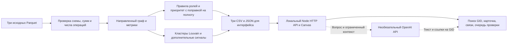

# Money Graph · HackAlem AI, трек 02 «Финансы»

Решение кейса Freedom **«Граф денег: восстановление финансовой структуры организованной группы по транзакционной сети»**. Money Graph помогает AML аналитику перейти от 81 исходного клиента к объяснимой очереди углублённой проверки: строит направленный граф, присваивает каждому узлу ролевую гипотезу, выделяет кластеры и формирует три CSV.

Обязательный сценарий — пересчёт, CSV, граф, поиск и карточки — работает локально на CPU без облачного кластера, GPU, платных сервисов и API-ключей. Дополнительный ИИ-помощник использует внешний OpenAI API и требует собственного ключа пользователя. Роли и приоритеты определяются открытыми правилами; наличие признаков не устанавливает виновность клиента.

[Установка](#системные-требования-и-стек) · [Запуск](#быстрый-старт) · [Свой API-ключ](#ии-помощник-внешний-openai-api) · [Кибербезопасность](#ключи-git-и-требования-кибербезопасности) · [Артефакты](#архитектура-и-артефакты) · [Формулы](#проверяемый-метод) · [Ограничения](#границы-интерпретации) · [Must-have](#соответствие-обязательным-функциям) · [Демо](PITCH.md)

## Системные требования и стек

- **Python 3.12** — рекомендуемая версия для воспроизведения, проверено на CPython **3.12.14**. Python 3.11 не подходит для закреплённых зависимостей; Python 3.14.1 также исключён требованиями NetworkX.
- **Node.js 24**, проверено на **24.19.0**. Сервер использует стандартную библиотеку Node; `npm install` не нужен.
- **Git** — получение кода из ветки `main`; современный браузер — просмотр локального интерфейса.
- Анализ: **pandas 3.0.6**, **NumPy 2.5.3**, **DuckDB 1.5.5** для чтения Parquet, **NetworkX 3.7** для графа. Версии закреплены в [requirements.txt](track02/requirements.txt).
- Интерфейс: HTML, CSS, JavaScript и Canvas; HTTP API — Node.js. Проверенный компьютер работает под Windows; ниже также приведены команды для Linux/macOS.

Интернет нужен при установке инструментов и Python-пакетов, получении репозитория и при обращении к ИИ-помощнику. После подготовки расчёт графа и просмотр результатов работают без сети. База данных, Docker, GPU и отдельный фронтенд-сборщик для запуска не нужны.

### Установка инструментов: Windows

1. Скачайте установщик **Node.js 24 LTS** с [официального сайта](https://nodejs.org/en/download), выбрав Windows и архитектуру компьютера (обычно x64). Запустите `.msi`, оставьте добавление Node в `PATH`. Для повторения проверенного окружения доступен [архив Node.js 24.19.0](https://nodejs.org/en/download/archive/v24.19.0).
2. Установите **Python Install Manager** с [python.org](https://www.python.org/downloads/windows/). Откройте новый PowerShell и выполните `pymanager install 3.12`. Менеджер установит доступный выпуск ветки 3.12; выбор версии описан в [официальной инструкции Python](https://docs.python.org/3/using/windows.html#installing-runtimes). Если Python 3.12 уже установлен, повторная установка не требуется.
3. Установите [Git for Windows](https://git-scm.com/install/windows) с доступом к Git из командной строки. Затем заново откройте PowerShell.
4. Проверьте версии:

```powershell
node --version
py -3.12 --version
git --version
```

Ожидаются Node `v24.x`, Python `3.12.x` и версия Git. Если `python` открывает Microsoft Store, используйте `py -3.12`, как в подготовке проекта ниже. Если команды не найдены, перезапустите терминал и проверьте `PATH` установленных программ.

### Установка инструментов: macOS

1. Установите **Node.js 24 LTS**: на [официальной странице](https://nodejs.org/en/download) выберите macOS и загрузите `.pkg`. В [архиве 24.19.0](https://nodejs.org/en/download/archive/v24.19.0) есть установщик для Intel и Apple Silicon.
2. Установите [Homebrew по его официальной инструкции](https://brew.sh/) и выполните показанные установщиком шаги добавления `brew` в `PATH`. Он используется для установки инструментов, в работе приложения не участвует.
3. В Terminal установите [Python 3.12](https://formulae.brew.sh/formula/python@3.12) и [Git](https://git-scm.com/install/mac), затем проверьте версии:

```bash
brew install python@3.12 git
node --version
python3.12 --version
git --version
```

Используйте именно `python3.12` при создании окружения проекта: системный `python3` может иметь другую версию.

### Установка инструментов: Linux

Ниже пример для **Ubuntu 24.04 LTS**. Установка Git и Python через пакетный менеджер описана в [документации Git](https://git-scm.com/install/linux) и [Ubuntu](https://ubuntu.com/developers/docs/howto/python-setup/). В других дистрибутивах установите эквивалентные пакеты Python 3.12 с `venv` и Git; команды `apt` относятся только к Debian/Ubuntu.

```bash
sudo apt update
sudo apt install git python3.12 python3.12-venv curl xz-utils
```

Для Node скачайте подходящий Linux-архив со [страницы Node.js 24](https://nodejs.org/en/download). Пример установки проверенной версии **24.19.0 для x64** в домашнюю папку:

```bash
mkdir -p "$HOME/.local/nodejs"
curl -fL https://nodejs.org/dist/v24.19.0/node-v24.19.0-linux-x64.tar.xz -o /tmp/money-graph-node.tar.xz
tar -xJf /tmp/money-graph-node.tar.xz -C "$HOME/.local/nodejs" --strip-components=1
export PATH="$HOME/.local/nodejs/bin:$PATH"
node --version
python3.12 --version
git --version
```

На ARM64 замените `linux-x64` в адресе на `linux-arm64`; архитектуру показывает `uname -m` (`x86_64` → x64, `aarch64` → ARM64). Файлы и контрольные суммы опубликованы в [официальном архиве](https://nodejs.org/en/download/archive/v24.19.0). Чтобы Node был доступен в новых терминалах, добавьте строку `export PATH="$HOME/.local/nodejs/bin:$PATH"` в свой `~/.bashrc` или `~/.zshrc`.

**Граница проверки:** полный запуск проекта и новая установка зависимостей проверены на Windows x64. Инструкции macOS/Linux сверены с документацией поставщиков; на этих ОС команда проект отдельно не запускала. Далее все команды выполняются из корня полученного репозитория.

## Исходные данные

Для отдельной проверки ролей на небольшом вымышленном графе используйте [синтетический набор](track02/fixtures/README.md). Он не заменяет данные организаторов.

Архив [track02/materials/data.zip](track02/materials/data.zip) получен из [материалов организаторов](https://drive.google.com/file/d/1yHdWaSb6gwPAUrqco-KrwR2U_YhzFQFT/view?usp=sharing). Команда распаковки ниже создаёт `track02/data/nodes.parquet`, `edges.parquet` и `transactions.parquet`. Извлечённые Parquet не дублируются в GitHub. [README набора](track02/materials/dataset-README.md) содержит описание исходных полей.

| Файл | Строк | Поля |
| --- | ---: | --- |
| `nodes.parquet` | 2 248 | `gid`, `depth`, `is_seed` |
| `edges.parquet` | 3 119 | `src`, `dst`, `sum_kzt`, `n_tx`, `depth` |
| `transactions.parquet` | 4 840 | `src`, `dst`, `date`, `sum_kzt` |

Период — **1–31 июля 2026 года**, 81 исходный клиент, только исходящие внутрибанковские цепочки до четырёх колен и операции от 5 000 KZT. Наблюдаемый оборот — **365 890 012,01 KZT** (в ТЗ округлён до 365 890 012). Обработка разовая, пакетная.

## Быстрый старт

Установка по этим шагам проверена в отдельной папке и новой `.venv` на Windows x64: зависимости загружены заново, 73 теста прошли, CLI-пересчёт занял 1,561 с, сервер и выгрузки работают. Нужны Python 3.12, Node.js 24 и доступ к репозиторию; Linux/macOS отдельно не запускались. [Протокол установки](reports/CLEAN_INSTALL.md).

### 0. Получение нужной версии

Нужен Git и доступ к закрытому репозиторию команды. Получите именно ветку `main`:

```powershell
git clone --branch main --single-branch https://github.com/BAITC-Hacks/hack-d4a071e9-mydream.git
cd hack-d4a071e9-mydream
```

Если скачиваете ZIP через GitHub, сначала выберите ветку `main`, распакуйте архив и откройте терминал в папке, содержащей `server.mjs`. Далее все пути отсчитываются от этой папки.

### 1. Однократная подготовка

Установите инструменты по разделу выше. Если Python установлен вне PATH, подставьте полный путь к его исполняемому файлу.

В PowerShell полный путь запускается через `&`: например, `& 'C:\Python312\python.exe' -m venv track02/.venv` (укажите свой путь). Если установлен Windows Python Launcher, для создания окружения можно использовать `py -3.12 -m venv track02/.venv`.

Windows / PowerShell:

```powershell
Expand-Archive -LiteralPath track02/materials/data.zip -DestinationPath track02 -Force
py -3.12 -m venv track02/.venv
track02/.venv/Scripts/python.exe -m pip install -r track02/requirements.txt
```

Linux / macOS (CPython 3.12 должен быть доступен как `python3.12`):

```bash
python3.12 -m zipfile -e track02/materials/data.zip track02
python3.12 -m venv track02/.venv
track02/.venv/bin/python -m pip install -r track02/requirements.txt
```

### 2. Один запуск от сырых Parquet до результата

Windows / PowerShell:

```powershell
track02/.venv/Scripts/python.exe track02/pipeline.py --data track02/data --out track02/out
```

Linux / macOS:

```bash
track02/.venv/bin/python track02/pipeline.py --data track02/data --out track02/out
```

Эта команда без ручных шагов проверяет исходные файлы, пересчитывает метрики, роли, приоритеты и кластеры, записывает все три CSV и данные интерфейса. Для другой выгрузки той же схемы передайте её папку через `--data`. Ожидаемый результат на наборе организаторов: **2 248 узлов, 66 кластеров, топ-50**, файлы в `track02/out/`. Лимит 5 минут относится к пересчёту подготовленного окружения, без установки пакетов.

### 3. Экран просмотра

```powershell
node server.mjs
```

Откройте <http://127.0.0.1:4173>. Кнопка **Пересчитать модель** повторяет тот же конвейер для `track02/data/`. Сервер выбирает Python из `track02/.venv`; переменная `PYTHON_BIN` позволяет указать другое подготовленное окружение. При занятом порте можно задать `PORT`, например `$env:PORT=4174` в PowerShell. Сайт не развёрнут публично; локальный адрес доступен только на машине запуска.

### ИИ-помощник: внешний OpenAI API

**Используйте свой API-ключ** из собственного разрешённого организаторами проекта OpenAI API. Ключ команды в репозитории не предоставляется. Не вставляйте ключ в исходный код, README или файлы `.env`; задайте его в окружении процесса способом ниже. Правила хранения и точные пункты инструкции организаторов приведены в разделе [«Ключи, Git и требования кибербезопасности»](#ключи-git-и-требования-кибербезопасности).

Техническая конфигурация: в [src/openai-assistant.mjs](src/openai-assistant.mjs) задан идентификатор модели **`gpt-6-sol`**, запросы идут через OpenAI Responses API со структурированным ответом. Ключ должен иметь доступ к этой модели; её название не выводится в интерфейсе. [Документация модели](https://developers.openai.com/api/docs/models/gpt-6-sol), [формат структурированных ответов](https://developers.openai.com/api/docs/guides/structured-outputs).

**Куда именно вводить токен:** в терминал, в ответ на приглашение **`Ваш OpenAI API key`**, которое появится после команды ввода ниже. Это значение переменной **`OPENAI_API_KEY`**; приложение прочитает её при запуске.

1. Откройте PowerShell на Windows или Terminal на macOS/Linux в папке проекта с `server.mjs`.
2. Выполните команды своего блока по порядку. Когда появится `Ваш OpenAI API key`, вставьте **собственный ключ** из буфера обмена и нажмите Enter. При скрытом вводе символы ключа не отображаются.
3. Запустите `node server.mjs` в **том же окне терминала**. Откройте локальный сайт и используйте кнопку **«Спросить помощника»**. В файлы проекта токен вводить не нужно.

Windows / PowerShell:

```powershell
$assistantKey = Read-Host 'Ваш OpenAI API key' -AsSecureString
$env:OPENAI_API_KEY = [System.Net.NetworkCredential]::new('', $assistantKey).Password
Remove-Variable assistantKey
node server.mjs
```

Linux / macOS, интерактивный Bash или Zsh (ввод скрыт, значение ключа не попадает в текст команды):

```bash
printf 'Ваш OpenAI API key: '
read -r -s OPENAI_API_KEY
printf '\n'
export OPENAI_API_KEY
node server.mjs
```

После остановки сервера очистите переменную: в PowerShell выполните `Remove-Item Env:OPENAI_API_KEY`, в Bash/Zsh — `unset OPENAI_API_KEY`. Закрытие терминала также завершает эту сессию окружения. Не добавляйте ключ в профиль PowerShell, `.bashrc` или `.zshrc`.

Если сервер уже работает, остановите его `Ctrl+C`, задайте переменную, запустите заново и обновите страницу. Приложение читает `OPENAI_API_KEY` только из окружения процесса; `.env` автоматически не загружается. Ключ не передаётся браузеру и не записывается приложением в файлы. Статус «настроен» означает наличие ключа; доступ и квота проверяются реальным запросом.

После загрузки карты **под графом автоматически появляется аналитика ИИ-помощника**:

- В общем виде и при просмотре кластера — обзор **топ-10 по всей сети**: почему каждый узел в приоритете, на что обратить внимание и какие сведения проверить. Десятка выбирается из рассчитанных показателей всех узлов, по убыванию `priority_score`; при равенстве используется строковый порядок GID.
- В режиме **«Связи узла»** — резюме выбранного GID: гипотеза роли, входящие и исходящие потоки, основания приоритета, ограничения и следующий шаг проверки. Ссылка на GID в сводке открывает его карточку и связи.
- Ниже остаётся свободный вопрос по кнопке **«Спросить помощника»**.

Сервер отправляет вопрос и выбранный фрагмент обезличенного графа в `https://api.openai.com/v1/responses`: до 60 узлов, 160 связей, вычисленные признаки, свидетельства путей и ограничения выборки. Для обзора все десять приоритетных узлов обязательно входят в контекст; для резюме — выбранный GID. Сырые Parquet и полный индекс транзакций не отправляются. Свободный вопрос отправляется дословно, поэтому используйте только обезличенные GID. Внешний поиск и обогащение отключены, установлен `store: false` (это не обещание отсутствия служебного хранения у провайдера).

Модель возвращает текст и ссылки на GID в строгой JSON-схеме. Сервер проверяет, что ссылки и упомянутые номера есть в отправленном контексте; содержательные выводы требуют проверки аналитиком. Ответы не меняют локальные роли или приоритет. Общие получатели вычисляются по направленным путям до двух переходов, с сохранением подтверждающих рёбер. Это достижимость по графу, а не доказательство движения тех же денег. Неполнота контекста передаётся модели.

Автоматический запрос начинается после 600 мс без смены выбора. Быстрое переключение узлов объединяется в запрос для последнего выбранного GID; завершившийся ответ для другого вида не подменяет текущую сводку. Изменение размера canvas запросов не вызывает. Успешные сводки кэшируются в памяти браузера и сервера (до 50 на каждом уровне), повторное открытие использует сохранённый ответ с отметкой времени. Кэш сервера привязан к SHA-256 содержимого `network.json`, поэтому изменившиеся результаты пересчёта не используют прежнюю аналитику. Перезапуск сервера очищает его кэш. Одновременные одинаковые запросы разделяют один вызов модели.

При отсутствии ключа, доступа к модели, квоты или интернета интерфейс показывает ошибку. Автоматической замены модели и имитации ответа локальными правилами нет. Один запрос к модели выполняется за раз, ожидание API ограничено 55 секундами. Повтор после ошибки выполняется только кнопкой; ошибок в кэше нет. Ответ обзора принимается только при наличии обоснования для каждого из десяти GID. На время автоматического анализа кнопка свободного вопроса ждёт его завершения. Граф, расчёты и CSV продолжают работать без API. Тесты используют подставной транспорт и не тратят квоту; живой ответ проверяется отдельно после настройки ключа.

### 4. Автоматические проверки

Полная проверка обязательных требований, ограничений и опциональных сигналов одной командой (после подготовки Python-окружения):

```powershell
node scripts/check-compliance.mjs
```

Команда запускает JavaScript- и Python-тесты без платных вызовов модели. Контрактные тесты дважды пересчитывают исходные Parquet в новые временные каталоги, сверяют все узлы, схемы, суммы, топ-лист, ограничения границы и сохранённые CSV. Лимит каждого полного прогона — 300 секунд. Результат — `reports/compliance-results.json`, подробные логи — `reports/javascript-tests.txt` и `reports/python-tests.txt`. Построчная проверка всего ТЗ и пределы автоматических проверок: [отчёт соответствия](docs/SPEC_COMPLIANCE.md).

Windows / PowerShell:

```powershell
node --test
track02/.venv/Scripts/python.exe tests/pipeline_analysis_test.py
track02/.venv/Scripts/python.exe tests/synthetic_data_test.py
track02/.venv/Scripts/python.exe tests/optional_analysis_test.py
track02/.venv/Scripts/python.exe tests/node_detail_pipeline_test.py
```

На Linux/macOS замените `track02/.venv/Scripts/python.exe` на `track02/.venv/bin/python`. Проверки покрывают схемы и полноту CSV, правила на синтетическом графе, сохранение точных GID, отдельные операции, поиск, ограничение числа узлов на canvas, работу HTTP API и подготовку контекста помощника. Автоматические тесты API не требуют настоящего ключа и не подтверждают доступ аккаунта к внешней модели. Проверенный полный пересчёт `pipeline.py` на текущем компьютере занял **2,00 с**; это измерение конкретного окружения, а не гарантия для любого оборудования.

## Основной сценарий

1. Аналитик размещает три Parquet в `track02/data/` и запускает конвейер; в интерфейсе видит сводку и ранжированный список узлов. Загрузка файлов выполняется через локальную папку или аргумент `--data`.
2. Находит любой `gid` поиском или выбирает узел на направленном графе.
3. Сразу видит гипотезу о роли и её основание. Карточка показывает приоритет, все показатели узла, кластер, все агрегированные связи и отдельные переводы с датой, направлением и суммой.
4. Изучает автокарточку и дополнительные сигналы узла, сравнивает сценарии устойчивости; при настроенном OpenAI API читает автоматический обзор топ-10 или резюме GID под графом и может задать свободный вопрос.
5. Открывает план недостающих данных, переходит к кластерам и выгружает три CSV для дальнейшей проверки.

Чтобы точки не накладывались, обзорный canvas показывает 66 кластеров и 40 крупнейших направленных потоков между ними. По клику группа раскрывает до 18 узлов с наибольшим приоритетом на каждом колене; режим связей показывает крупнейшие по сумме переводы выбранного узла (до 24 с каждой стороны на узком экране и до 36 на широком). Подпись графа всегда указывает, сколько узлов и связей показано из общего числа. Поиск открывает любой gid и прокручивает страницу к его карточке. Все связи доступны в карточке; отдельные операции загружаются по запросу только для выбранного узла.

На широком экране карта и карточка GID выровнены по высоте; ниже расположены сводка ИИ-помощника, очередь проверки и кластеры. Карточка разделена на четыре вкладки: **«Обзор»** — гипотеза роли и дополнительные сигналы; **«Связи»** — потоки и все контрагенты; **«Расчёт»** — метрики и вклад факторов в приоритет; **«Переводы»** — отдельные операции. Длинные списки прокручиваются внутри вкладки. Переключение вкладок не вызывает модель; при выборе нового GID открывается «Обзор». На узком экране блоки идут в одну колонку. Вкладками можно управлять клавишами ←/→, Home и End.

Три проверочных примера для [пятиминутного демо](PITCH.md):

| GID | Что показать | Ожидаемые наблюдения |
| --- | --- | --- |
| `100000003115284100` | Консолидация | 8 отправителей, 2 получателя, 19 операций; вход 2 160 500 KZT, выход 517 000 KZT; сила роли 0,96 |
| `100000003684369100` | Координация и поправка seed | 24 отправителя, 62 получателя, 125 операций; приоритет 89,3%, коэффициент полноты 0,90 |
| `100000003037476100` | Обрыв на 4-м колене | 3 отправителя, 0 наблюдаемых получателей; среди узлов колен 1–3 с 3–5 входящими операциями 61 % отправляли дальше, поэтому роль `peripheral`, продолжение неясно |

Эти GID приведены только как примеры проверки, в правилах расчёта списков «правильных» GID нет. Поиск должен открывать и произвольный GID жюри, включая изолированные узлы. В JSON `gid` хранится строкой, поэтому 18-значный номер не округляется JavaScript.

Алгоритм не утверждает виновность клиента. Роли и приоритеты являются проверяемыми гипотезами, рассчитанными из предоставленной сети переводов. Особенно осторожно следует читать узлы на четвёртом колене: отсутствие исходящих переводов в обрезанном графе не доказывает, что это конечный получатель.

## Вход и выход

Входные файлы: `track02/data/nodes.parquet`, `edges.parquet`, `transactions.parquet`. Архивы и README организаторов сохранены в `track02/materials/`, пример кода — в `track02/starter/`. После распаковки parquet конвейер не читает архив повторно.

Свежий запуск пишет в `track02/out/`. В [deliverables/](deliverables/) лежат сохранённые проверенные CSV для сдачи; они не обновляются автоматически при нажатии кнопки пересчёта.

Выгрузки имеют фиксированную схему и кодировку UTF-8:

- `nodes_roles.csv`: строго `gid,role,role_score,cluster_id,priority_score,evidence` (по строке на каждый узел, `evidence` не длиннее 200 символов);
- `clusters.csv`: `cluster_id,n_nodes,n_seed,sum_kzt_internal,top_gids,hypothesis`;
- `top_nodes.csv`: `rank,gid,role,priority_score,why`;
- `network.json`: расширенные метрики, дополнительные сигналы, маршруты, циклы и сценарии устойчивости; 18-значные `gid` сохранены как строки без округления.
- `transactions_by_gid.json`: локальный индекс отдельных переводов для карточки; браузер получает данные только выбранного `gid`.

В `nodes_roles.csv` типы: `gid` — int64, `role`/`evidence` — строки, `role_score`/`priority_score` — числа 0–1, `cluster_id` — целое. В `clusters.csv`: `cluster_id`, `n_nodes`, `n_seed` — целые; `sum_kzt_internal` — число; `top_gids` — строка из максимум пяти GID через запятую; `hypothesis` — текст. В `top_nodes.csv`: `rank` — целое от 1; `gid` — int64; `role`/`why` — строки; `priority_score` — число 0–1. При открытии CSV в Excel импортируйте GID как текст, чтобы сохранить все 18 цифр.

Сервис предоставляет `GET /api/health`, `GET /api/network`, `GET /api/node/{gid}`, `POST /api/rebuild`, `GET /api/export/{имя CSV}`, `GET /api/assistant/status`, `POST /api/assistant`. Последний принимает JSON `{ "question": "Объясни роль", "selectedId": "100000003115284100" }` и возвращает `{ "text": "…", "references": [{ "gid": "…", "reason": "…" }], "model": "идентификатор модели", "scope": { ... } }`. `selectedId` необязателен, вопрос — до 4 000 символов. Сервис слушает только `127.0.0.1`; API-ключ нужен только ИИ-помощнику.

Автосводка использует `POST /api/analysis`: `{ "mode": "overview" }` для топ-10 или `{ "mode": "node", "gid": "100000003115284100" }` для узла. Ответ содержит те же поля модели, а также `mode`, `gid`, `focus_gids`, `generated_at` и `cached`. Все GID в JSON передаются строками, без округления. Неизвестный GID возвращает HTTP 404 до вызова внешнего API.

## Архитектура и артефакты



| Артефакт для жюри | Содержание |
| --- | --- |
| [nodes_roles.csv](deliverables/nodes_roles.csv) | 2 248 строк, по одной на узел |
| [clusters.csv](deliverables/clusters.csv) | 66 кластеров, их состав и гипотезы |
| [top_nodes.csv](deliverables/top_nodes.csv) | 50 приоритетных узлов с основаниями |
| [SOLUTION.md](SOLUTION.md) | Отдельная диаграмма решения |
| [PITCH.md](PITCH.md) | Пятиминутное демо и короткий питч |
| [HACKATHON.md](HACKATHON.md) | Проверки готовности и действия для подачи |
| [pipeline.py](track02/pipeline.py), [optional_analysis.py](track02/optional_analysis.py) | Исходный код всех расчётов |

## Структура

- `track02/pipeline.py` — расчёт ролей, кластеров, приоритетов и экспортов.
- `track02/optional_analysis.py` — временные сигналы, маршруты, циклы, сравнение по колену и устойчивость сети.
- `server.mjs` — локальный HTTP сервер и запуск конвейера.
- `index.html`, `styles.css`, `src/app.js`, `src/graph-layout.mjs` — интерфейс, ограниченное отображение графа и вызов помощника.
- `src/assistant-context.mjs` — выбор фактов и путей из графа для ответа.
- `src/openai-assistant.mjs` — серверный вызов внешней модели и проверка ссылок ответа.
- `src/graph-analysis.mjs` — задания модели для топ-10 и выбранного узла, проверка полноты ссылок и кэш сводок.
- `src/analysis-controller.mjs` — задержка запросов при переключении, клиентский кэш и защита от устаревших ответов.
- `track02/materials/` — исходные архивы и README набора; вспомогательные PDF остаются локально.
- `tests/` — проверки.
- `PITCH.md` — краткий сценарий демонстрации.
- `SOLUTION.md` — схема «данные → метрики → роли → интерфейс».
- `HACKATHON.md` — контрольный список готовности.

## Проверяемый метод

На предоставленном наборе проверенный полный запуск команды, включая запуск Python и запись файлов, обработал 2 248 узлов, 3 119 рёбер и 4 840 транзакций, выдал 66 кластеров и топ 50 за 2,00 секунды на локальном компьютере. Результат зависит от машины и версии пакетов; `runtime_sec` в JSON измеряет только этап до записи JSON.

Конвейер считает направленные степени, суммы и число транзакций, активные дни и выборочную посредническую центральность. Упорядоченные правила дают одну из шести ролевых гипотез. PageRank доступен в расширенных данных интерфейса как вспомогательная метрика, но не влияет на приоритет. Louvain группирует узлы по ненаправленной проекции с логарифмом суммы; направление сохраняется в ролях и графе интерфейса.

Правила применяются сверху вниз; первое совпадение определяет роль:

| Роль | Наблюдаемое условие |
| --- | --- |
| Граница 4-го колена (`terminal` или `peripheral`) | Глубина 4 и нет наблюдаемого выхода. Узел сравнивается с узлами колен 1–3, чьи исходящие обход проследил: берётся доля тех, кто с таким же числом входящих операций отправлял деньги дальше. Доля ≤ 1/3 при поддержке ≥ 30 узлов — `terminal` («вероятно конечный»); доля ≥ 2/3 — `peripheral` («вероятно продолжение»); иначе `peripheral` («продолжение неясно»). См. [отделение обрыва](#отделение-обрыва-графа-от-конечных-получателей). |
| Периферия без связей (`peripheral`) | Нет наблюдаемых входящих и исходящих связей. |
| Конечный получатель (`terminal`) | Есть входящие, нет выхода в пределах наблюдаемого обхода. |
| Координация (`coordinator`) | Не менее 2 входов и 2 выходов; посредничество выше нуля и не ниже 90-го процентиля среди узлов с такими связями и положительным посредничеством. |
| Консолидация (`consolidator`) | Не менее 3 входов и 1 выхода; число входящих связей минимум в 1,5 раза выше исходящих. |
| Распределение (`distributor`) | Не менее 3 выходов и выполнено одно из условий: узел seed либо исходящих связей минимум в 1,5 раза больше входящих. |
| Транзит (`transit`) | Есть вход и выход, узел не seed, отношение исходящей и входящей сумм от 0,5 до 2 включительно. |
| Прочая периферия (`peripheral`) | Ни одно предыдущее правило не выполнено. |

Исходные признаки считаются только по наблюдаемым направленным рёбрам: `in_deg`/`out_deg` — число разных отправителей/получателей; `in_kzt`/`out_kzt` — сумма переводов по рёбрам; `in_tx`/`out_tx` — сумма числа операций на рёбрах. `active_days` — число разных дат, когда узел отправлял или получал перевод. `pass_through = out_kzt / in_kzt` при положительном наблюдаемом входе, иначе 0; для seed он не используется как критерий транзита. Посредничество (`betweenness`) — нормированная центральность по направленным кратчайшим путям: длина ребра `1 / ln(1 + sum_kzt)`, выборка до 128 исходных вершин с фиксированным seed 42. Более крупный перевод делает путь короче. PageRank считает направленные потоки с весом суммы и коэффициентом 0,85, но не влияет на роль или приоритет.

`role_score` — эвристическая сила совпадения с первым выполненным правилом выше, **не вероятность**. `d_in`, `d_out` — входящая и исходящая степени; `days` — активные дни; `p_bridge` — процентиль посредничества среди всех узлов. После проверки условий роли выставляется:

| Первое сработавшее правило | Формула `role_score` |
| --- | --- |
| Граница 4-го колена, «вероятно конечный» | `min(0,75; 0,45 + 0,40 × (1 − доля продолжения))`; ниже, чем у наблюдаемых конечных |
| Граница 4-го колена, иначе | 0,40 |
| Нет связей | 0,75 |
| Конечный получатель в наблюдаемой сети | `min(0,92; 0,78 + 0,03 × min(in_tx; 4))` |
| Координация | `min(0,98; 0,70 + 0,28 × p_bridge)` |
| Консолидация | `min(0,96; 0,67 + 0,035 × min(d_in; 6) + 0,02 × min(days; 4))` |
| Распределение | `min(0,96; 0,67 + 0,035 × min(d_out; 6) + 0,02 × min(days; 4))` |
| Транзит | `min(0,94; 0,70 + 0,20 × C + 0,01 × min(days; 4))`, где `C = 1 − min(1; abs(ln(pass_through)) / ln(2))` |
| Остальная периферия | 0,55 |

Приоритет рассчитывается одинаково для каждого узла. Здесь `P(x)` — процентильный ранг значения среди всех узлов входного набора (2 248 в предоставленном): средний ранг при равенстве значений, делённый на число узлов. Логарифм перед ранжированием не меняет порядок значений.

| Строка в карточке | Вклад в индекс |
| --- | --- |
| Признаки роли | `R = 0,30 × role_score × w(role)`; `w`: coordinator 1,00; consolidator 0,95; distributor 0,90; transit 0,85; terminal 0,55; peripheral 0,15 |
| Оборот | `V = 0,25 × P(ln(1 + in_kzt + out_kzt))`; это наблюдаемый оборот, не баланс и не объём уникальных денег |
| Число связей | `D = 0,20 × P(ln(1 + d_in + d_out))` |
| Посредничество | `B = 0,15 × P(betweenness)` |
| Активность | `A = 0,10 × (P(in_tx + out_tx) + P(active_days)) / 2` |

Сумма до поправки: `S = R + V + D + B + A`. Коэффициент полноты наблюдения `Q` начинается с 1: умножается на 0,90 для seed, на 0,55 для узла на 4-м колене без выхода, на 0,75 при не более одной наблюдаемой операции. Поправки перемножаются; если у узла вообще нет связей, `Q` принудительно равен 0,20. Итог: `priority_score = round(clip(S × Q; 0; 1); 6)`. Пять положительных строк интерфейса показывают `100 × R/V/D/B/A` процентных пунктов, вычет за неполноту — `100 × S × (1 − Q)` п.п. Ранжирование: убывание `priority_score`, при равенстве — возрастание `gid`. Топ содержит 50 узлов.

Например, для GID `100000003684369100`: роль coordinator, `role_score = 0,979253`, `Q = 0,90` из-за неполного входа seed. Вклады до округления интерфейсом: `29,3776 + 24,9778 + 19,9644 + 14,9600 + 9,9244 − 9,9204 ≈ 89,2837` п.п.; итог на экране **89,3%**. Сумма отдельно округлённых строк может отличаться на 0,1 п.п.

Пороги и веса — заданные командой эвристики для прозрачного порядка проверки, а не обученные или откалиброванные вероятности. Разметки истинных ролей нет, поэтому accuracy, precision и recall не заявляются. Высокая центральность может соответствовать законной активности; оценку должен проверять аналитик.

`priority_score` задаёт только очередность ручной проверки. Порогов «виновен/невиновен» нет. В `evidence` для каждого узла указаны правило и фактические значения; `why` в топе содержит это объяснение и вклады факторов.

Кластеры определяются Louvain по ненаправленной проекции: вес связи `ln(1 + sum_kzt)`, веса встречных направлений складываются. Seed алгоритма — 42. Кластеры сортируются по убыванию размера, при равенстве — по минимальному GID; затем получают `cluster_id` от 0. `n_nodes` — число узлов, `n_seed` — число исходных клиентов; `sum_kzt_internal` — сумма исходных переводов с обоими концами внутри группы; `top_gids` — пять узлов группы с наибольшим приоритетом. Направление сохраняется при расчёте ролей и в интерфейсе.

Гипотеза кластера выбирается по первому совпавшему условию состава ролей:

| Наличие ролей в группе | Гипотеза |
| --- | --- |
| coordinator + consolidator + distributor | Сбор, мост и рассылка |
| consolidator + distributor | Сбор и дальнейшая рассылка |
| distributor | Веер исходящих переводов |
| consolidator | Сходящиеся входящие переводы |
| transit | Последовательные переводы |
| Иначе | Получатели и периферия выборки |

Каждая строка дополнена указанием, что это гипотеза по наблюдаемому графу, а не вывод о нарушении. Закреплённые версии пакетов и seed 42 обеспечивают повторяемость на одном и том же входном наборе; после изменения данных или алгоритма номера кластеров могут измениться.

## Дополнительные функции

Оценка обрыва графа участвует в выборе роли и её score по опубликованному правилу; через ролевой вклад она влияет на приоритет. Остальные дополнительные сигналы помогают разбору и не добавляют слагаемых в `role_score` или `priority_score`.

- **Обрыв графа:** узел глубины 4 без выхода получает оценку продолжения по эталону колен 1–3, см. [отдельный раздел](#отделение-обрыва-графа-от-конечных-получателей). Узел с входом и без выхода на меньшей глубине — наблюдаемый конечный получатель. Переводы вне выгрузки неизвестны.
- **Временные сигналы:** считаются входящие операции, после которых у GID был исходящий перевод в тот же день или в следующие 2 дня. Всплеск — минимум 3 операции за день и минимум вдвое больше медианы по активным дням при наличии не менее 3 активных дней. Синхронный сбор — минимум 3 разных отправителя за день.
- **Маршруты:** A→B→C повторяется, если оба ребра наблюдались в одни и те же минимум 2 дня. Возвратный контур — направленный цикл длиной 2–4. Вывод ограничен 2 000 маршрутами и 2 000 циклами.
- **Аномалии:** кандидат на дробление — минимум 3 перевода от одного GID другому за день в диапазоне 5 000–25 000 ₸. Дополнительные крупные переводы за тот же день не отменяют этот сигнал. Профиль сравнивается с узлами того же колена: верхний 1% по объёму или числу связей и показатель выше 1,5× медианы; сравнение не проводится при менее чем 30 узлах в колене.
- **Устойчивость:** после удаления топ-1/5/10 по текущему приоритету считаются слабосвязные компоненты и размер крупнейшей. Это структурный сценарий без пересчёта переводов.
- **ИИ-помощник:** естественный вопрос передаётся во внешний OpenAI API вместе с ограниченным контекстом из локальных расчётов. Ответ объясняет признаки, маршруты, циклы и устойчивость, ссылается на существующие GID и формулирует гипотезы для проверки. Ключ и подключение настраиваются отдельно; внешние сведения о клиентах не используются.
- **Автокарточка и полнота:** краткая справка собирает роль, потоки, приоритет, дополнительные сигналы и ограничения наблюдения. Для каждого GID указан первый следующий запрос обезличенных данных; эти данные не используются в текущем счёте.

В сохранённом расчёте дополнительные сигналы нашли 54 повторяющихся маршрута и 387 коротких циклов. Дата известна только с точностью до дня: совпадение дат не доказывает порядок операций внутри дня или движение тех же денег.

### Отделение обрыва графа от конечных получателей

У 444 узлов глубины 4 нет исходящих переводов, но обход на них закончился, поэтому их собственные исходящие неизвестны. Эталон: узлы колен 1–3 с входящими переводами, чьи исходящие обход проследил по тем же правилам (июль, от 5 000 ₸, внутри банка). Для них видны дальнейшие переводы в пределах этой выборки. Эталон делится по числу входящих операций узла — выбранному наблюдаемому признаку продолжения:

| Входящих операций | Узлов колен 1–3 | Отправили дальше | Решение для узла колена 4 |
| --- | ---: | ---: | --- |
| 1 | 1 126 | 26 % | `terminal`, «вероятно конечный» |
| 2 | 257 | 44 % | `peripheral`, «продолжение неясно» |
| 3–5 | 211 | 61 % | `peripheral`, «продолжение неясно» |
| 6 и больше | 129 | 83 % | `peripheral`, «вероятно продолжение» |

Пороги: доля ≤ 1/3 — вероятно конечный, ≥ 2/3 — вероятно продолжение, между ними — неясно; при поддержке меньше 30 эталонных узлов решение всегда «неясно». Доля, размер эталона и вывод записаны в `evidence` и в карточке узла; в `network.json` они лежат в полях `continuation_rate`, `continuation_support`, `boundary_label`, а сама эталонная таблица — в `meta.continuation_reference`. На предоставленном наборе 328 узлов колена 4 получили «вероятно конечный», 101 — «неясно», 15 — «вероятно продолжение». Коэффициент полноты 0,55 сохраняется для всех узлов границы: это оценка по похожим узлам, а не наблюдение собственных переводов. Эталон считается заново при каждом запуске, поэтому на другом наборе таблица и решения изменятся.

## Границы интерпретации

Перенос доли с колен 1–3 на колено 4 — эвристическое допущение. Репрезентативность этих групп и точность определения настоящего конечного получателя не проверены на размеченных данных. `continuation_rate` — наблюдаемая доля в группе сравнения, а не индивидуальная вероятность. Подтвердить гипотезу можно дополнительной выгрузкой исходящих переводов узла за границей обхода.

Наблюдаются только исходящие внутрибанковские цепочки за 1–31 июля 2026 года до четырёх колен и операции от 5 000 ₸. Операции ниже порога, внешние банки и продолжение цепочки за четвёртым коленом неизвестны. Поэтому 444 узла глубины 4 без наблюдаемого выхода не считаются конечными получателями автоматически: 328 из них получили `terminal` по сравнению с эталоном колен 1–3, остальные 116 остались периферией границы. Входящие переводы seed неполны; отношение исходящей и входящей сумм не применяется к ним как признак транзита. Из 81 seed 19 вообще не участвуют в рёбрах, ещё 12 встречаются только как получатели; все 81 сохраняются в результате.

Проверка компонент на исходных рёбрах даёт 16 компонент со связями и ещё 19 изолированных seed. Крупнейшая компонента содержит 1 877 узлов, следующая — 270; вне крупнейшей 371 узел, из них 352 имеют хотя бы одну связь. У 354 узлов с наблюдаемым входящим потоком исходящая сумма больше входящей. Это не полный баланс клиента, поскольку выборка построена только по исходящим цепочкам.

В данных нет ФИО, ИИН, остатков, типа операций и размеченных истинных ролей. Модель не добавляет внешние атрибуты; значения score помогают определить порядок ручной проверки и не служат автоматическим AML решением или выводом о виновности.

## Приватность и использование AI

Данные организаторов обезличены: GID — синтетические идентификаторы. Набор предназначен для использования в рамках хакатона; открытая лицензия на его распространение не заявляется. Доступ к командному репозиторию и материалам должен оставаться у команды и организаторов. Не распространяйте архив и производные выгрузки публично; после мероприятия соблюдайте требования организаторов к удалению локальных копий. Основание — [инструкция по кибербезопасности](https://drive.google.com/file/d/1iq6W0b4wYYlhWEcqqbJ3TrRVuKuQ9d5S/view).

Основной пайплайн читает только предоставленные Parquet, не обогащает клиентов внешними источниками и не создаёт ФИО, ИИН, пол, возраст, доход или организацию. Он не требует аккаунтов или секретов. Для внешнего помощника используйте разрешённый организаторами API-проект и только разрешённые к передаче обезличенные данные; ключ задаётся через окружение. При отсутствии такого разрешения весь обязательный сценарий доступен без помощника.

При разработке использовался AI-агент Codex для реализации, проверки кода и документации. В самом приложении роли, кластеры, показатели и ранжирование вычисляются интерпретируемым кодом; внешняя модель при наличии доступа поясняет ограниченный контекст уже выполненного расчёта. Подтверждение живого API-ответа требует отдельного настроенного ключа и не является условием воспроизведения трёх CSV.

### Ключи, Git и требования кибербезопасности

**Запрещено добавлять API-ключи, токены, пароли и файлы `.env` / `.env.*` в Git, коммиты и GitHub.** Не помещайте их в исходники, README, логи, скриншоты и сообщения. В этом проекте `.env` и `.env.*` исключены через [.gitignore](.gitignore); это не удаляет ранее закоммиченный секрет из истории и не заменяет проверку изменений. Пользователь вводит свой ключ только в окружение процесса способом из [раздела настройки помощника](#ии-помощник-внешний-openai-api).

Основание — **[«Инструкция по кибербезопасности для участников хакатона»](https://drive.google.com/file/d/1iq6W0b4wYYlhWEcqqbJ3TrRVuKuQ9d5S/view?usp=drive_link)**, предоставленная организаторами. Конкретные требования документа:

| Раздел документа | Требование | Как применяется в проекте |
| --- | --- | --- |
| **5. Работа с учетными данными и данными** | Не передавать другим лицам пароли, API-ключи, токены и другие средства доступа; не размещать секреты в коде, репозиториях, презентациях и чатах. | Каждый использует собственный ключ; секреты и `.env` не коммитятся, ввод ключа скрыт, сервер получает его через `OPENAI_API_KEY`. |
| **5. Работа с учетными данными и данными** | Использовать только предоставленные или разрешённые организаторами данные и сервисы; не передавать конфиденциальные данные сторонним сервисам без разрешения. | Для помощника нужен разрешённый API-проект и разрешение на передаваемые данные; отправляется ограниченный обезличенный контекст. |
| **5. Работа с учетными данными и данными** | После мероприятия удалить временные ключи, токены и локальные копии предоставленных данных; самостоятельно проверить безопасность и корректность результатов AI. | Удалить временные реквизиты и данные по правилам организаторов; аналитик проверяет ответы помощника по расчётам и связям. |
| **6. Разработка и тестирование** | Хранить проект в защищённом репозитории с доступом только команды и организаторов; до публикации проверить отсутствие паролей, токенов и конфиденциальной информации. | Репозиторий остаётся закрытым; перед каждым коммитом и push проверяйте состав файлов и изменения. |
| **7. Сообщение об инцидентах** | Немедленно сообщить организаторам или в штаб кибербезопасности при раскрытии пароля, токена, API-ключа или случайной публикации конфиденциальных данных. | При утечке сразу сообщите об инциденте; отзовите раскрытый ключ у провайдера и согласуйте с организаторами дальнейшие действия. |

В документе эти требования оформлены маркированными пунктами внутри разделов; отдельной нумерации вида «5.3» у них нет. Запрет коммита `.env` — правило проекта, применяющее запрет хранения секретов из раздела 5; название файла `.env` в инструкции организаторов отдельно не перечислено.

## Соответствие обязательным функциям

| Must-have | Реализация и способ проверки |
| --- | --- |
| Один запуск от трёх Parquet до трёх CSV за ≤5 минут | Команда `pipeline.py` из быстрого старта; полный локальный запуск измерен в 2,00 с после подготовки окружения |
| Роль и score у каждого узла | `nodes_roles.csv`: 2 248 уникальных GID, шесть допустимых ролей, оба score в [0;1], непустой `evidence` ≤200 символов |
| Объяснимые критерии | Порядок правил, пороги и формулы в этом README; факты и вклады факторов в карточке и CSV |
| Кластеризация | 66 групп; `cluster_id` у каждого узла, размер/seed/оборот/лидеры/гипотеза в `clusters.csv` |
| Топ ≥20 и экран просмотра | `top_nodes.csv` содержит 50 строк; направленные связи, цвета ролей, кластеры, поиск GID и полная карточка |

Сохранённые CSV побайтно совпали с повторным расчётом исходных Parquet. Это проверка воспроизводимости и полноты результатов; она не подтверждает истинность ролевых гипотез. Пайплайн также проверяет наличие полей, уникальность GID и направленных пар, наличие концов рёбер в nodes, положительные суммы/количества и согласованность сумм/числа транзакций с агрегированными рёбрами.

## Практическая ценность и развитие

Аналитик получает очередь проверки из 2 248 узлов, основания для каждого решения и возможность перейти от роли к конкретным переводам. Полнота карточки и три CSV позволяют проверить расчёт и подготовить список клиентов для дальнейшего запроса. Измеримое свойство текущего прототипа — скорость полного локального пересчёта; сокращение рабочего времени аналитика пока не измерялось.

Отличие подхода — совместный показ графовой роли, вклада каждого признака и поправки за неполноту наблюдения. Обрыв обхода не превращается автоматически в гипотезу конечного получателя. Дополнительные маршруты, циклы и сценарии удаления узлов помогают проверить несколько объяснений одной структуры.

Следующие этапы: оценить правила на обезличенной размеченной контрольной выборке, проверить устойчивость при изменении порогов, добавить версионирование выгрузок и решений аналитика, измерить время разбора дела с инструментом и без него. Реализация для миллиона узлов описана далее; её производительность сейчас не заявляется.

## Масштабируемость до ~1 млн узлов (план)

Текущая реализация рассчитана на предоставленный граф из 2 248 узлов: NetworkX анализирует его в памяти, а браузер получает общий `network.json`. При росте до ~1 млн узлов подход изменится следующим образом; эти изменения пока не реализованы и заявленного времени обработки для такого размера нет.

- **Подготовка данных:** читать Parquet по разделам и считать входящие/исходящие суммы, количества связей и активные дни потоково. Хранить индекс `gid → связи и операции`, чтобы открытие карточки не требовало чтения всей сети.
- **Графовые метрики и группы:** текущая оценка посредничества уже использует до 128 исходных вершин. На большом графе перейти от объектов NetworkX к разреженному представлению и более эффективному графовому движку, выбирать размер выборки по допустимой ошибке; PageRank считать итерационно на разреженном графе. Кластеризацию выполнять по компонентам или агрегированной проекции, сохраняя направление переводов для ролевых правил.
- **Сервис и интерфейс:** пересчитывать версионированные результаты фоновым заданием, отдавать топ и кластеры страницами, а граф — как ограниченное соседство выбранного `gid`. Не отправлять миллион узлов и все транзакции одним JSON в браузер.

Правила ролей, проверка соответствия сумм и числа операций исходным переводам, точное хранение 18-значных `gid` и предупреждения о границе четырёх колен должны сохраниться. Перед переходом к такому объёму понадобятся отдельные замеры времени, памяти и точности приближённых метрик на контрольной выборке.

## Подача и демонстрация

Репозиторий сдачи: [ветка main](https://github.com/BAITC-Hacks/hack-d4a071e9-mydream/tree/main). Публичная развёрнутая версия отсутствует: для демо используется `node server.mjs` и локальная страница. [PITCH.md](PITCH.md) содержит сценарий на 5 минут с живым пересчётом и разбором трёх узлов; [HACKATHON.md](HACKATHON.md) — готовое описание и финальные действия для подачи.

По [инструкции участников](https://drive.google.com/file/d/105Rnhzg3Q5tKjfGZIddRqY13kmq_w4r_/view) после отправки кода в выданный GitHub-репозиторий нужно отдельно открыть страницу выбранного трека, нажать **«Сдать решение»** и заполнить название и описание. Наличие коммитов само по себе не подтверждает отправку этой формы.
